### 概览

欢迎阅读Beacon网关安装手册。本手册将帮助您完成网关的安装和接线，同时也将提供功能介绍以及技术参数等重要信息。

### 安全警示

为了保障您的个人安全以及产品和连接设备的安全, 在安装网关产品之前请务必仔细阅读安全警示。本手册中的警示均用警示三角形标注并注明危险等级。

 

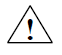**Danger**

如果不采取合适的预防措施**将会**造成严重的人身伤亡以及财产损失。

 

**Warning**

如果不采取合适的预防措施**可能会**造成严重的人身伤亡以及财产损失。

 

**Caution**

如果不采取合适的预防措施将造成轻微的人身伤害以及财产损失。

 

### 合格的专业人员

只允许符合各项工作要求的**合格人员**进行操作。合格人员必须遵照安全规范及警示提示, 并具备资质进行产品编程，接地, 标记电路等操作。

 

### 正确使用

**Warning**

本设备及其组件只允许用于产品目录或技术文件中已规定的应用情况, 如果需要使用其他公司的产品和组件，必须得到***Beacon Global Technology\***推荐和允许。本产品必须在正确搬运，存放，组装，装配，安装，调试，操作和维护的前提下正确运行。

### 责任免除

我们已对印刷品中所述内容与硬件和软件的一致性作过检查。然而不排除存在偏差的可能性，因此我们不保证印刷品中所述内容与硬件和软件完全一致。印刷品中的数据都按规定经过检测，必要的修正值包含在下一版本中。欢迎与我们联系并提出改进意见。

 

### 回收与废弃

BT系列网关由于其低污染量可进行回收。如您需要回收或废弃相关网关产品请联系我们。

北美,欧洲和亚太(中国大陆除外)客户可发邮件至recycling@beacongt.com

中国大陆地区客户可直接致电客服电话400-871-0598

 

### 主机及组件

安装启动本产品您将具备以下配件。

| **包装箱中包含1 个Beacon网关**                               |  |
| :----------------------------------------------------------- | :----------------------------------------------------------: |
| **包装箱中包含1 个电源接线端子**                             |  |
| **包装箱中包含若干条白色RJ45以太网网线（和以太网端口数量相符合）** |                              |
| **包装箱中包含若干条橙色RJ45-DB9M电缆（如果使用RS232方式接线）** |               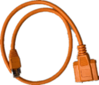               |
| **包装箱中包含若干个DB 9F转接线端子排RS-485（如果使用RS232方式接线和串行端口数量相符合）** |                              |
| **包装箱中包含若干个RJ45转接线端子排RS-485（如果使用RS485方式接线）** |                              |
| **包装箱中包含一根Null Modem转接电缆（RS232 ONLY),用于连接PC** |               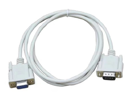               |
| **包装箱中包含一根黑色电缆USB to   端子排,用于连接Profibus 配置端口和电脑（DM模块）** | 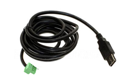 |
| **包装箱中包含一张CD或者U盘（DM，DS模块）**                  |                              |

###  安装介绍

本章将根据网关特性协议描述如何安装启动本网关产品。

#### **第一步：连接电源**

 

**注意：**网关电源采用了桥式整流防反接保护电路，正负任意连接均可正常供电，直流电源允许范围 10~36VDC，功耗：3W, 标称值 24 VDC @ 125mA，**特别注意：**网关在使用中应避免与变频器、驱动设备等共用直流电源，应该优先使用小于15W的直流电源，如果有小功率(大于5W)的12V直流电源则优先推荐使用。如果违反该要求，超出该电源范围使用，由此造成的网关损坏，Beacon Global Technology将不承担任何维修和赔偿责任。*

网关包装内并没有配备SD存储卡，用户可以另外从Beacon Global Technology订购SD存储卡。由于网关配置文件空间较小，推荐采用不超过16G的SD存储卡，以降低读写缓存地址的延时。如果用户自行采购市售SD存储卡，推荐使用工业等级产品。如果因为SD存储卡内存损坏，造成网关停机，配置文件丢失，Beacon Global Technology将不承担任何责任。

#### **第二步：设备链接**

##### **以太网端口设备链接**

 
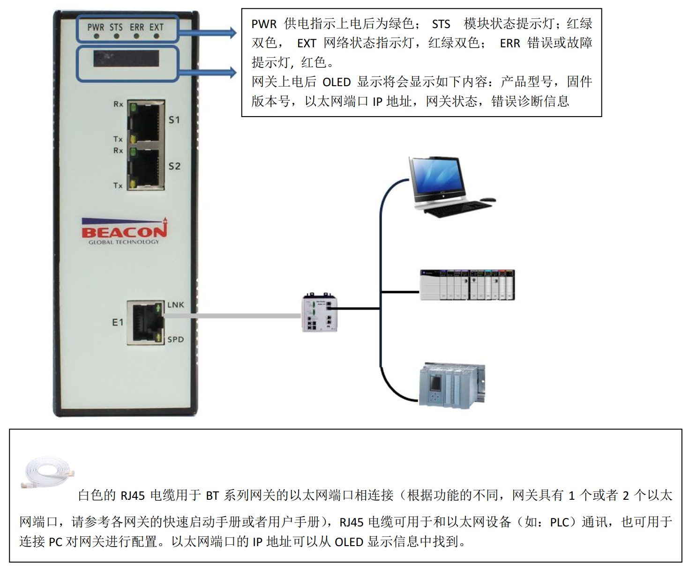 

**注意：**请勿将白色RJ45以太网电缆用于和网关串行端口（RJ45）连接，如由此造成网关的损坏，Beacon Global Technology将不承担任何责任。

网关以太网端口采用：10/100Mbps Shield工业级RJ45 连接器，50 Hz 到 60 Hz 时电气隔离 1500 Vrms达 60 秒，遵循 IEC 60950：1991 第 5.3.2 节的规定。

##### **串行端口设备的连接**

**注意：**请勿将黄色电缆用于和网关以太网端口（RJ45）连接，如由此造成网关的损坏，Beacon Global Technology将不承担任何责任。

网关串行端口采用2500 Vrms端口信号隔离，符合 UL 1577 高压隔离标准和IEC60747-5-2安全规范。串行端口通信信号提供高可靠的隔离数据路径。

虽然串行端口进行了光电隔离，但是由于误操作造成的串行端口击穿不在网关保修范围内。同时建议用户每次拆卸串行端口电缆连接时，关闭网关电源。

用户如果需要利用该电缆连接上位机对串行端口数据进行诊断，而上位机只有USB端口的情况下，用户需要自己配备一根USB-DB9M的电缆。如因用户自备电缆造成的PC机端口以及主板损坏，Beacon Global Technology将不承担任何责任。

串口线接线图

 

上图为采用橙色RJ45-DB9M电缆与DB9F端子排的转接接头连接的方式。

举例1，RS485接线方式：

S1口引出来485接口，端子6+，1-

USB转485引出来的485接口，端子T/R+ ,T/R-

6+ ---------------端子T/R+

1-  ---------------端子T/R-

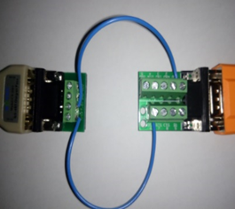

举例2，RS232接线方式：

S1口引出来232接口，端子2RX，3TX, 5GND 接线

如果选用232接线方式，每个串口只能连接一个从站，接线长度不能超过15米。

注意：串口不应热插拔。

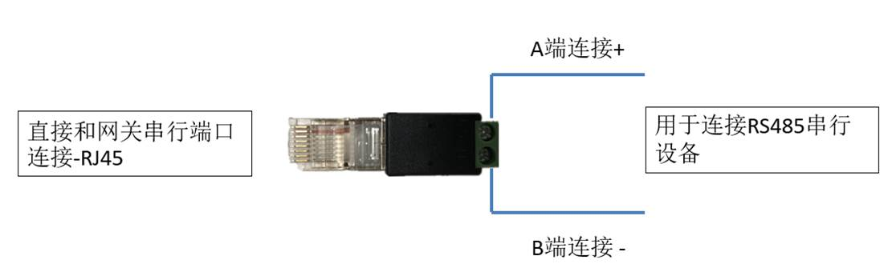

 上图为采用RJ45-双接线柱转接头的方式，支持RS485串口设备使用。

**Profibus DP 主站端口设备的连接**

 

**注意：**请勿将白色RJ45以太网电缆用于和网关串行端口（RJ45）连接，如由此造成网关的损坏，Beacon Global Technology将不承担任何责任。

网关以太网端口采用：10/100Mbps Shield工业级RJ45 连接器，50 Hz 到 60 Hz 时电气隔离 1500 Vrms达 60 秒，遵循 IEC 60950：1991 第 5.3.2 节的规定。

网关串行端口采用2500 Vrms端口信号隔离，符合 UL 1577 高压隔离标准和IEC60747-5-2安全规范。串行端口通信信号提供高可靠的隔离数据路径。

虽然串行端口进行了光电隔离，但是由于误操作造成的串行端口击穿不在网关保修范围内。同时建议用户每次拆卸串行端口电缆连接时，关闭网关电源。

用户如果需要利用该电缆连接上位机对串行端口数据进行诊断，而上位机只有USB端口的情况下，用户需要自己配备一根USB-DB9M的电缆。如因用户自备电缆造成的PC机端口以及主板损坏，Beacon Global Technology将不承担任何责任。

**Profibus DP 从站端口设备的连接**

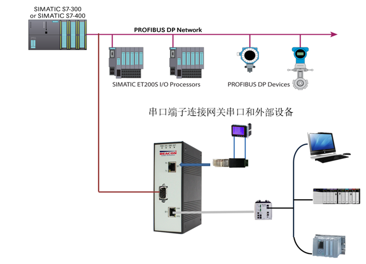

**注意：**请勿将白色RJ45以太网电缆用于和网关串行端口（RJ45）连接，如由此造成网关的损坏，Beacon Global Technology将不承担任何责任。

网关以太网端口采用：10/100Mbps Shield工业级RJ45 连接器，50 Hz 到 60 Hz 时电气隔离 1500 Vrms达 60 秒，遵循 IEC 60950：1991 第 5.3.2 节的规定。

网关串行端口采用2500 Vrms端口信号隔离，符合 UL 1577 高压隔离标准和IEC60747-5-2安全规范。串行端口通信信号提供高可靠的隔离数据路径。

虽然串行端口进行了光电隔离，但是由于误操作造成的串行端口击穿不在网关保修范围内。同时建议用户每次拆卸串行端口电缆连接时，关闭网关电源。

用户如果需要利用该电缆连接上位机对串行端口数据进行诊断，而上位机只有USB端口的情况下，用户需要自己配备一根USB-DB9M的电缆。如因用户自备电缆造成的PC机端口以及主板损坏，Beacon Global Technology将不承担任何责任。

 

### 产品尺寸

**俯视图**

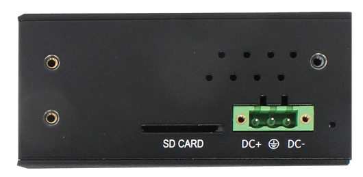 

**侧视图**

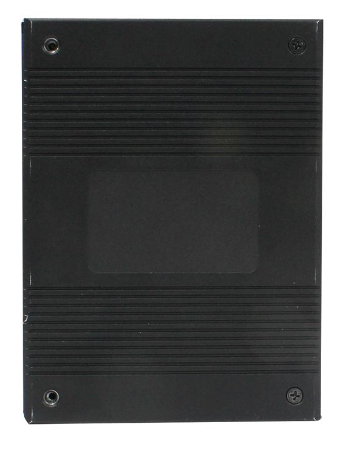

**正视图**

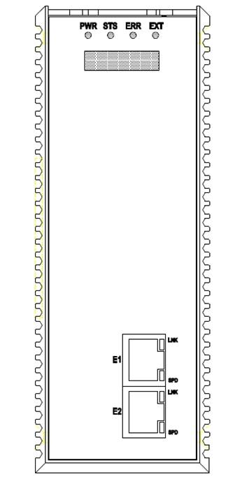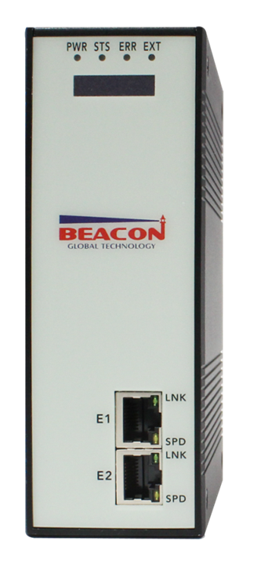

