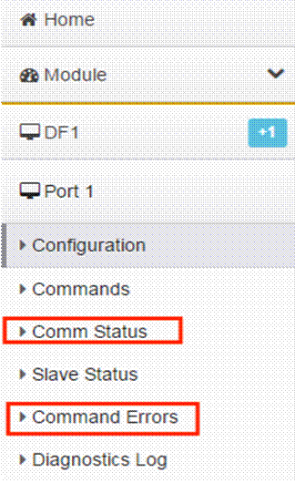

# DF1 协议错误诊断

##### 错误代码

在模块使用DF1协议时，用户可以在模块页面查看通讯状态以及命令错误代码，从而快速了解问题所在。

点击DF1 ---Port1 ---Comm status(或Command Errors)

相关错误代码明细如下：

| 代码 | 代码（16进制） | 描述            |
| ---- | -------------- | --------------- |
| -1   | 0xFFFF         | CTS未置位       |
| -2   | 0xFFFE         | 发送等待超时    |
| -10  | 0xFFF6         | 等待DLE ACK超时 |
| -11  | 0xFFF5         | 超时            |
| -12  | 0xFFF4         | 数据长度错误    |
| -20  | 0xFFEC         | DLE NAK错误     |
| -200 | 0xFF38         | DLE NAK错误     |
| -201 | 0xFF37         | DLE NAK错误     |
| -211 | 0xFF2D         | 结束符错误      |

 
