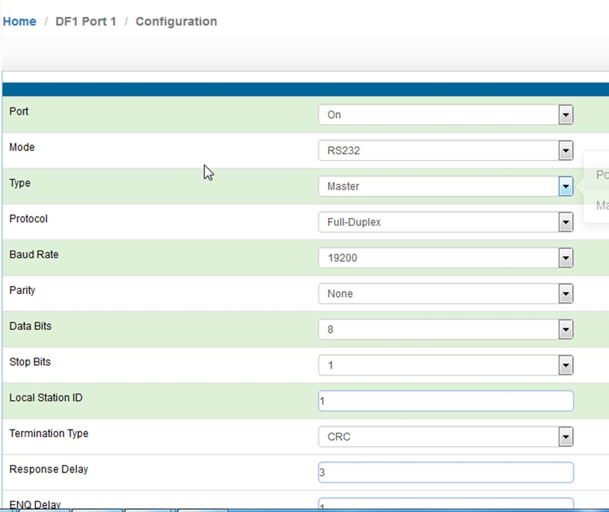
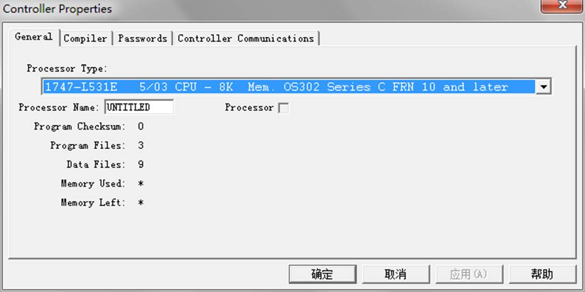
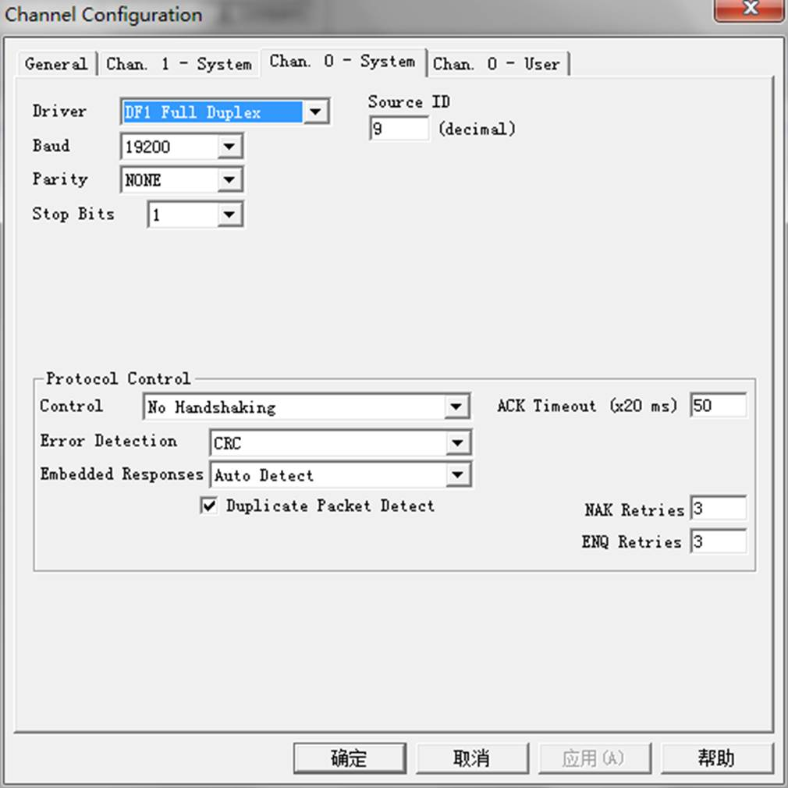
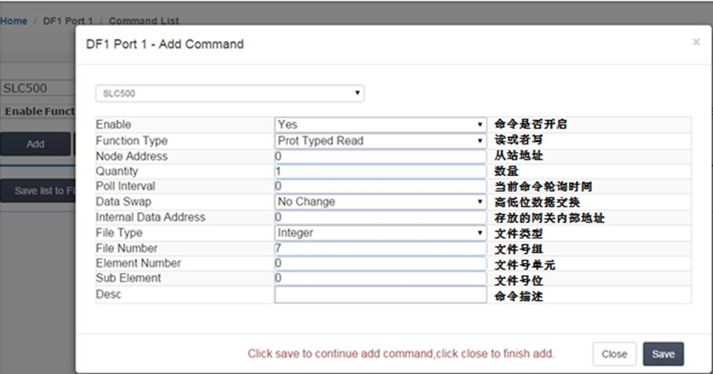
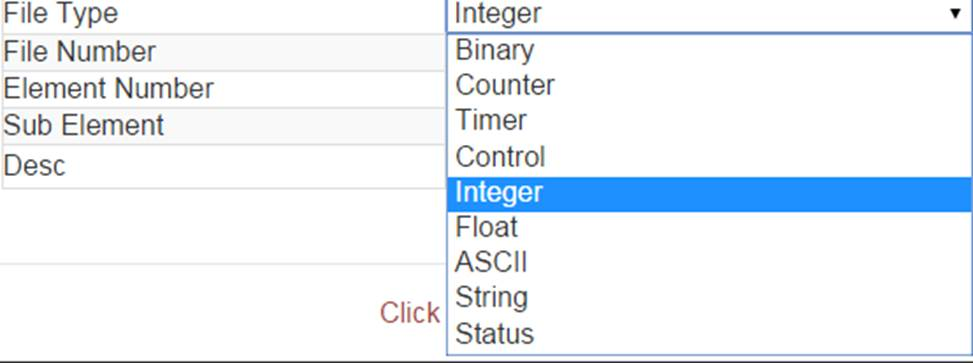

# 配置DF1主站

点击DF1 ---Port1 ---Configuration

配置通讯设备的DF1从站端口。以SLC500 1747 PLC的DF1接口作为从站举例，如下图进行顺序配置。

注意端口工作方式，波特率，数据位，停止位和效验等参数要和DF1主从站保持一致。

配置模块DF1主站命令。返回模块配置DF1主站命令界面，点击“commands”用来配置读或写SLC 500的命令。模块每个DF1主站支持使用最大128条指令。点击Add，可以增加新的命令，如下为添加指令的配置界面：

备注：PLC5 ASCII命令用于罗克韦尔PLC5数据的读写。

PLC5 Binary命令用于罗克韦尔PLC5数据的读写。

SLC 500命令用于罗克韦尔SLC 500数据的读写。

DF1端口配置说明

支持的数据类型

 

举例模块的 DF1采用master方式读取数据

我们在RSLogix 500中建立一个N30文件，并且录入一些数据。

之后我们配置模块的DF1端口如下，DF1配置为Master读取RSLogix 500的数据

DF1的指令含义为，读取0号DF1从站内的30号文件夹中的十个数据，将数据存储在模块内部数据区起始地址为0到9当中，数据类型为integer.

可以看到模块内部数据区起始地址0-9如下图，从DF1从站中读到的数据。

