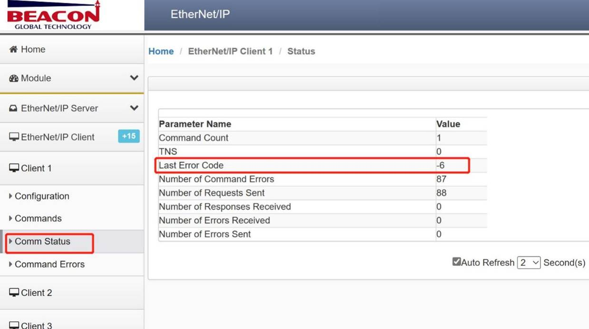
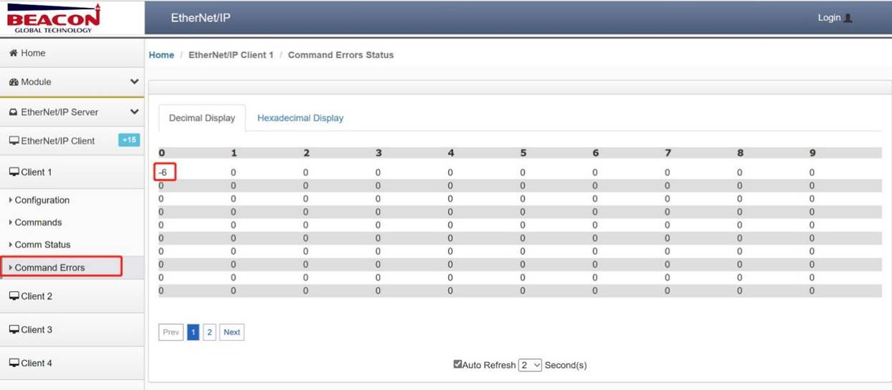

# EtherNet/IP协议错误诊断

**错误代码**

在模块EtherNet/IP协议端口做Client（主站）时，用户可以在模块页面查看通讯状态以及命令错误代码，从而快速了解问题所在。

 

 

相关错误代码明细如下：

 

| 代码 | 代码（16进制） | 描述                   |
| ---- | -------------- | ---------------------- |
| 1    | 
0x01           | 连接失败               |
| 2    | 0x02           | 资源不可用             |
| 4    | 0x04           | 路径错误               |
| 5    | 0x05           | 未知对象路径           |
| 7    | 0x07           | 连接丢失               |
| 8    | 0x08           | 服务不支持             |
| 9    | 0x09           | 属性值非法             |
| 11   | 0x0B           | 输入请求状态错误       |
| 12   | 0x0C           | 对象状态冲突           |
| 14   | 0x0E           | 属性只读               |
| 15   | 0x0F           | 违反私有属性           |
| 16   | 0x10           | 设备状态冲突           |
| 17   | 0x11           | 应答数据过大           |
| 19   | 0x13           | 数据不完整             |
| 20   | 0x14           | 属性不支持             |
| 21   | 0x15           | 数据过多               |
| 22   | 0x16           | 对象不存在             |
| 24   | 0x18           | 属性数据不存在         |
| 25   | 0x19           | 存储失败               |
| 31   | 0x1F           | 指定供应商             |
| 32   | 0x20           | 非法服务参数           |
| 255  | 0xFF           | 数据地址非法           |
| -2   | 0xFFFE         | 命令超时               |
| -3   | 0xFFFD         | 目标连接失败           |
| -4   | 1xFFFC         | 目标注册超时           |
| -5   | 2xFFFB         | 建立连接超时           |
| -6   | 3xFFFA         | 无TCP/IP连接(网线断开) |
| -10  | 0xFFF6         | 缺少参数               |
| -11  | 0xFFF5         | 功能不支持             |
| -20  | 0xFFEC         | 应答数据包长度错误     |
| -21  | 0xFFEB         | CPF数据项错误          |
| -22  | 0xFFEA         | CPF数据地址错误        |
| -23  | 0xFFE9         | CPF数据类型错误        |
| -24  | 0xFFE8         | CPF命令码错误          |
| -25  | 0xFFE7         | CPF状态错误            |
| -26  | 0xFFE6         | CPF连接ID错误          |
| -27  | 0xFFE5         | 数据域上下文不匹配     |
| -28  | 0xFFE4         | 会话处理错误           |
| -29  | 0xFFE3         | CPF消息号不匹配        |
| -30  | 0xFFE2         | 会话数据长度错误       |
| -31  | 0xFFE1         | 会话数据状态错误       |
| -32  | 0xFFE0         | 会话版本错误           |
| -35  | 0xFFDD         | FOPEN消息长度不符合    |
| -36  | 0xFFDC         | FOPEN状态错误          |
| -41  | 0xFFD7         | PCCC消息长度不符       |
| -42  | 0xFFD6         | PCCC消息状态错误       |
| -43  | 0xFFD5         | PCCC命令错误           |
| -44  | 0xFFD4         | PCCC消息TNS不匹配      |
| -45  | 0xFFD3         | PCCC供应商ID不匹配     |
| -46  | 0xFFD2         | PCCC序列号不匹配       |
| 8455 | 0x2107         | 读取数据类型不正确     |

 