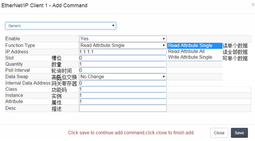
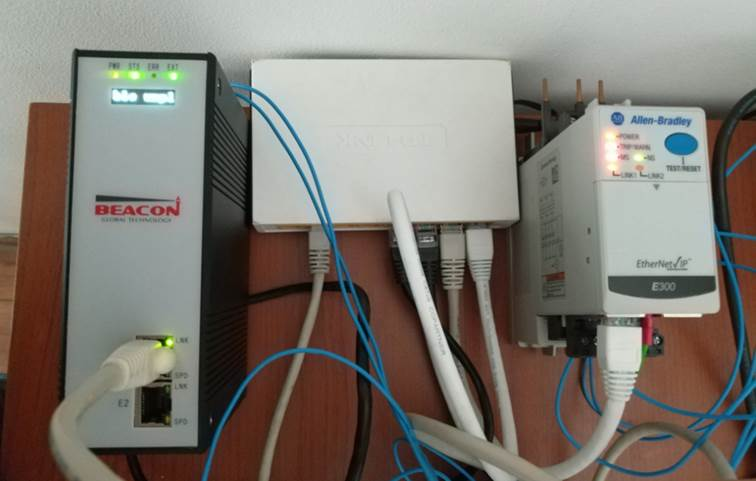
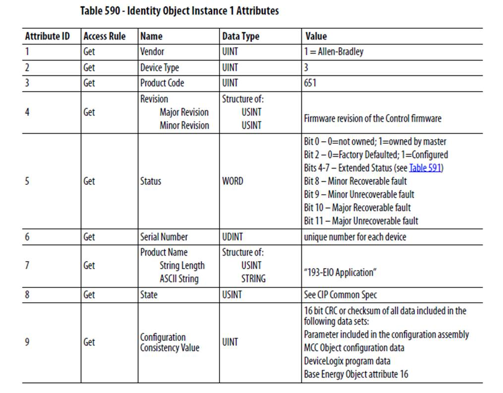
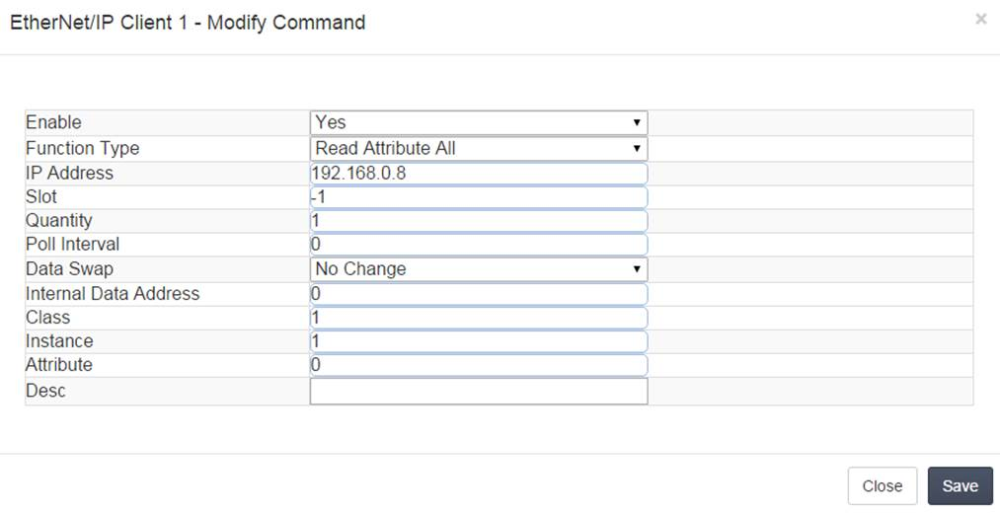
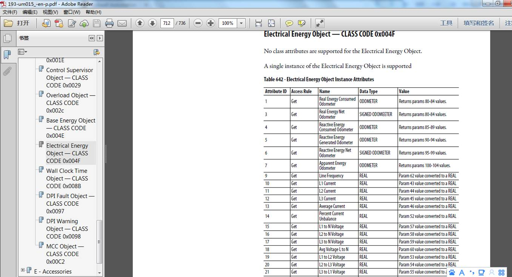
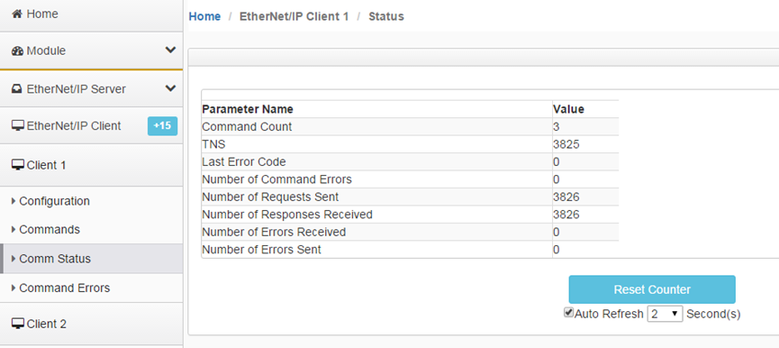
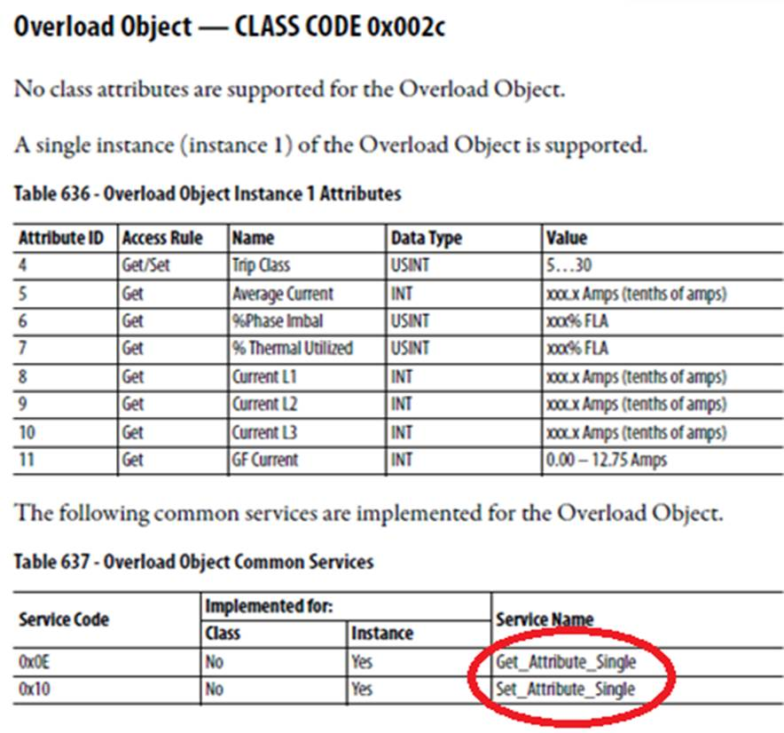
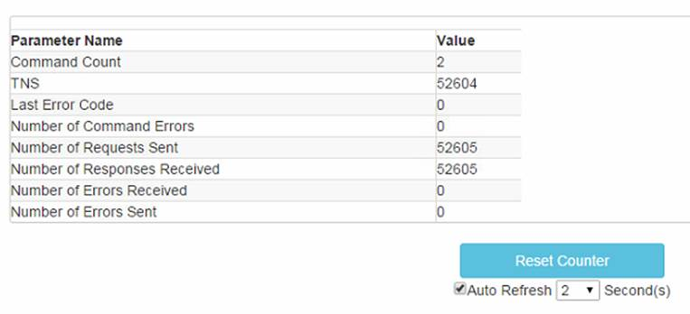

# 配置EtherNet IP Client（主站）链接罗克韦尔（非PLC）设备

本章节内容将主要介绍如何读取罗克韦尔非PLC设备的数据，如果您只需要和PLC进行通讯，可以略过本章节。

在模块登录页面，选择EtherNet/IP---Client1---Configuration，Message类型请选择 Unconnected。

Message的使用方法和指令详解，选择Generic添加命令行。

注：Read Attribute ALL ,使用这条指令读取全部Attribute时，

需要设置Class和Instance，对Attribute的设置是无效的；

Read Attribute Single ,使用这条指令读取单个Attribute时，

需要同时设置Class，Instance和Attribute，Attribute ID表示是从第几个属性开始读；

Write Attribute Single ,使用这条指令写入单个Attribute时，

需要同时设置Class，Instance和Attribute，Attribute ID表示是从第几个属性开始写；

#### 举例，利用网关BT-EN系列模块，读E300设备状态,读E300电压电流等

测试过程如下:在RSLinx 里面可以浏览到两个设备的信息。

BT-EN网关EN一侧可以连接多个支持EtherNet/IP协议的设备，包括E300,Powerflex755, PowerMonitor 500等设备，请保持各个IP设备的以太网网段一致。

浏览器打开AB E300配置界面

E300：用户名Administration，密码：（空），或者是E300的S/N号码， E300的S/N号码在E300正面滑盖内部。

配置BT-EN模块的命令，选择EtherNet/IP Client 1，进行配置。

EtherNet/IP一侧，BT-EN模块P系列支持15个Client，每个Client最多可以使用128条指令，支持10000个16位的寄存器。BT-EN模块B系列支持5个Client，每个Client最多可以使用32条指令，支持2000个16位的寄存器。本次举例测试采用BT-EN模块P系列。

具体连接E300数量，可以根据每个E300所分配的指令数来计算，比如每个E300使用10条指令，BT-EN模块B系列每个Client可以连接2-3个E300设备，则一共可连接10-15个E300。另外，还要考虑数据寄存器的空间大小。

包括E300，PF750，PM5000等设备一共采集的数据量不能超过数据寄存器之和，具体使用中建议用户留有余量。同时要注意，因为采用的是非预约性的显性报文，所以过多使用指令数，可能导致系统延时时间增加。

#### 建立对E300读取数据的指令：

#### 读取E300状态（对应寄存器参考E300手册）：

命令设置：

需要注意

Function Type 选择读取属性的所有内容

Slot 填写 -1

Quantity 默认1 

Internal Data Address 表示读上来的数据放到BT-EN模块内部寄存器的起始地址

Class 1 这里对应E300说明书中读取的代码序号

Instance 1 这里对应一个E300

#### 读取E300电流电压值等：

需要注意

Function Type 选择读取属性的所有内容

Slot 填写 -1

Quantity 默认1 

Internal Data Address 表示读上来的数据放到BT-EN模块内部寄存器的起始地址

Class 79 这里对应E300说明书中读取的代码序号004F十六进制转换成十进制79

Instance 1 这里对应一个E300

Comm Status 可以看到命令的状态

Command Errors 可以看到命令是否有错误。

内部寄存器读取数据可以看到从E300采集到的数据

#### 建立对E300写数据的指令：

E300可以按照手册写入单个数据，主要可写的是过载等级。

举例：

需要注意

Function Type 选择写单个属性数据

Slot 填写 -1

Quantity 默认1 

Internal Data Address 表示读上来的数据放到BT-EN模块内部寄存器的起始地址。

Class44这里对应E300说明书中读取的代码序号002C十六进制转换成十进制 44

Instance 1 这里对一个E300

Attribute4 这里对应Attribute ID

为了验证是否写入E300，可以再建立一条读命令。

Comm Status 可以看到命令的状态

用户可以给对应寄存器地址写入数据，观察数据是否写入给E300。

