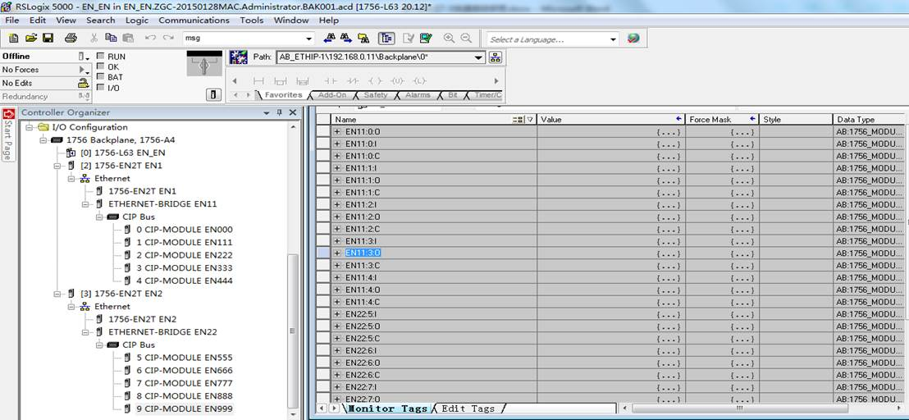
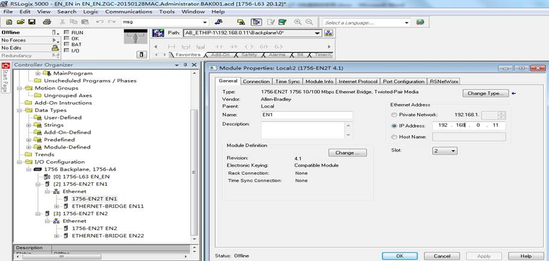
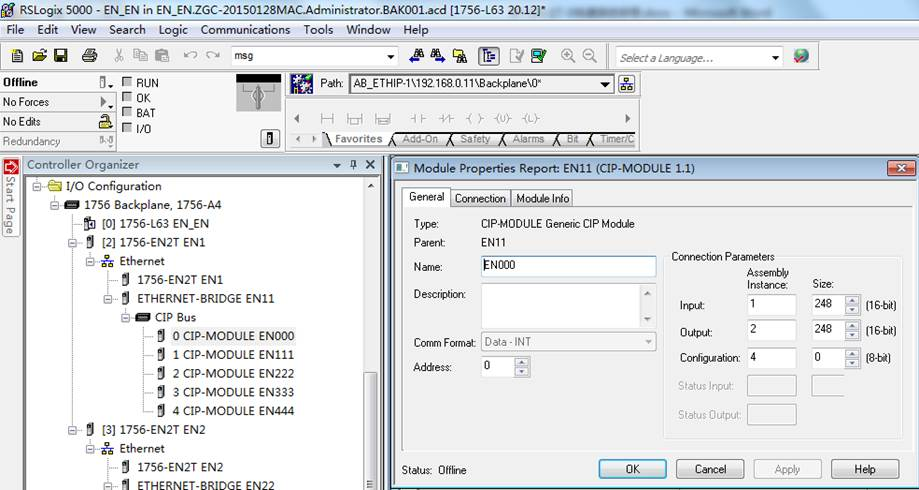
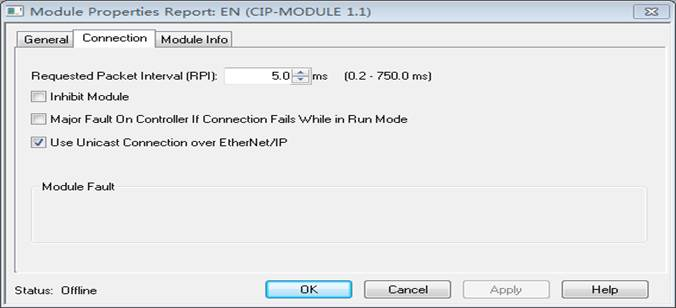
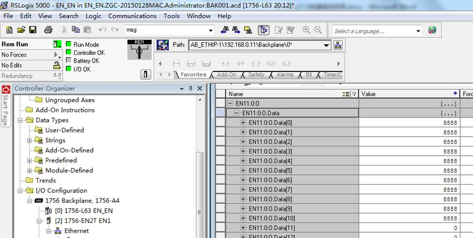
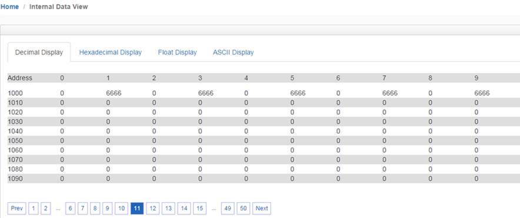

# 配置两个EtherNet IP Client（主站）之间数据交换

1、在RSLogix 5000中做和模块配置一致的输入输出映射关系。打开装在上位机中的RSLogix 5000软件，同时将模块不同的端口（EtherNet/IP 从站）和不同的EtherNet/IP 主站（PLC）相连接。分别在两块1756-EN2T下建立以太网桥及以太网模式：

需要在一块1756-EN2T (192.168.0.11)下建立以太网桥ETHERNET-BRIDGE(192.168.0.250  BT-EN-EN-S) 以及以太网模式CIP-MODULE。

需要在另一块1756-EN2T (192.168.1.12)下建立以太网桥ETHERNET-BRIDGE(192.168.1.250 BT-EN-EN-S) 以及以太网模式CIP-MODULE。

2、放置于同一个机架的两块1756-EN2T的具体配置请参照以下截图：

a)  放置于第二槽的1756-EN2T配置截图如下：

b)  放置于第三槽的1756-EN2T配置截图如下：

c)  第二槽1756-EN2T的以太网桥ETHERNET-BRIDGE(192.168.0.250 BT-EN-EN-S)配置截图如下：

d)  第三槽1756-EN2T的以太网桥ETHERNET-BRIDGE(192.168.1.250 BT-EN-EN-S)配置截图如下：

e)  以太网模式CIP-MODULE截图如下：

请使用Input和Output都为248个字，Configuration为0。Comm format需要选择Data INT。

Assembly instances设定方式：input为1，output为2，configuration为4。

每一个I/O connection都需要进行如上的配置，之后点击Create，来设定I/O connection的RPI time时间。单机PLC结构，Use Unicast Connection over EtherNet/IP要勾选，RPI时间可以使用5ms或者20ms。冗余PLC结构，Use Unicast Connection over EtherNet/IP不要勾选，RPI时间可以使用20ms或者40ms。

模块支持10个EtherNet/IP class1 I/O 链接，链接的CIP配置方法都相同，只需按照0-9的顺序修改address。可通过复制粘贴等操作，完成后RSlogix5000会自动对address进行排序。

本案例中两个不同1756-EN2T的以太网桥EN11和EN22输入、输出对应关系如下：

192.168.0网段的输出对应着192.168.1网段的输入。

192.168.0网段的输入对应着192.168.1网段的输出。

读写一些数据进行观察。在IP地址为192.168.0.11的PLC一侧的输出数组EN11:0:O.Data[0]- [10]写一些数据，如下图：

可以看到模块内部寄存器地址2500-2510收到了相应的数据：

同时，从IP地址为192.168.1.12的PLC一侧的输入数组EN22:5:I.Data[0]- [10]中也能收到这些数据：

从IP地址为192.168.1.12的PLC一侧的输出数组EN22:9:O.Data[0]- [10]写一些数据，如下图：

可以看到模块内部寄存器地址1000-1009收到了相应的数据：

同时从从IP地址为192.168.0.11的PLC一侧的输入数组EN11:4:I.Data[0]- [10]能收到这些数据：

注意：1 个浮点数需要占 用 2 个模块内部寄存器地址。

​            16个布尔量占用一个模块内部寄存器地址。

具体应用中需要根据实际采集和输出的具体数据类型，来分配模块数据区。

BT-EN模块支持EtherNet/IP Class 1 server，可以支持10个EtherNet/IP Class1 I/O链接，数据交换区5000个字，支持多个EtherNet/IP以太网客户端交换数据。

同时模块还可支持作为EtherNet/IP Class 3 server，PLC可以采用MSG命令完成数据交换，此种方式数据交换的速度会低于Class 1的方式，配置命令可以参考Logix 5000的相关资料，本手册中将不再一一举例。
