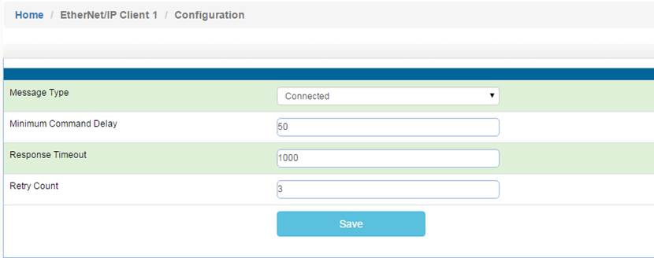
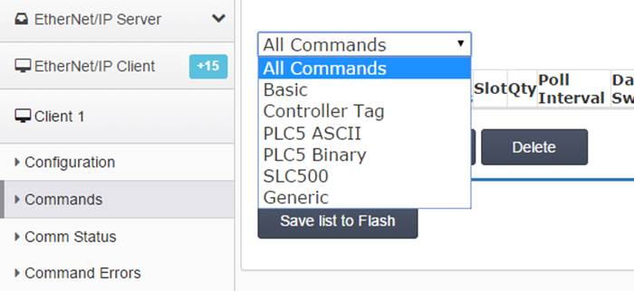
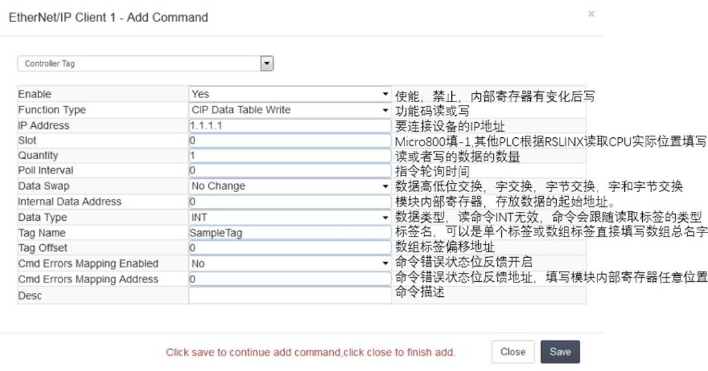
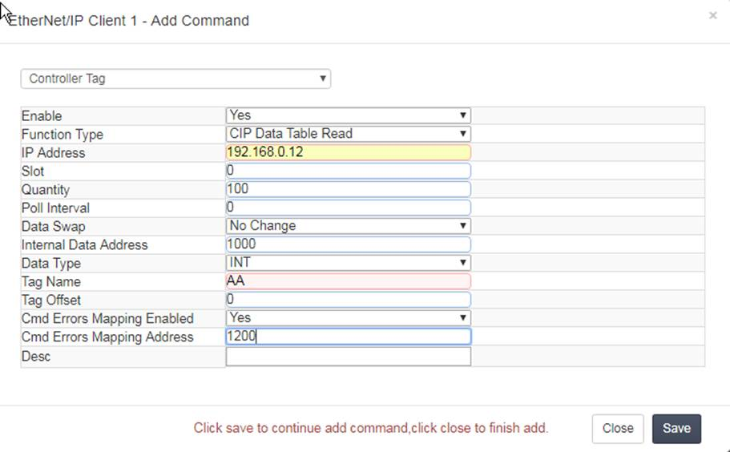
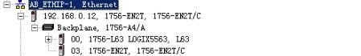
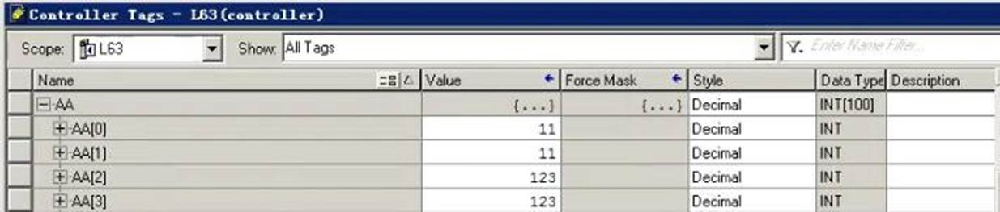
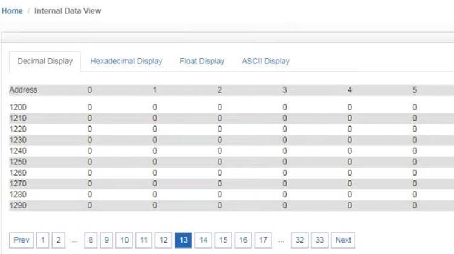

# 配置EtherNet/IP Client（主站）

点击 EtherNet/IP Client ---Client1 ---Commands

点开 Configuration.查看默认的配置

Message Type: Connected。

连接罗克韦尔1756系列，1769系列，1746系列,PLC-2系列,PLC-5系列，SLC500系列，Micrologix PLC系列，PowerFlex变频器系列，连接E300智能马达保护器，PowerMonitor智能电力监控仪等需要选择Connected。 此处用于连接1756PLC，因此选择Connected。

Minimum Command Delay ：每个 Client 执行指令的轮询时间 单位 ms， 范围 0-65535

注：该时间越小,发送命令越快，但并非越小越好，需要先查看从站设备的说明书，确定从站响应时间是否能及时接受和反馈，主站发送命令的间隔。 

Response Timeout：所连接设备的响应时间， 单位 ms，范围 0-65535 

Retry Count：重新尝试连接次数 ，范围 0-65535                    

选择指令的类型：

Basic命令用于罗克韦尔PLC-5, ControlLogix数据的读写；

Controller Tag命令用于罗克韦尔CompactLogix, ControlLogix数据标签或标签数组的读写；

PLC5 ASCII命令用于罗克韦尔PLC-5, ControlLogix数据的读写；

PLC5 Binary命令用于罗克韦尔PLC-5, ControlLogix数据的读写；

SLC500命令用于罗克韦尔SLC500, MicroLogix ，PowerFlex变频器数据的读写；

Generic命令用于罗克韦尔PowerFlex变频器，E300智能马达保护器，PowerMonitor智能电力监控仪数据的读写。

选择要连接的种类，相应的命令。点击Add可以增加命令行。 

以下介绍BT网关和1756 PLC通讯举例，和其他罗克韦尔产品的通讯指令详细内容，可另外参考其他手册，或者咨询BEACON技术支持。 

在实际操作中，因为不同产品型号的模块内部数据区大小不同，请务必注意模块数据区的实际大小，并根据实际数据寄存器的地址范围来配置指令，同时还请注意相同地址是否重复被多种协议写入数据。

此选项用于罗克韦尔 PLC 在不能停机的情况下，对RSLogix 5000或者Studio 5000软件里面标签或者标签数组进行读或写的操作。 

举例1：如下图所示，读取 IP 地址为 192.168.0.12，CPU 位于 0 槽位的 L63 CPU 里面的全局变量标签数组 AA ，数组是 INT 格式 ，数量 100 个(每条命令最大 100 个 INT,或者 50 个 DINT/REAL),放到模块内部寄存器 1000-1099 里面，如果命令检测不到 AA 的数组有 100 个或者没有 AA 数组，或者 IP 地址不对，槽位不对等，就会在模块内部寄存器 1200 的位置报一个非零值，显示这条命令有错误，工程师可以使用 Cmd Errors Mapping 反馈来查看所连接设备的状态。 （注：对于读来说 Data：Type 始终是 INT,不可修改，但是会随着数组的类型自动调整） 

**
**

**
**

举例2： 读取 IP 地址为 192.168.0.12，CPU 位于 0 槽位的 L63 CPU 里面的全局变量标签数组 BB ，数组是 REAL 格式 ，数量 50 个(每条命令最大 100 个 INT,或者 50 个 DINT/REAL),放到模块内部寄存器 1000-1099 里面，如果命令检测不到 BB 的数组有 100 个或者没有 BB 数组，或者 IP 地址不对，槽位不对等，就会在模块内部寄存器 1201 的位置报一个非零值，显示这条命令有错误，工程师可以使用 Cmd Errors Mapping 反馈来查看所连接设备的状态。 

​    

检查命令状态，可以看发送和接收的次数，最后的错误代码等

在 AA 和 BB 输入些数据 

查看内部寄存器 1000 和 1100 的数据，此处说明 1 个 REAL 的浮点数占 2 个内部寄存器，虽然命令是 50 个浮点数，放到 1100 开始的内部寄存器，实际上是 1100-1199 这 100 个寄存器存放着 50 个浮点数

可以看到内部寄存器 1200 和 1201 没有错误反馈

如果我们从RSLogix 5000 里面删除掉 AA 或者 BB 数组标签的时候，命令检测不到有这两个数组，就会在内部寄存器1200 和 1201 里面报错误，其他协议可以采集存放错误标签寄存器来反馈命令的执行情况。也可以查看命令状态。 这里可以看到错误代码 4 产生，这里面错误代码含义很多种，如果命令检测不到 AA 的数组有 100 个或者没有 AA数组，或者 IP 地址不对，槽位不对等，就会在模块内部寄存器 1201 的位置报一个非零值，工程师编程时，此地址不等于 0 就表示命令没有执行下去，因为错误代码组合种类非常多，例如 IP 地址不对，又没有检测不到 AA 数组，这时候就会产生 IP 和检测不到 AA 数组的错误代码组合。这里不再详细介绍。 

