# 配置EtherNet/IP Server（从站）方法1

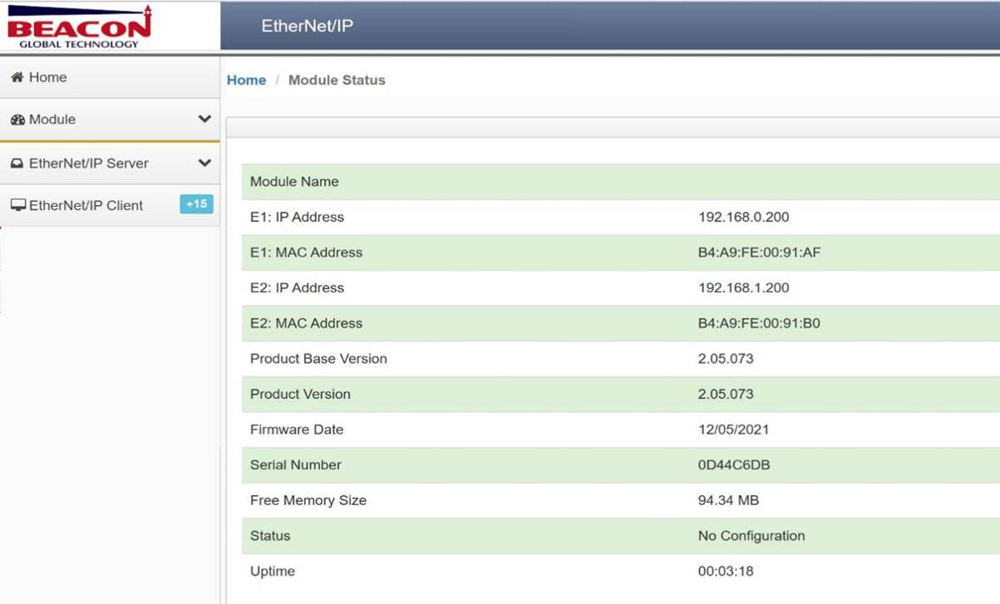

通过浏览器，进入模块主页面，如上图。在左侧菜单中，“EtherNet/IP Server”下点击“Congfiguration”，查看EtherNet/IP Server Configuration的链接数，不同型号的模块的EtherNet/IP Server Configuration 链接数不同。可以看到当前模块有 6 组 Class 1 Connections 的链接，这 6 组Class 1 Connections 的链接可以在RSLogix 5000 软件里进行配置全部采用或者根据需要部分采用，每组 Class 1 Connections 提供 248 个INT 数据类型的输入和 248 个 INT 数据类型的输出。

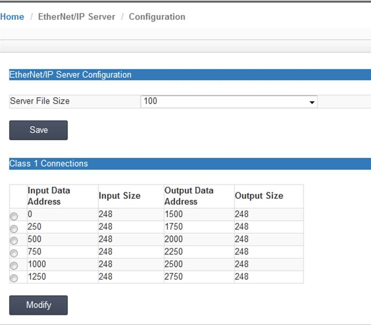

数据对应关系：

Input Data Address表示罗克韦尔PLC采集模块数据（对PLC一侧为输入）的内部寄存器地址范围，0 是指模块内部第 0 个寄存器，输入起始地址为 0 ，数量248，表示模块对PLC的第一组输入数据，所占用的模块内部寄存器地址范围。

Output Data Address表示罗克韦尔PLC写给模块数据（对PLC一侧为输出）的内部寄存器地址范围，1500 是指模块内部第1500 个寄存器，输出起始地址为1500 ，数量248，表示PLC对模块的第一组输出数据，所占用的模块内部寄存器地址范围。

此处248个输入寄存器的数量要与RSLogix 5000里面的 Class 1 Connections 对应上。并且输入输出的起始位置和数量可以任意更改。 

注：模块默认做EtherNet/IP从站，不需要任何设置。 

如下步骤为在RSLogix 5000配置软件中添加模块。

将网关E1端口和电脑，以及Logix PLC以太网接口相连接。在电脑中使用RSLinx扫描模块，然后在 RSLogix 5000中添加该模块的EDS文件，如下图。

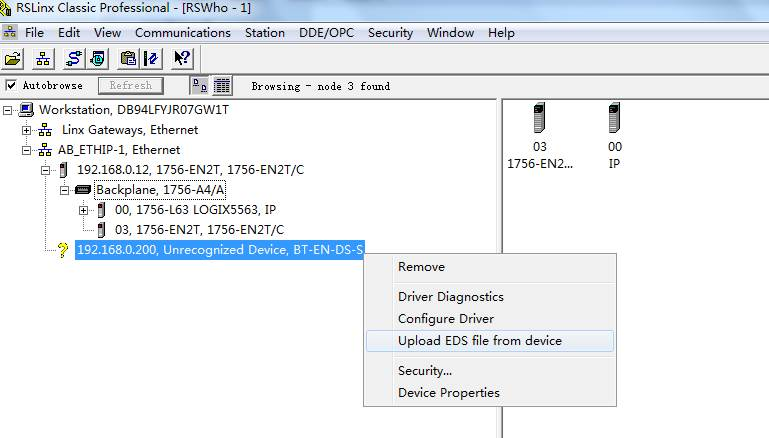

选择从设备上传 EDS 文件，如下图。

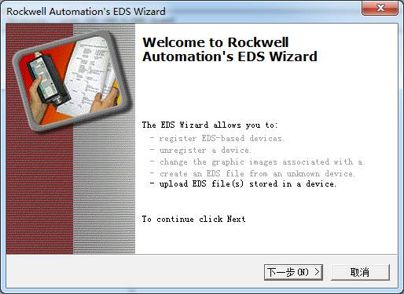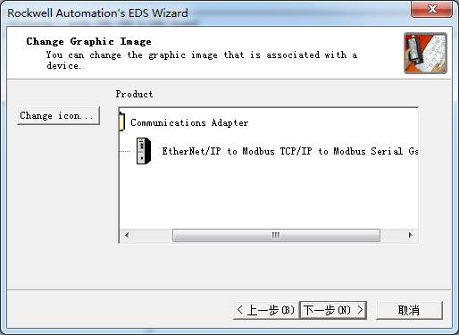

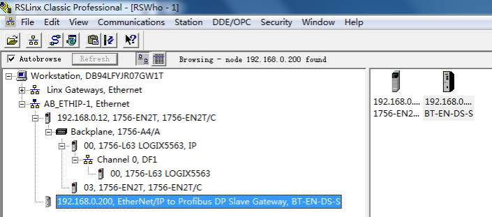

下一步通过添加“Generic EtherNet Bridge”完成 PLC 和模块的通讯，如下图。

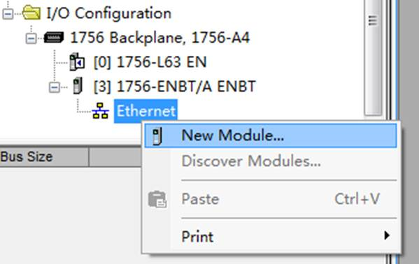

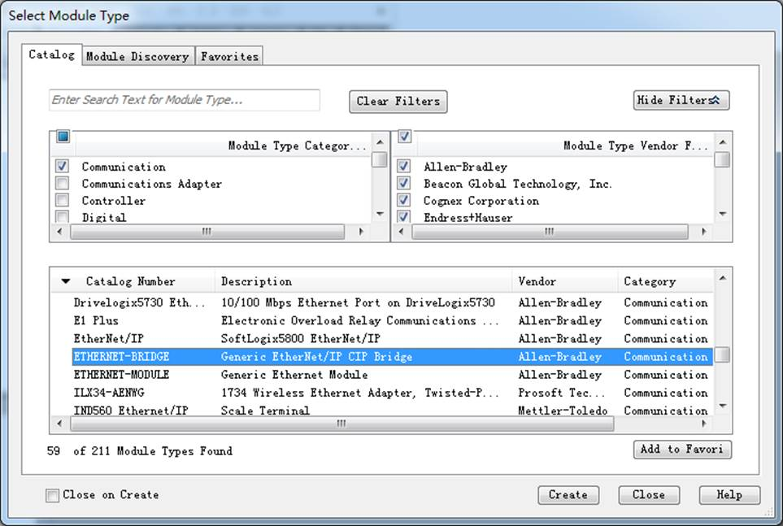

设定模块的IP地址，该地址为E1端口地址。

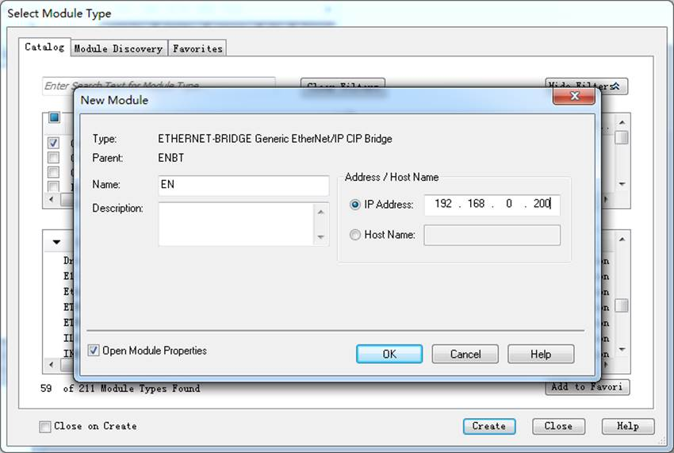

在Generic EtherNet Bridge下添加一个新模块，再添加一个新的CIP-Connection。

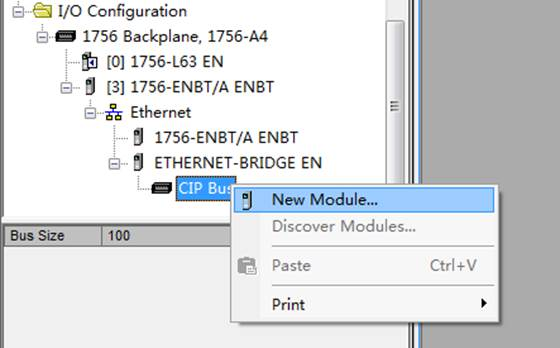

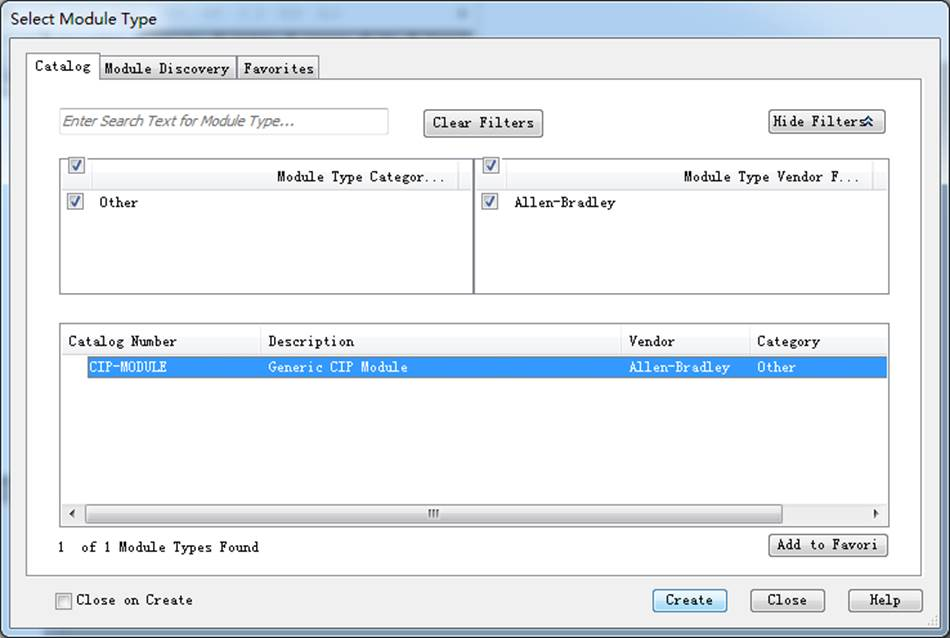

之后开始设定PLC I/O Connection的参数，如下图。

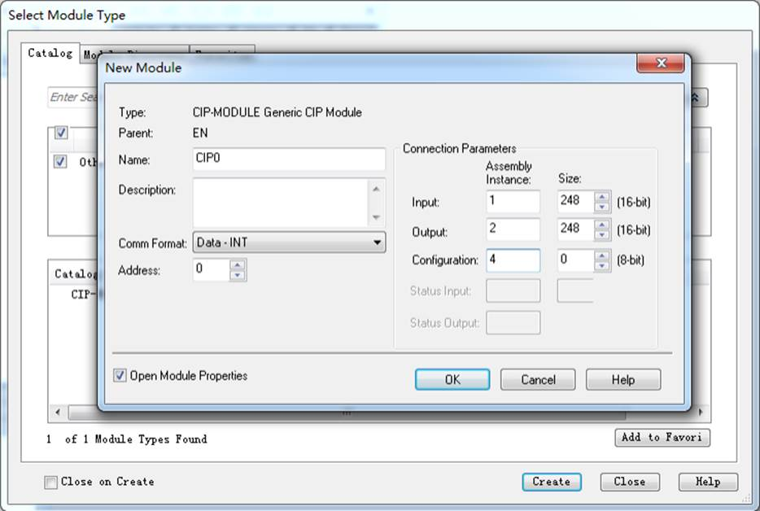

请使用Input和Output都为248个字，Configuration为0。Comm format需要选择Data INT。 

Assembly instances设定方式： Input 为 "1"， Output 为 "2"，Configuration 为"4"。

每一个I/O Connection都需要进行如上的配置，之后点击Create，来设定I/O connection的RPI time 时间。单机PLC结 构，Use Unicast Connection over EtherNet/IP要勾选，RPI时间可以使用5ms或者20ms。冗余PLC结构，Use Unicast Connection over EtherNet/IP不要勾选，RPI时间可以使用20ms或者40ms。

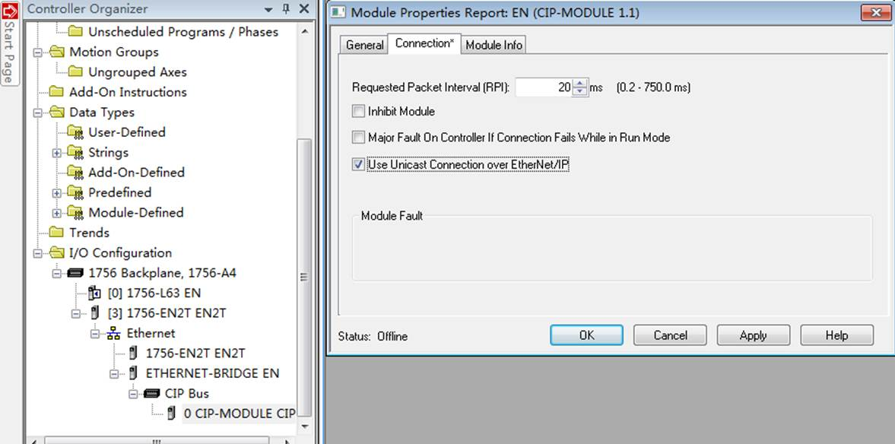

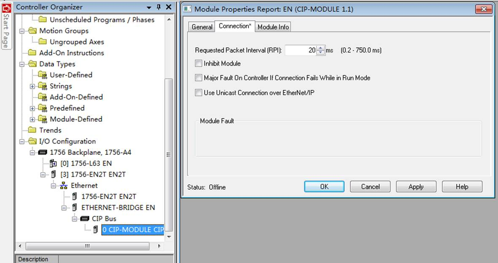

以上步骤完成后，在模块Status栏查看状态。

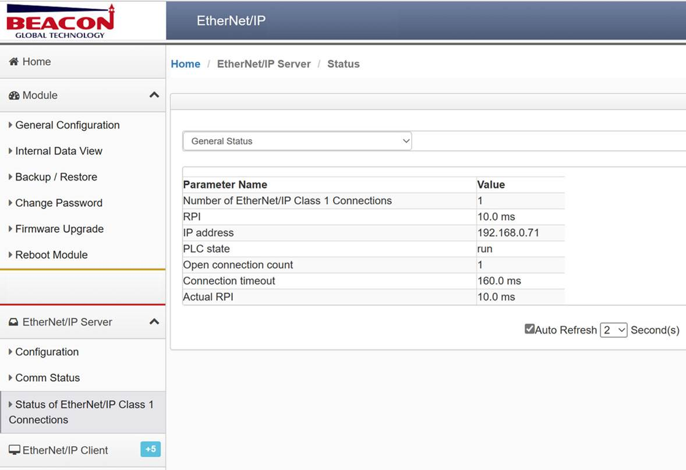

数据对应关系如下：0-1499内部寄存器是RSLogix 5000输入的区域，1500-2999内部寄存器是RSLogix 5000输出的区域，如有特殊应用可以调整起始地址，但不建议调整长度，每种不同型号模块的输入输出区域不一样，请查看每种型号模块的技术参数表，确定内部寄存器数量。

| __EN:0:I.Data[0] - EN:0:I.Data[247]对应模块内部寄存器0-247的地址__| *输入* |
| :----------------------------------------------------------- | :----- |
| EN:0:O.Data[0] - EN:0:O.Data[247]对应模块内部寄存器1500-1747的地址 | 输出   |
| EN:1:I.Data[0] - EN1:I.Data[247]对应模块内部寄存器250-497的地址 | 输入   |
| EN:1:O.Data[0] - EN1:O.Data[247]对应模块内部寄存器1750-1997的地址 | 输出   |

数据对应关系如下：

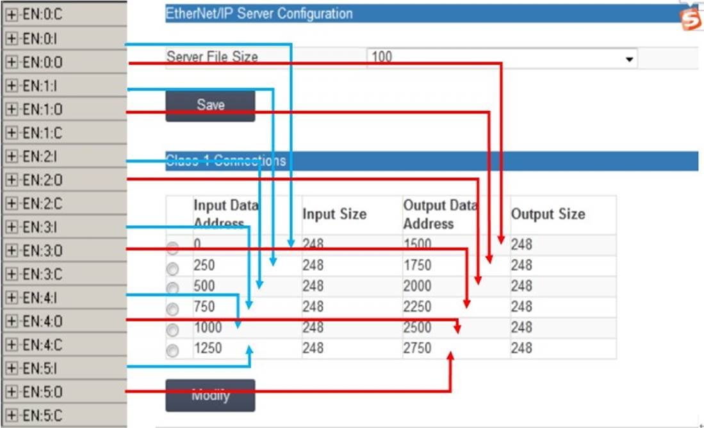

举例1：在 EN:0:O.Data[0]到 EN:0:O.Data[5]写一些数据。 

查看模块内部寄存器 1500 起始位置的寄存器显示，模块接收到这些数据。

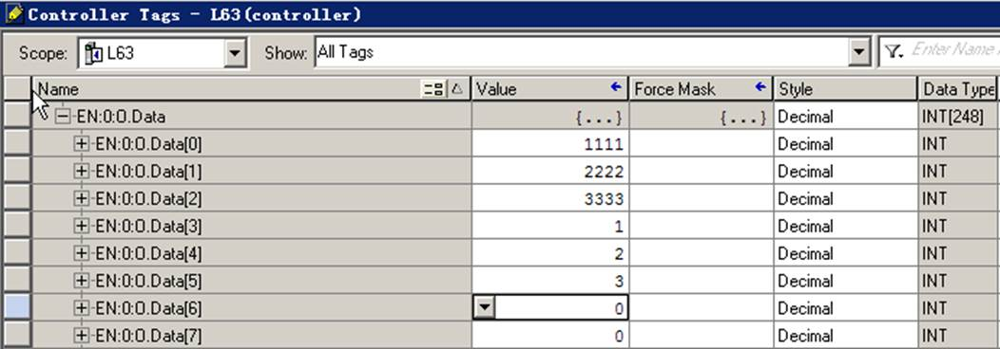

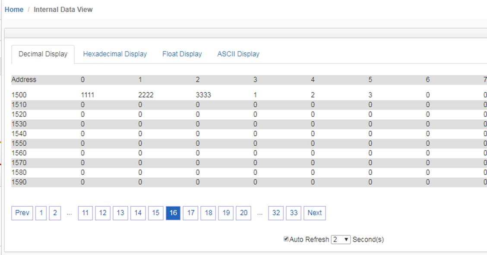
