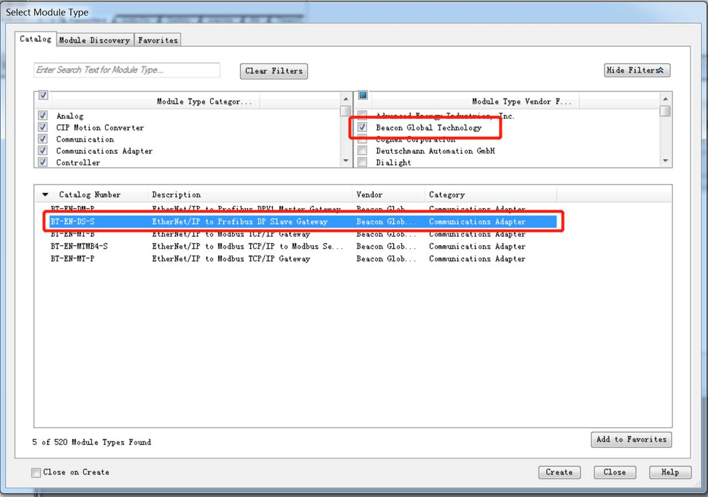
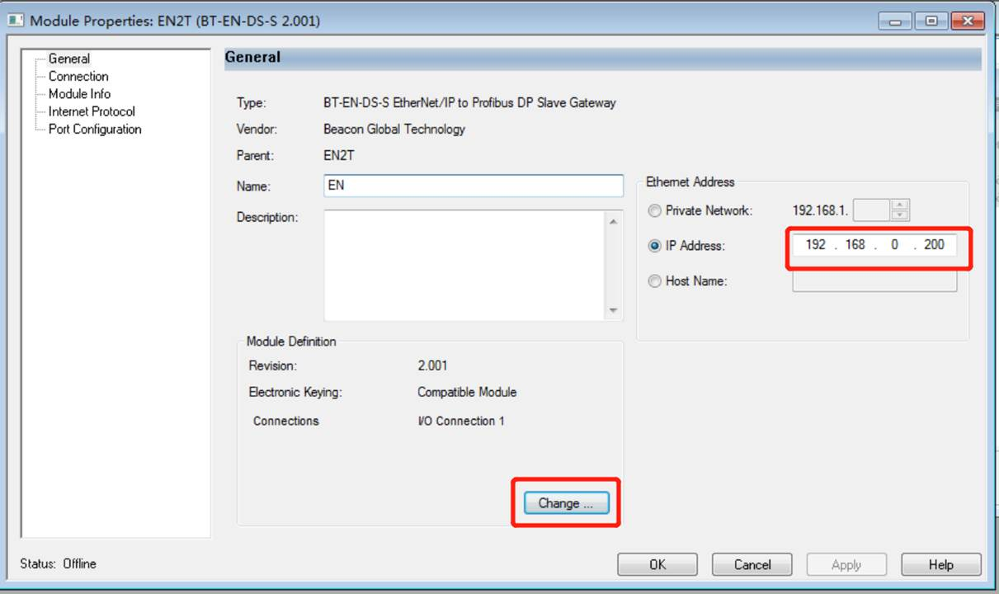
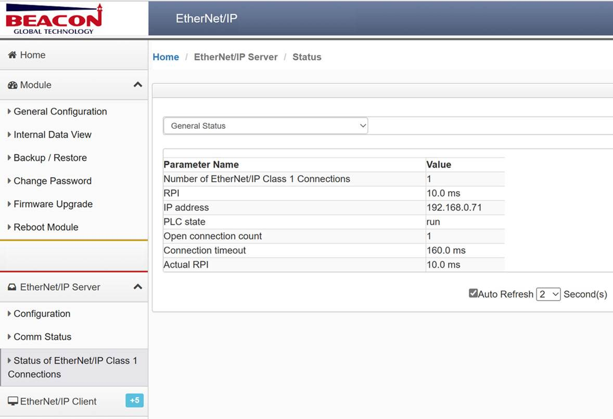
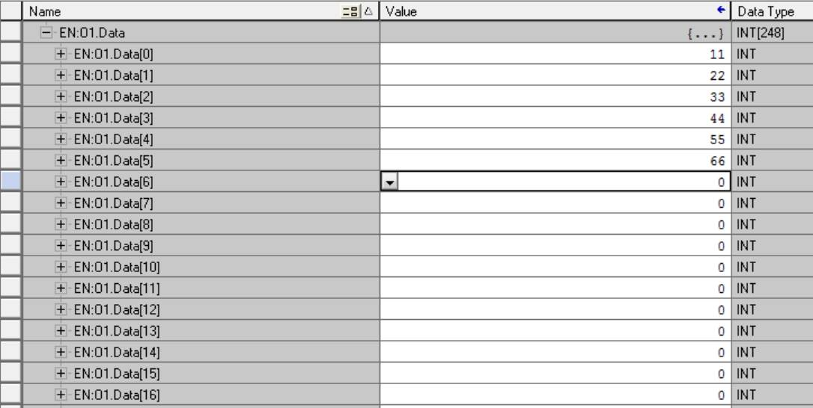
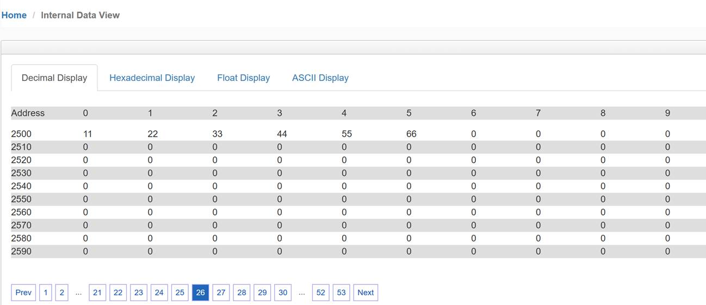

# 配置EtherNet/IP Server（从站）方法2

接下来我们介绍另外一种用直接添加模块做从站的方法。

该方法前提RSlinx软件能扫描出模块，并已导入模块对应的EDS文件（导入方法可以参考上述内容）。

打开 RSLogix 5000 软件，在硬件配置的以太网模块下面中添加新模块。

在“Beacon Global Technology”里选择添加对应的BT网关模块，如下图。

设定模块的IP地址，该地址为E1端口地址。

点击“Change”设定PLC I/O connection的参数。

Revision修改为对应的版本号，Electronic Keying：选Compatible Module。

把Size默认的“SINT”修改为“INT”，请使用Input和Output都为248个字。

可在“I/O Connection 1”下方添加“I/O Connection 2”，每一个 I/O Connection都需要进行如上的配置。

以上步骤完成后，在模块Status栏查看状态。

数据对应关系如下：

| EN:0:I.Data[0]-  EN:0:I.Data[247]对应模块内部寄存器0-247的地址 | 输入 |
| :----------------------------------------------------------- | :--- |
| EN:0:O.Data[0]]-  EN:0:O.Data[247]对应模块内部寄存器2500-2747的地址 | 输出 |
| EN:1:I.Data[0]-  EN1:I.Data[247]对应模块内部寄存器250-497的地址 | 输入 |
| EN:1:O.Data[0]]-EN1:O.Data[247]对应模块内部寄存器2750-2997的地址 | 输出 |

如下图，在RSLogix5000第一个I/O链接的输出标签的开头写一些数据，查看模块内部寄存器 2500 起始位置的寄存器显示，模块接收到这些数据。

