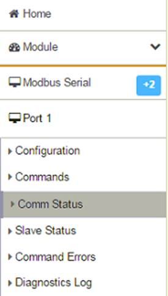
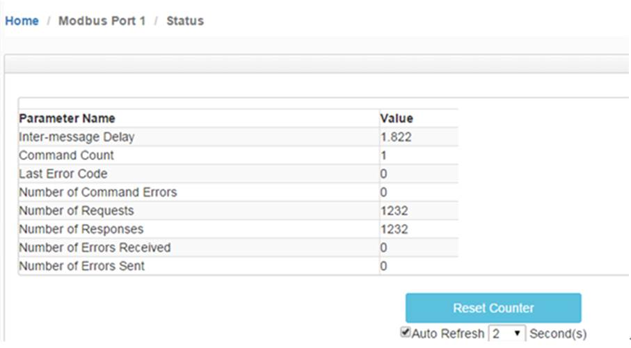
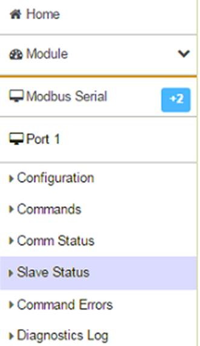
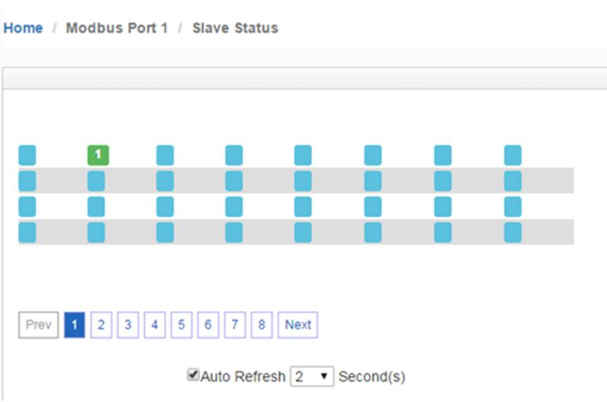
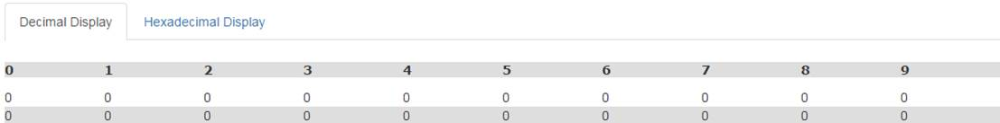
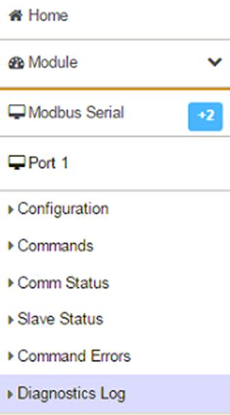
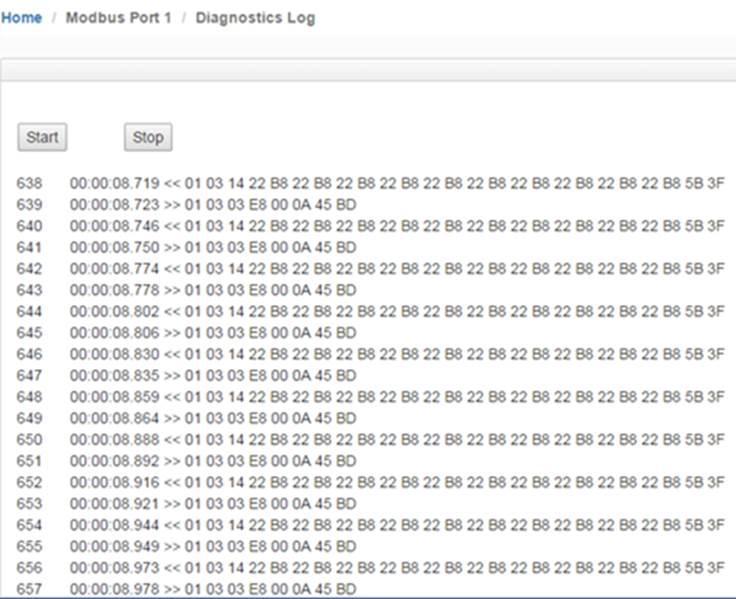
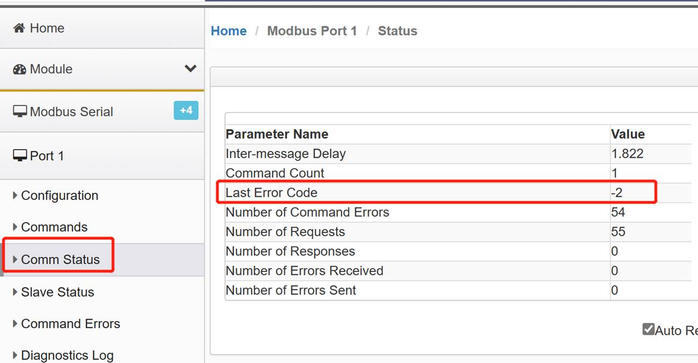
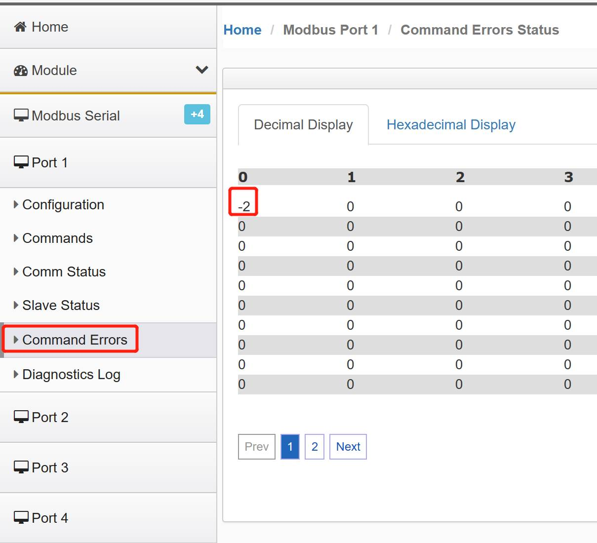

# Modbus RTU 协议错误诊断

## **Modbus RTU** **诊断方式**

在“Port 1”下点击“Comm Status”查看主站端口命令是否有错误，发包和收包状态

 

可视化查看从站状态 点击“Slave Status” 可以看到1号从站是绿色的。

 

点击“Command Errors”查看命令行是否有错误产生点击：

报文诊断功能：点击Diagnostics Log,再点击Start端口发送和接收报文的情况.

\>>符号是S1端口发送的报文，<<符号是S1端口接收的报文。

   

 

 

## 错误代码

 

在模块使用Modbus RTU协议时，用户可以在模块页面查看通讯状态以及命令错误代码，从而快速了解问题所在。

 

 

相关错误代码明细如下：

 

| 代码 | 代码（16进制） | 描述         |
| ---- | -------------- | ------------ |
| -1   | 0xFFFF         | 未知错误     |
| -2   | 0xFFFE         | 命令超时     |
| -3   | 0xFFFD         | 发送超时     |
| -4   | 0xFFFC         | CTS超时      |
| 12   | 0x0C           | 消息长度错误 |

 