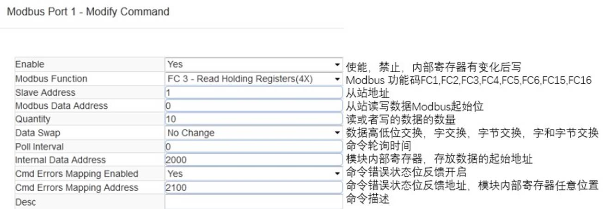
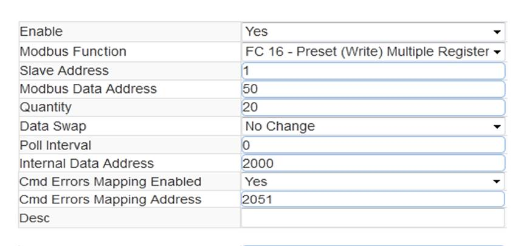
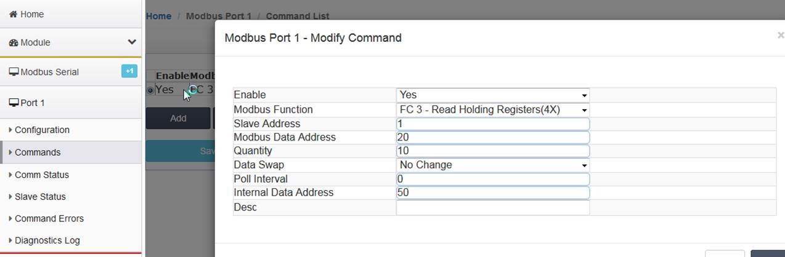
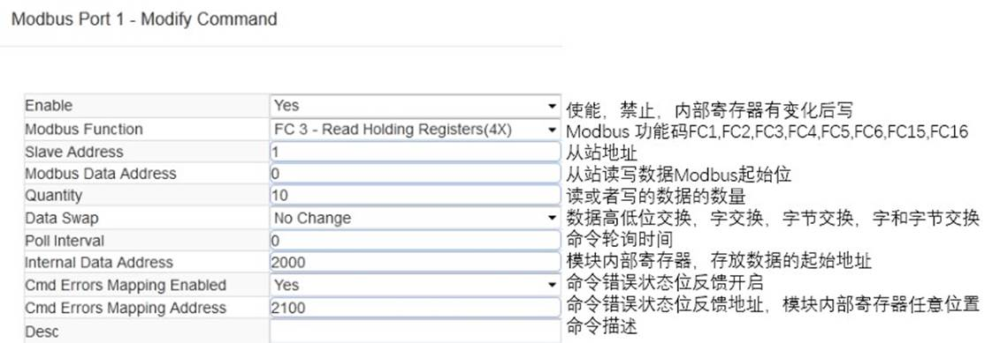
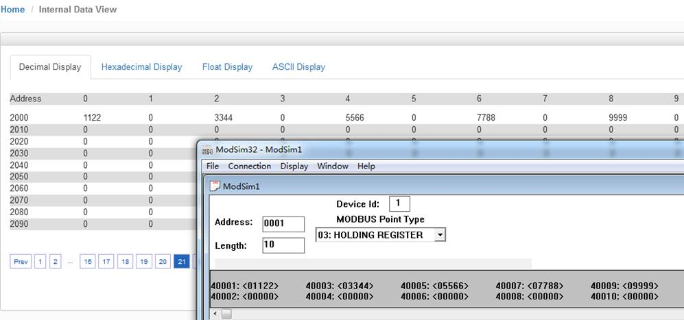
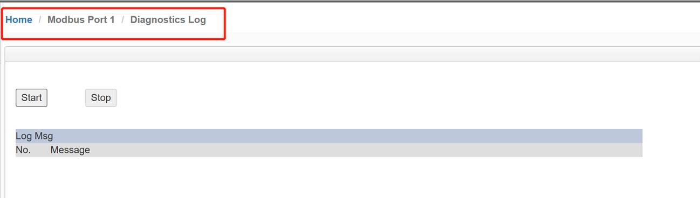
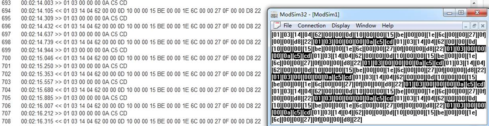
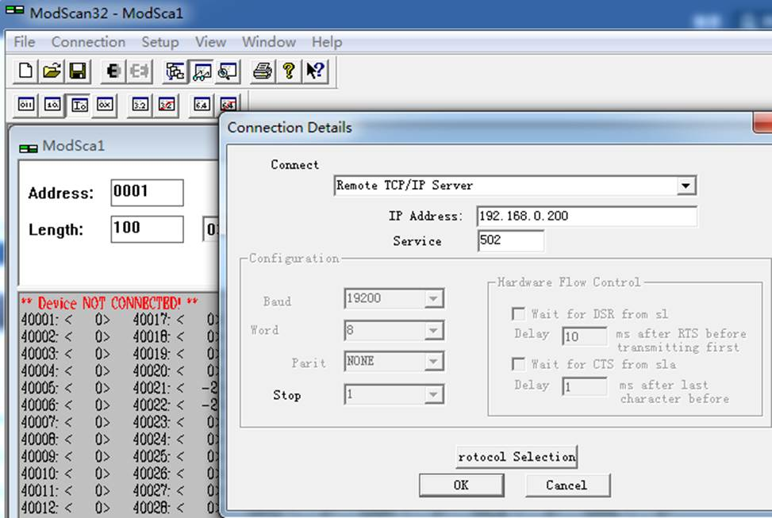
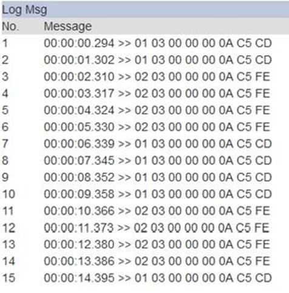

# 配置Modbus RTU Client（主站）

首先打开浏览器，进入模块主配置页面，在左侧导航栏点击Modbus Serial --- Port1 里面的 Configuration, 显示S1端口配置的页面： 如下图

此处模块作为Modbus主站，请根据需要连接的Modbus从站情况，合理在此页面配置参数。

点击Port1 里面的 “Commands” 显示S1端口命令的配置页面，点击Add。 出现如下指令配置页面：

Modbus主站命令说明，采用功能码控制读写区域，注意一定要先确定模块内部数据的范围。以下举例中采用的模块最多可以支持4000个字数据区地址范围，实际配置模块时，请按照模块真实数据区大小进行指令的使用。模块内部寄存器是16位的INT格式，读写Bool的时需要注意16倍关系。

 

以上指令说明如下：模块使用功能码 FC3，从站数据起始地址是 0等于40001.读取数量是 100. 模块内部寄存器起始地址 2000。表示读1号从站，从站数据地址范围为 40001-40100的100个字，放到模块内部寄存器 2000-2099,命令没有正确返回在内部寄存器 2051 报错。 

如果功能码是FC4 时（只读），从站数据起始地址是 0等于30001.读取数量是 100.模块内部寄存器起始地址 2000，表示读1号从站，从站数据地址范围为 30001-30100 ，放到模块内部寄存器 2000-2099, 命令没有正确返回，会在内部寄存器 2051 报错。

 

以上指令说明如下：模块使用功能码 FC1 时，从站数据起始地址是 0等于00001,读取数量是 16（此处读取16个位等于读取一个字）.模块内部寄存器起始地址 32000（此处为位地址，读取16个位等于读取一个字，模块内部寄存器是字，所以实际上模块内部寄存器的起始地址为32000/16=2000）。表示读1号从站，从站数据地址范围为 00001-00160， 放到模块内部寄存器起始地址为 2000（因为读取到16个位数据，等于1个字数据，所以只占用模块内部寄存器一个地址）,命令没有正确返回在内部寄存器 2051 报错。 

如果是功能码 FC2 时（只读），从站数据起始地址是 0.读取数量是 16.模块内部寄存器 32000，同上表示读1号从站，从站数据地址范围为 00001-00160， 放到模块内部寄存器 2000, 命令没有正确返回，会在内部寄存器 2051 报错。

 

以上指令说明如下：Conditional表示有条件情况下，模块使用功能码 FC6或者FC16 时，写出数量是 20.模块内部寄存器起始地址为 2000，表示当模块内部寄存器范围 2000-2049的任意寄存器发生数据发生变化时候，触发一条写的命令，数据从模块写到1号从站，从站接收数据地址范围为 40051-40071，命令没有正确执行，会在内部寄存器 2051 报错。 

 

以上指令说明如下：模块功能码 FC6 或者 FC16 时，写出数量是 20.模块内部寄存器起始地址 2000。表示内部寄存器 范围2000-2049的数据，一直连续的写出到1号从站，从站接收数据的地址范围为 40051-40071，命令没有正确执行，会在内部寄存器 2051 报错。

 

 

**举例**：

 

命令说明：把MODBUS RTU从站的40021-40030这10个16位的数值读到内部数据库50-59里面。配置完，点SAVE，然后关闭这个命令，再点击SAVE，把这个命令保存到命令列表里面，然后根据提示重启模块。

用户在配置好模块MODBUS RTU主站端口后，可以利用MODBUS RTU仿真软件MODSIM32，作为MODBUS RTU从站，仿真测试与模块主站端口通讯。

 

打开MODSIM 32软件，配置端口2参数，从40021-40030写入十个数据。点击OK。可以看到模块主站对应的内部数据区也相应的显示出从站的数值变化。

 

 

**举例**：介绍Cmd Errors Mapping Enabled 和 Cmd Errors Mapping Address 这两个参数 

Cmd Errors Mapping Enabled 表示命令错误是否映射，选择 YES 表示使用，选择 NO，表示不使用 

Cmd Errors Mapping Address 表示命令错误映射的地址。

上图命令表示：读取 1 号从站,从站数据地址范围 40001-40010， 这 10 个数放到内部起始地址为 2000的连续10个寄存器内（2000-2009），如果发送错误，错误反馈会放到内部寄存器 2100 里面。 

指令执行效果如下图显示

通过查看命令状态“**comm Status**”可以看到命令执行情况，通过点击 Mosim32 菜单栏显示报文，可以查看从站与主站的发送和接收报文的情况。

通过查看从站可以直接看到各路从站的通讯状态，1-31 路都可以直观看到。

绿色表示线路数据通讯报文都正常； 

红色表示线路数据通讯报文都不对； 

绿色和红色闪烁表示线路正常，数据通讯报文不正常

通过查看命令错误“Command Errors”可以看到从站报的错误值，如果开启了命令反馈功能，这个值也会送到工程师填写的命令错误存放地址里面。

通过诊断报文，可以查看主站发送和接收的报文情况。点击 Start，就可以看到下面报文发送和接受的情况。

下图为主站发送和接收的报文以十六进制格式显示，Modsim32也可以从十进制报文切换到十六进制报文显示

## **Modbus** **命令使能控制介绍**

新版本增加了 Modbus RTU 做主站的命令使能控制，这个作用是表示可以控制发出几个命令，比如模块连接了 15 个从站，如果有一个从站坏掉了，这时候 Modbus RTU 网络会变慢，主站每次发送命令会等待这个从站响应，解决的办法是不发送这个从站的命令，具体使用方法如下。

上图中建立两条指令 。

1- 读 1 号从站的 40001-40010 到内部寄存器 0-9，错误状态放在了内部寄存器 20 

2- 读 2 号从站的 40001-40010 到内部寄存器 10-19，错误状态放在了内部寄存器 21 

使能命令触发地址，在模块Modbus主站端口配置页面中，Command Trigger Address 设置成 30，如下图，表示使用模块内部起始地址为30的寄存器作为触发条件。然后保存，重启生效。

之后使用 Modscan 仿真作为 Modbus 从站，用 Modscan 的 40031 和 40032 可以模拟控制这两条指令的触发状态。

 

ModScan 的 40031 和 40032设置为1，可以看到模块内部寄存器地址30数据是1，内部寄存器地址31也是1，表示以上两条指令处于触发情况。模块内部寄存器地址20-21数据是-2，表示有错误代码，说明以上两条指令都没有正确执行。

 

直观表现如下：检查 Port1 报文发送情况，显示第一条命令发送 4 次 ，第二条命令发送 4 次。因为命令本身发送 1 次，如果找不到从站设备，该命令会重新发送 3 次，共计4次。 

重发次数，可以在端口配置中进行修改（如下图）。

以上两条指令都没有正确执行，如果是 2 号从站有问题，我们可以把 2 号从站的命令停止发送。

需要修改 Modscan 中 40032 的数值，从 1 改成 0（如下图），这样相当于停止了触发读取2号从站的指令。

   

就实现了模块只读取 1 号从站数值的报文。避免了多个从站中有一个或两个掉线而影响整体 Modbus RTU 网络变慢的情况。 

该功能建议配合前文提到的命令反馈功能一并使用，当其中一个命令返馈回来出现非 0 值，PLC 的程序可以自动关联这个触发值去停止Modbus指令的执行 。
