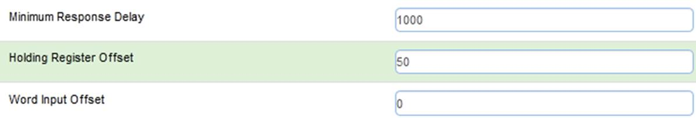
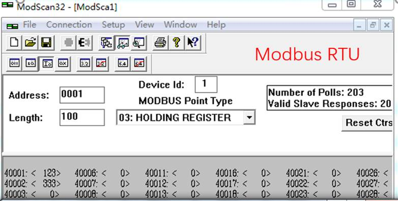
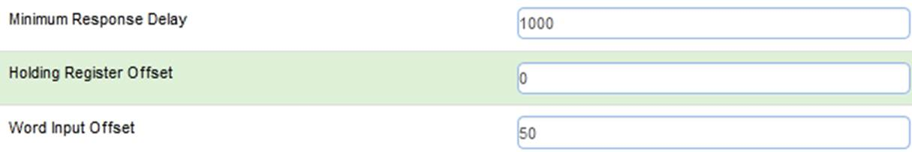

# 配置Modbus RTU Server（从站）

点击Port1 里面的 Configuration 显示S1端口配置的页面：

注意事项： S1作为Modbus RTU从站，只需要配置端口参数，无需配置端口命令。

模块做Modbus RTU从站时，需要搞清楚内部寄存器与Modbus RTU数据对应关系**：**

| 
 模块内部寄存器 | 0           | 1           | 100         | 1000        | 2000        |
| ----------------------------------------- | ----------- | ----------- | ----------- | ----------- | ----------- |
| Modbus地址（4区）                         | 40001       | 40002       | 40101       | 41001       | 42001       |
| Modbus地址（3区）                         | 30001       | 30002       | 30101       | 31001       | 32001       |
| Modbus地址（1区）                         | 10001-10016 | 10017-10032 | 11601-11616 | 26001-26016 | 42001-42016 |
| Modbus地址（0区）                         | 00001-00016 | 00017-00032 | 01601-01616 | 16001-16016 | 32001-32016 |

打开Modbus RTU仿真软件ModScan32，其作用是仿真Modbus RTU主站。软件连接作为Modbus RTU从站的模块。选择Connection，选择电脑的USB-485接口COM2，修改波特率，数据位，奇偶校验位，停止位等参数与模块的端口参数一致。点击OK，可以看到连接的发送和接收次数。在40001等数据区进行写数据，可以看到模块内部对应寄存器同样有数据显示。

备注：40001对应着内部寄存器0，40100对应着内部寄存器99，以此类推。

Modbus RTU配置成从站时，在主页面，可以设置接收地址偏移。

**Holding Register Offset**使用方法：Modbus RTU主站，在40001和40002输入两个数据，正常情况下，这两个数据应该会被写入到模块内部寄存器0-1当中去。如果此处偏移量设置成50(如下图)，则数据会直接偏移写入模块内部寄存器50-51里面。 4区，3区，1区，0区同样遵循这个原理。

 

**Word Input Offset**使用方法：如果此处偏移量设置成50(如下图)，Modbus RTU 主站一侧在3区对30001和30002输入两个数据，数据会直接向后偏移放到模块内部寄存器50-51里面，ModScan32仿真软件不能载入3区的数值，请以现场设备实际数据区域来填写。

