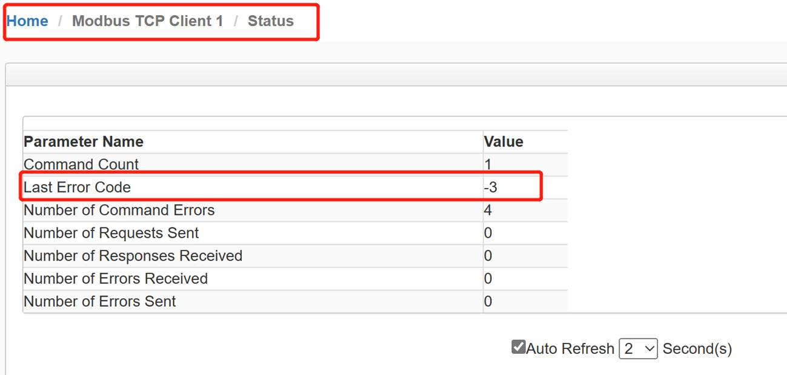
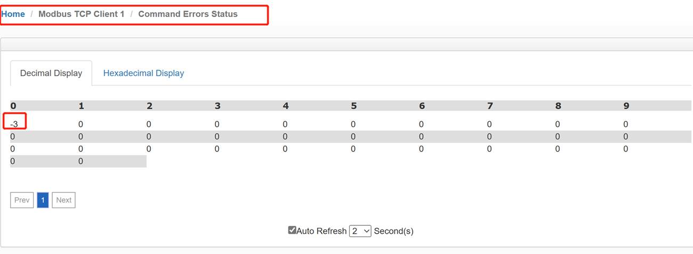

# Modbus TCP/IP 协议错误诊断

**错误代码**

在模块使用Modbus TCP/IP协议时，用户可以在模块页面查看通讯状态以及命令错误代码，从而快速了解问题所在。

相关错误代码明细如下：

| 代码 | 代码（16进制） | 描述         |
| ---- | -------------- | ------------ |
| -2   | 0xFFFE         | 命令超时     |
| -3   | 0xFFFD         | 发送超时     |
| -5   | 0xFFFB         | 连接已终止   |
| -6   | 0xFFFA         | 消息长度错误 |

 