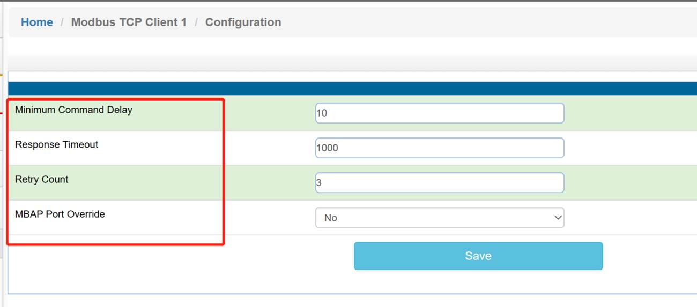
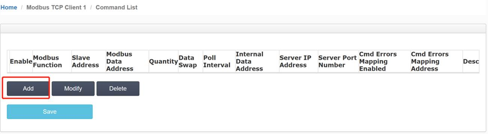
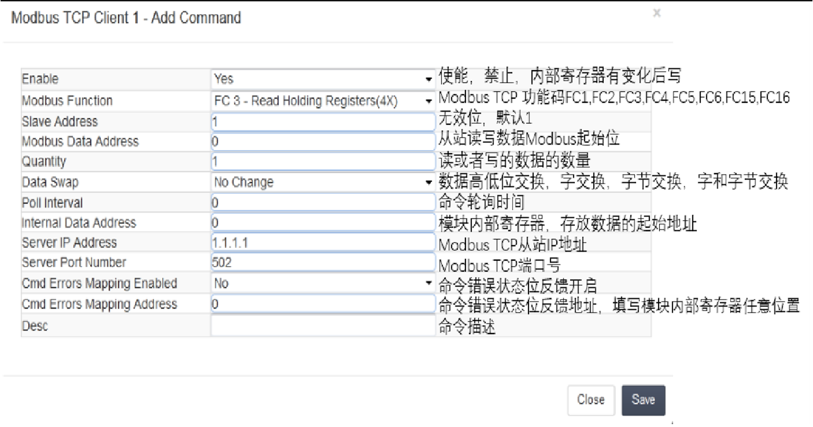
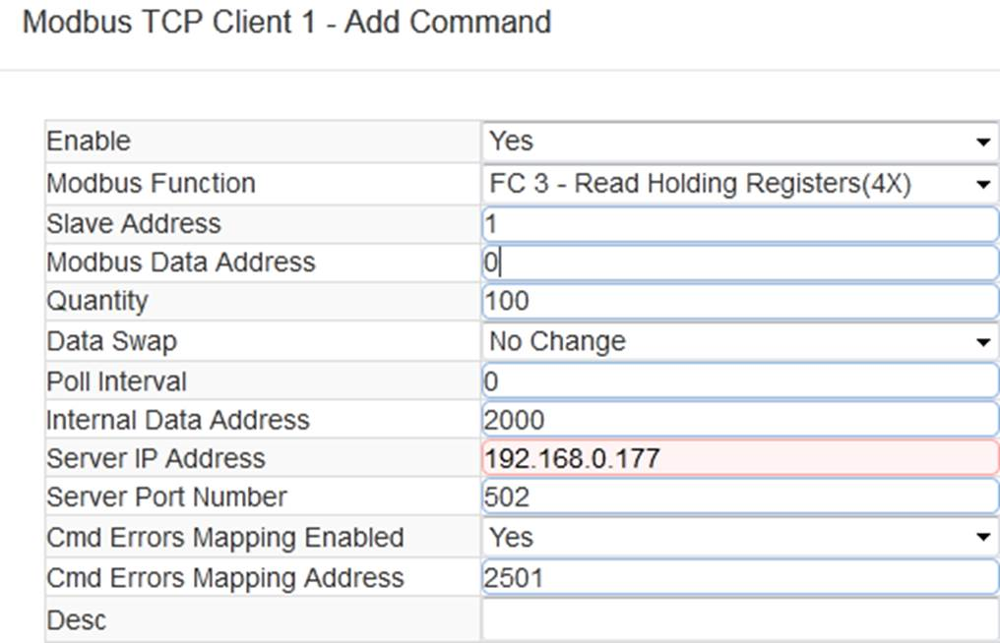
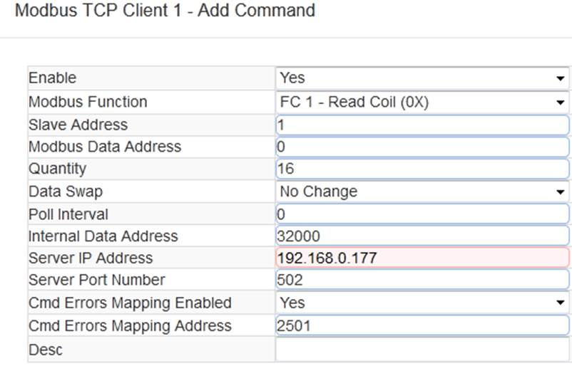
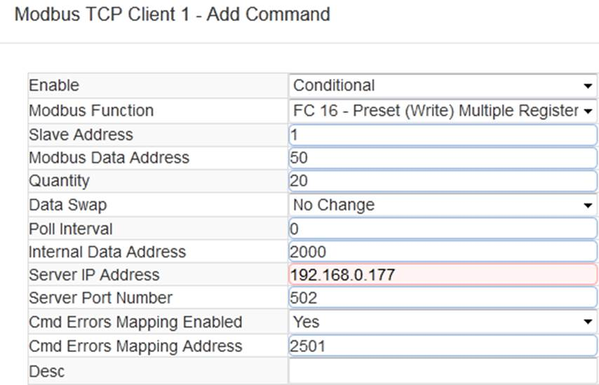
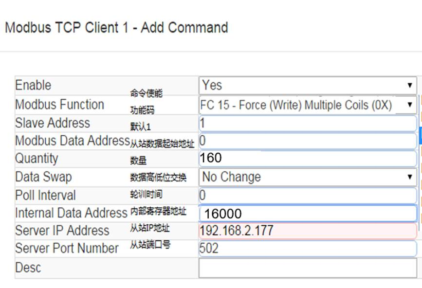

# 配置Modbus TCP/IP Client（主站）

如下图点击Modbus TCP/IP Client---Client1---Configuration

点开Configuration.查看默认的配置

此配置默认就可以使用。

Minimum Command Delay：每个Client执行指令的轮询时间单位ms ：0-65535。

（注：该时间越小,发送命令越快，但并非越小越好，需要先查看从站设备的说明书，确定从站响应时间是否能及时接受和反馈，主站发送命令的间隔。）

Response Timeout：所连接设备的响应时间单位ms：0-65535。

Retry Count：重新尝试连接次数0-65535。

MBAP Port Override：端口502覆盖NO/YES。

点击Modbus TCP/IP Client---Client1---Commands。

点击Add,可以增加一条命令，命令如下

命令说明：采用功能码控制读写区域，模块内部寄存器是16位的INT格式，读写Bool的时需要注意16倍关系。

（注意，先要确认模块的内部寄存器数据区大小，不同型号模块数据区大小不同，以下举例中的指令配置均按照10000个字的数据区举例。实际配置模块时，请严格参照模内部数据区的范围。）

以上指令含义如下：模块使用功能码FC3，从站数据起始地址是0等于40001。读取数量是100。模块内部寄存器起始地址2000。表示读IP地址为192.168.0.177的从站，从站数据地址范围40001-40100的100个字，放到模块内部寄存器2000-2099,命令没有正确返回在内部寄存器2051报错。

如果功能码是FC4时（只读），从站数据起始地址是0等于30001。读取数量是100。模块内部寄存器起始地址2000，表示读IP地址为192.168.0.177的从站，从站数据地址范围为30001-30100，放到模块内部寄存器2000-2099,命令没有正确返回，会在内部寄存器2051报错。

以上指令含义如下：模块使用功能码FC1时，从站数据起始地址是0等于00001,读取数量是16（此处读取16个位等于读取一个字）.模块内部寄存器起始地址32000（此处为位地址，读取16个位等于读取一个字，模块内部寄存器是字，所以实际上模块内部寄存器的起始地址为32000/16=2000）。表示读IP地址为192.168.0.177的从站，从站数据地址范围为00001-00160，放到模块内部寄存器起始地址为2000（因为读取到16个位数据，等于1个字数据，所以只占用模块内部寄存器一个地址）,命令没有正确返回在内部寄存器2051报错。

如果是功能码FC2时（只读），从站数据起始地址是0.读取数量是16.模块内部寄存器32000，同上表示读IP地址为192.168.0.177的从站，从站数据地址范围为00001-00160，放到模块内部寄存器2000,命令没有正确返回，会在内部寄存器2051报错。

以上指令说明如下：Conditional表示有条件情况下，模块使用功能码FC6或者FC16时，写出数量是20。模块内部寄存器起始地址为2000，表示当模块内部寄存器范围2000-2049的任意寄存器发生数据发生变化时候，触发一条写的命令，数据从模块写到IP地址为192.168.0.177的从站，从站接收数据地址范围为40051-40071，命令没有正确执行，会在内部寄存器2051报错。

以上指令说明如下：模块功能码FC6或者FC16时，写入数量是20.模块内部寄存器起始地址2000。表示内部寄存器范围2000-2049的数据，一直连续的写出到IP地址为192.168.0.177的从站，从站接收数据的地址范围为40051-40071，命令没有正确执行，会在内部寄存器2051报错。

以上指令说明为：功能码FC15时，从站数据起始地址是0.模块写出Bool的数量是160（16的整数倍，160位实际为10个16位字）.调用模块内部寄存器起始地址16000（16的整数倍，16000位的实际起始地址为1000），表示将模块内部字寄存器1000-1009当中160个位的数据（10个整型数），写入从站地址00001-00160当中。
