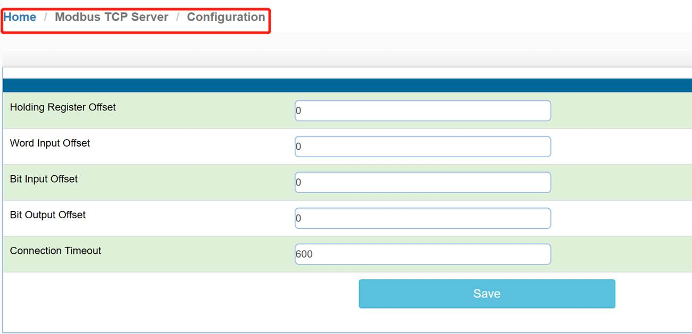
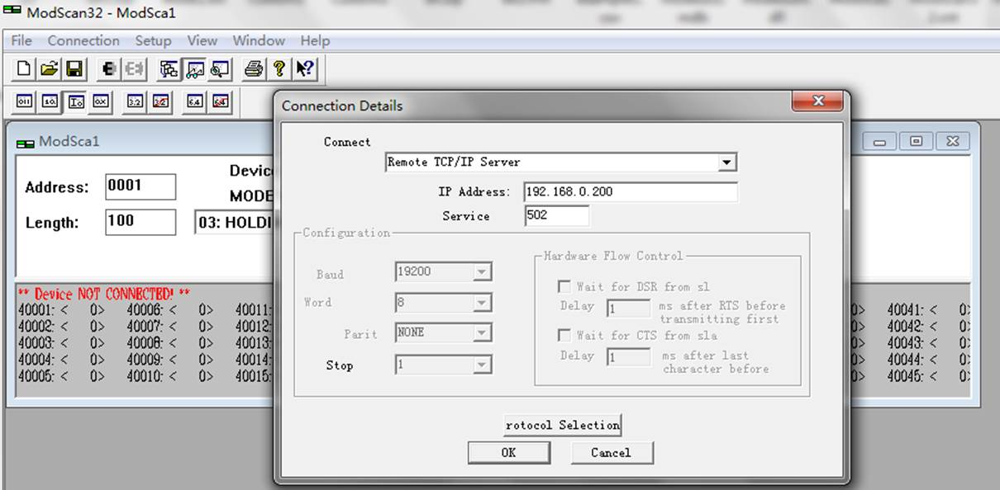
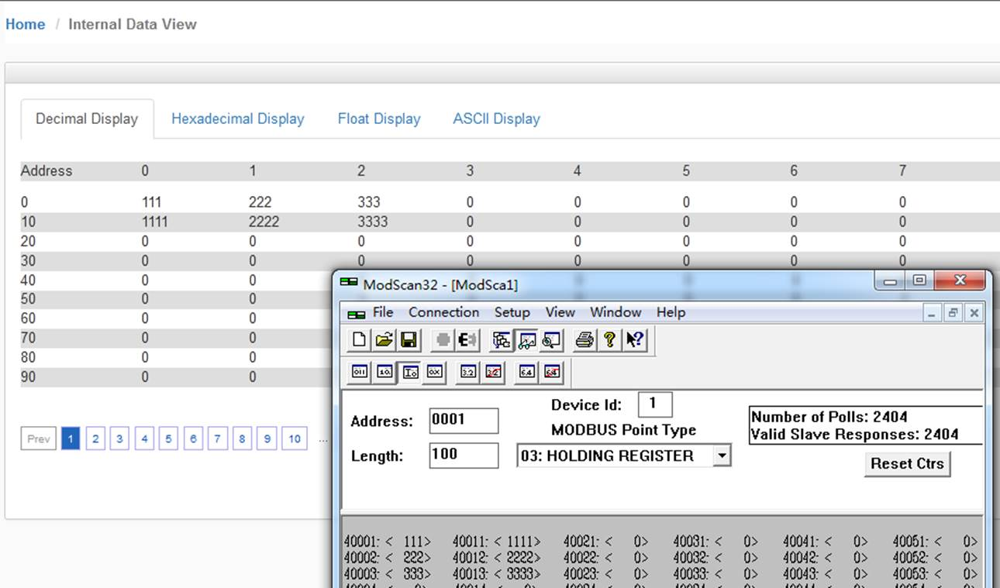
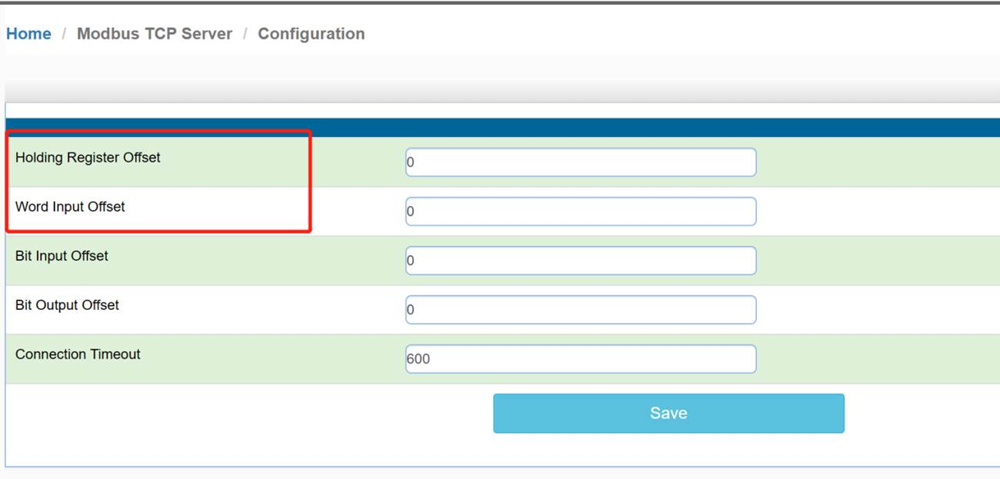
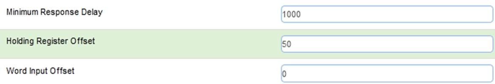
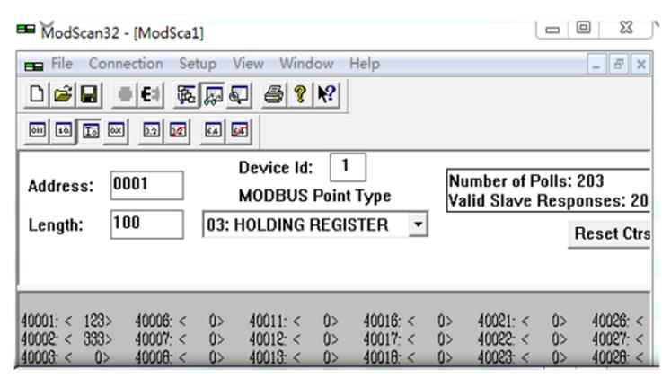
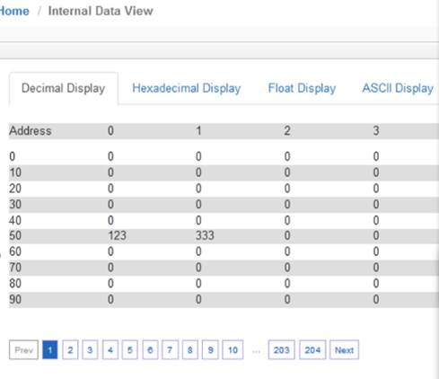
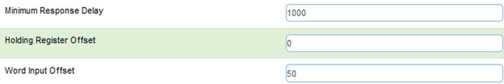

# 配置Modbus TCP/IP Server（从站）

配置Modbus TCP/IP Server一般默认初始配置即可。

模块内部寄存器对应着 Modbus TCP/IP 地址如下： 

| 
 模块内部寄存器 | 0           | 1           | 100         | 1000        | 2000        |
| ----------------------------------------- | ----------- | ----------- | ----------- | ----------- | ----------- |
| Modbus地址（4区）                         | 40001       | 40002       | 40101       | 41001       | 42001       |
| Modbus地址（3区）                         | 30001       | 30002       | 30101       | 31001       | 32001       |
| Modbus地址（1区）                         | 10001-10016 | 10017-10032 | 11601-11616 | 26001-26016 | 42001-42016 |
| Modbus地址（0区）                         | 00001-00016 | 00017-00032 | 01601-01616 | 16001-16016 | 32001-32016 |

用户可以用Modbus TCP/IP 仿真软件 ModScan32测试连接模块 Modbus TCP/IP Server。修改本地电脑 IP 地址为 192.168.0.177（与网关Modbus TCP/IP端口同一网段）。

举例：打开ModbusTCP仿真软件ModScan32，作用是仿真ModbusTCP主站。使用功能码FC03，读写模块内部数据区0-99的连续100个字的数据，40001对应内部寄存器0，40100对应内部寄存器99，以此类推。选择Connection，选择RemoteTCP/IPServer，填写模块E1口的IP地址192.168.0.200，端口号默认502。然后点击OK。

ModScan32软件可以对内部寄存器读写同时进行，在40001-40003，40011-40013写一些数据，查看模块内部寄存器地址0-2和10-12里面的数据情况。数据能完整对应，同时可以看到ModScan32软件右上角发送了2404次，接收了2404次。如果有错误，发送和接收的数据次数会不相等。

模块设置成为Modbus TCP/IP从站的时候，在configuration界面中，可以看到下图两个选项。

**Holding Register Offset**使用方法：

Modbus TCP/IP主站对模块写数据，在40001和40002输入两个数据，正常情况下，这两个数据应该会被写入到模块内部寄存器0-1当中去。如果此处偏移量设置成50(如下图)，则数据会直接偏移写入模块内部寄存器50-51里面。4区，3区，1区，0区同样遵循这个原理。

**Word Input Offset**使用方法：

如果此处偏移量设置成50(如下图)，Modbus TCP/IP主站一侧在3区对30001和30002输入两个数据，数据会直接向后偏移放到模块内部寄存器50-51里面，ModScan32仿真软件不能载入3区的数值，请以现场设备实际数据区域来填写。

