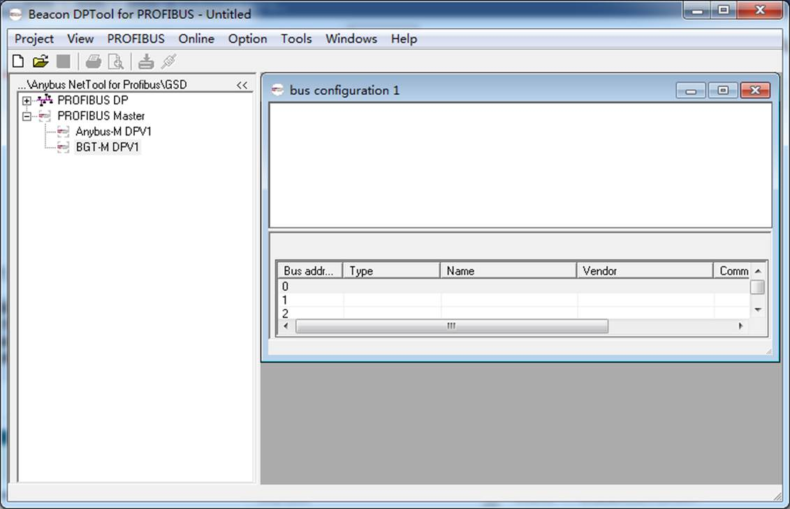
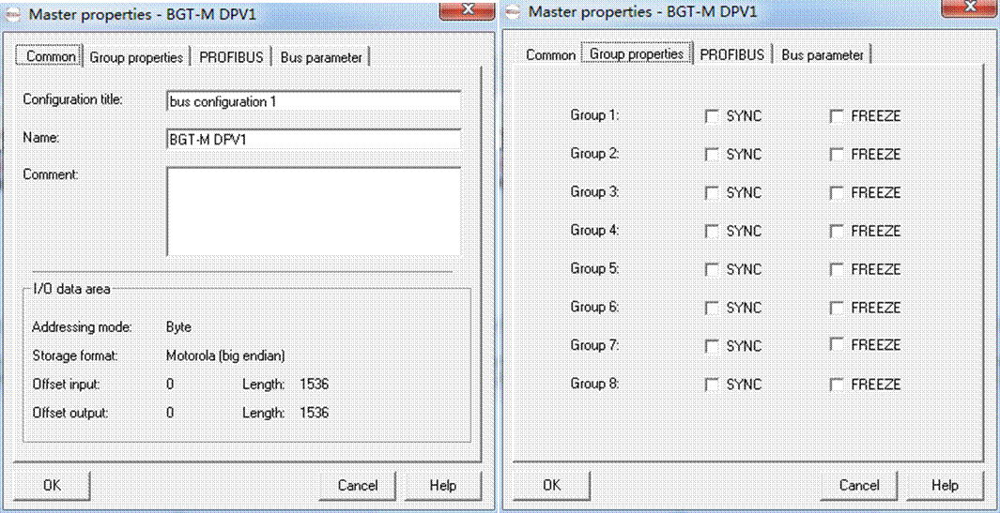
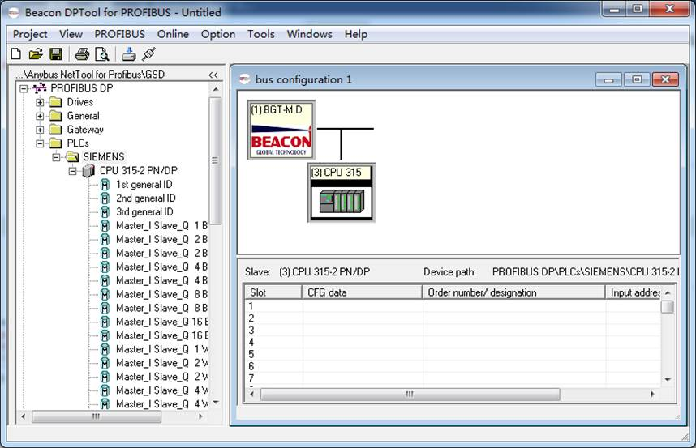
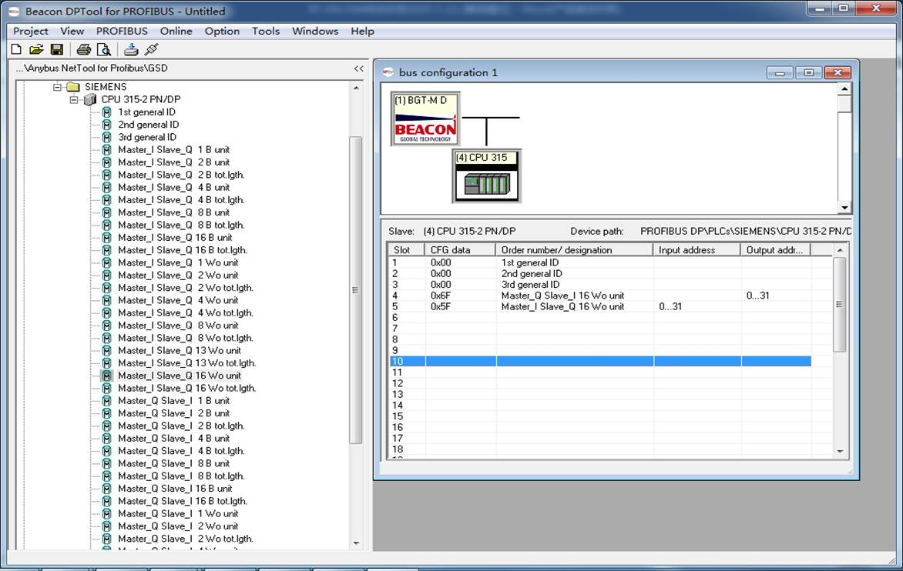
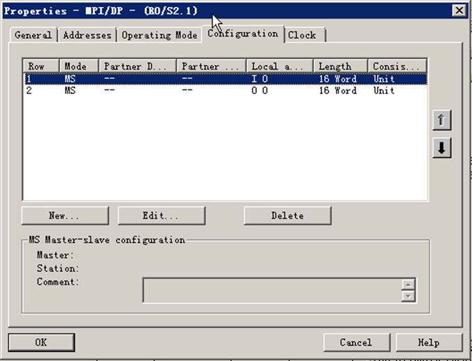
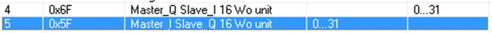
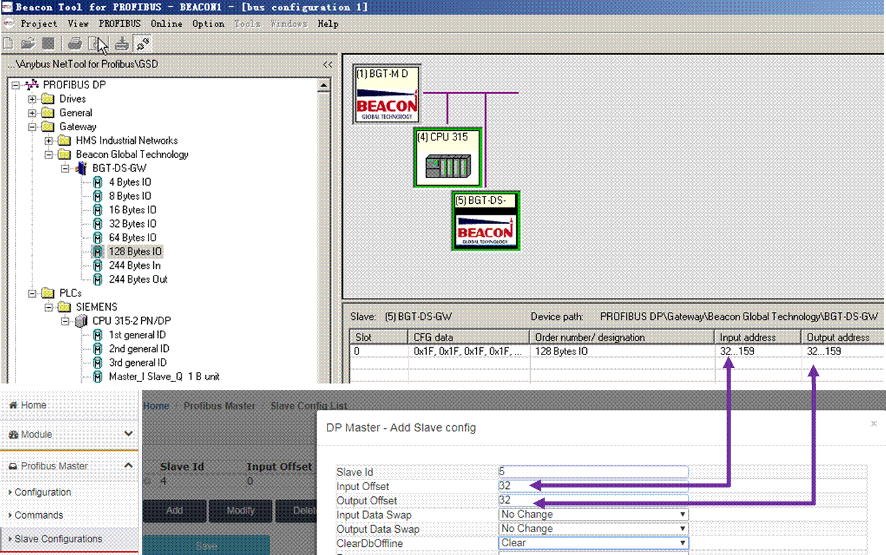
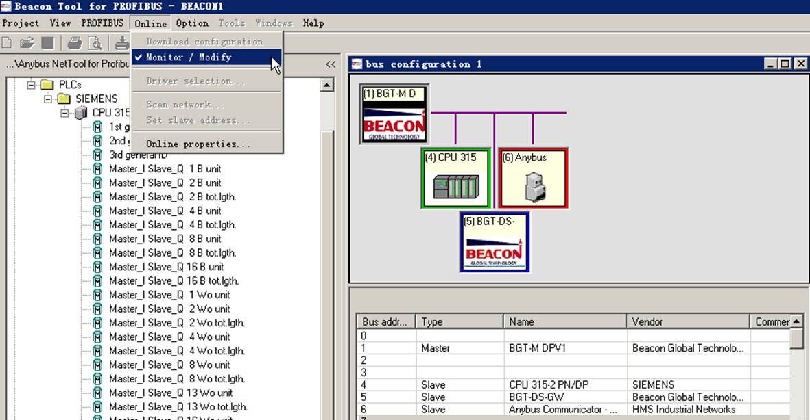
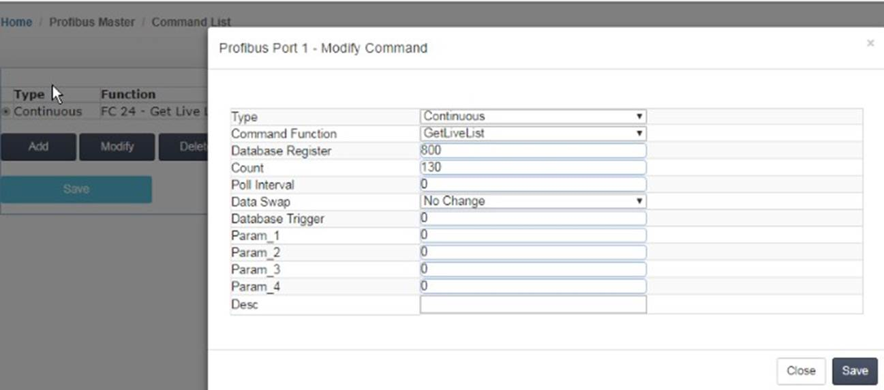
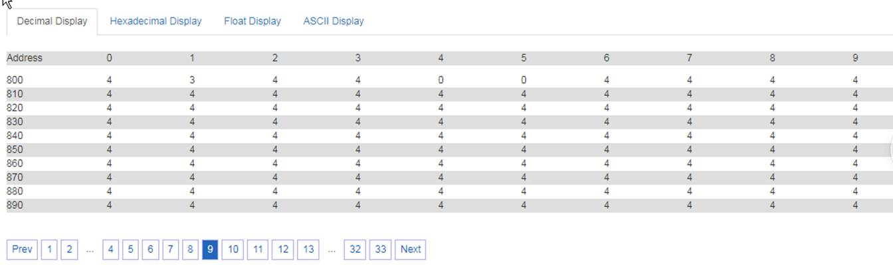

# 配置Profibus DP Master（主站）

对模块参数进行配置，点开模块 Home –>Profibus –>Master Configuration（如下图所示）

在该窗口中可以配置 Profibus 主站的输入数据量（Input data size）和输出数据量（Output data size），此参数可根据用户的实际应用进行设置。此页面中 ： 

DP 从站对于模块的输入起始地址为 0，代表 DP 主站读取 DP 从站数据，存储在模块内部数据区的起始地址； 模块对于 DP 从站输出起始地址为 1500，代表 DP 主站写给 DP 从站数据，调用模块内部数据区的起始地址。

注意：此处“Master Configuration”配置页面中的输入/输出起始地址，和后文中提到的“Slave configuration”配置页面中的输入/输出起始地址，正好相反。

DP Master的输入起始地址=DP slave 的输出起始地址

DP Master的输出起始地址=DP slave 的输入起始地址。

同时该窗口还可以对输入数据、输出数据的字节转换方式进行设置。建议选择默认参数即可，如果所连的从站设备类型为同一设备类型（例如从站都是西门子 S7-300 PLC），且需要字节高 8 位和低 8 位交换，可以在该窗口设置输入和输出数据交换。如果所连接从站设备类型为不同设备类型 (例如有西门子 DP 从站，传感器 DP 从站)，就不用在该窗口设置数据交换，后面篇幅会介绍具体交换的方法。 

 由于配置 Profibus 网络比较复杂，因此我们为客户提供了专门的 Profibus网络配置软件 DP MASTER （该软件可在模块随机 U 盘内找到，无需安装，可直接在 WINDOW 环境中运行），该软件可实现以下功能： 

 1、建立一个 Profibus 网络项目； 

 2、对主站模块进行配置； 

 3、Profibus 网络的配置（包括主站和从站的配置）；

 4、将配置文件传输到模块。 

运行 DP MASTER 软件配置模块前，先找到包装内的黑色 USB 数据线电缆，电缆 USB 端口连接电脑 USB 端口，另一端连接模块 CFG 端口。

电脑运行 DP MASTER软件，进入 PROFIBUS-DP 组态页面，点击左上角新建项目。

拖动 BGT-M DPV1 图标到右侧 bus configuration 1 的空白页面里面，然后开始对 DP 主站进行配置。

双击BGT-M DPV1 图标显示 DP 主站配置的界面如下 4 张图所示。用户只需要修改波特率即可，其余参数默认。

## 组态Profibus-DP Slave （从站）设备

在DP MASTER 软件上组态PROFIBUS-DP从站设备，首先安装新的 DP 从站 GSD 文件。鼠标右键点击 PROFIBUS DP,出现 Install new GS*-file… ，选择导入对应的 DP 从站 GSD 文件。

拖动 DP 从站设备加入到 DP 网络中进行组态，双击图标从站会弹出从站属性对话框，我们在这里可以对从站设备的一些属性参数进行设置。

1、 Slave name：从站名称设置 

2、 Profibus address：从站站点地址设置，有效输入0‐125 

3、 Activate：激活从站，如果不激活则从站停止和主站的数据交换 

4、 WatchDog：是否启用看门狗，如果启用看门狗设置则意味着主站对从站的轮询一定要在定义的看门狗 

时间内，如果超时，则从站自动复位。 

5、 Sync/Freeze：是否启用同步和冻结模式，最大8组，通过Group assignment可设置相关组别。

 

## 配置从站的 IO 数据文件

首先我们展开导入的从站设备，展开后我们可以看到一个配置数据列表，该列表根据所选从站设备的不同，GSD 文件的不同，配置列表也不同。（举例，添加西门子 315-2PN/DP PLC 的 GSD 文件） 。

点击从站设备，会弹出从站的配置表格，从这里我们添加从站的 IO 模块，左键点住 16words in put 拖到右下表格中，这样一个 16 个 word 的输入模块我们就添加进来了，同理我们还可以添加一个 16words out put 的输出模块。 

  这时 DP 从站的 IB0—IB31 和 QB0—QB31 的数据就可以和这个 Profibus-DP 主站模块进行数据交换了。如果增加两个或多个输入输出模块，Input address 和 Output address 会随着模块的增加自动分配 Profibus 地址。

点击保存 Profibus DP 网络配置并返回到主站设置窗口，将配置文件下载到模块里面。将模块包装内自带的 USB 数据线，电缆 USB 端口链接到电脑 USB 接口。可以通过包装里面自带的 USB 设备的驱动，安装好该驱动后，查看电脑设备管理器会出现 COM 号,然后把 数据线另一端接口连接模块的 CFG 端口上，下载网络配置文件。

点击“Create..”创建一个新的串口下载路径，然后点右侧图形的 OK 按钮，弹出选择对应的串口 COM 号，点击OK ,这样下载路径就建立完毕。然后点击菜单栏下载配置文件到模块里面。

回到模块的网页配置界面（登录后操作），点击 Slave Config List ，点击Add 按钮可以增加配置 4 号从站输入输出字节的高位和低位交换。**注意：如果涉及到** **EtherNet/IP** **的产品型号，由于罗克韦尔和西门子数据字的高 8** **位和低8** **位是反向的，所以这里需要选择 Byte Swap** **字节交换****。**“**ClearDbOffline**”表示 DP 从站离线或者发生断线情况下，是否保留断线之前的数据，这里可以选择不清零或者清零。配置完成后，点击 Save，提示 Success 成功。再点击配置列表里面的 Save 保存所有的配置。

以上步骤便完成了 DP 主站模块和一个设备从站的配置。

同时西门子 315-2 PN/DP PLC 作为 DP 从站的硬件设置如下：

 

 

配置好硬件后，下载到西门子 CPU，之后点击 PLC 变量表查看输入输出关系，如下图： 

 

第一行是 DP 从站输入的 16 个字，对应模块（DP 主站）输出区域，模块内部寄存器地址 1500-1515 

第二行是 DP 从站输出的 16 个字，对应模块（DP 主站）输入区域，模块内部寄存器地址 0-15 

 下图为模块内部寄存器地址区域分配的配置 

 接下来我们继续介绍添加第二个 DP 从站的方法及配置。 

举例：配置第二个 DP 从站（BEACON 系列 DP 从站模块，5 号站） ，方法与前面介绍相同。从下图可以看到，

5 号从站自动分配的地址输入和输出范围都是 32-159，这里的范围是字节显示方式，而模块内部寄存器是字

的显示方式。所以模块内部寄存器实际对应的输入、输出地址范围应该为 16-80 个字。同样也可以在模块

网页中配置 5 号从站的数据交换模式和清零模式。

由于 5 号从站为非西门子设备，所以字节高低位并不需要交换，另外用户也可以选择 DP 从站离线后，模块内部寄存器是否清零。

如下图显示，添加第二个 DP 从站的配置。由于前文配置的第一个 DP 从站设备，已经占据了模块内部寄存器输入和输出的前 32 个字节（0-31 字节=0-15个字寄存器）的地址，所以第二个 DP 从站所使用的模块内部数据区的起始地址，需要向后偏移 32 个字节。所以在输入偏移和输出偏移的地址需要填写 32。

此处需要注意，“Slave configuration”配置页面中的 input 地址区域是该 DP 从站的输入数据区域，对应 DP 

Master 的 output 地址区域；同理，DP 从站设备对模块（DP 主站）的 output 数据区域，对应于 DP Master 数据的 input 地址区域；所以此处的配置代表如下含义： 

模块（DP 主站）写给该 DP 从站的数据，将来自于模块内部寄存器地址 1516 到 1580 的区域，同时模块（DP主站）读取该 DP 从站的数据，将被保存在模块内部寄存器地址 16 到 80 的区域。模块对该 DP 从站输入和输出数据出高低位字节不交换，该 DP 从站离线后，内部寄存器清零。

点击保存，然后点击重启模块，使配置生效。后面要接入更多的 DP 从站均可按照这个规则进行配置。

 举例：配置 3 个从站，获取从站在线和离线状态到模块内部寄存器。 

 

在配置软件中，从站绿色外框表示从站 GSD 文件正确，输入输出字节数与从站输出输入字节数一致，DP 终端电阻和 DP 线路正确。

从站蓝色外框（红色外框偶尔闪烁）表示从站 GSD 文件不正确，或者 GSD 文件配置的输入和输出与从站的输出和输入字节数不相符 DP 线路正确。

从站红色外框表示从站线路不正确，有可能是 DP 中断电阻拨码不对或者是线路没有按照 Profibus-DP 标准来接线。 

再次点击网页配置模块的部分（需登录后操作），点击 Profibus Master---Command，点击 Add 按钮增加从站状态反馈，可获取 127 个从站的状态，Count 填写规则要大于 127，800 表示状态值从内部寄存器 800 开始放置。配置完成后，点击 Save，提示 Success 成功。再点击配置列表里面的 Save 保存所有的配置。

 

在模块的内部寄存器页面中，如上图： 状态值0表示从站正常运行，4表示从站离线状态。  
