# 配置Profibus DP Slave（从站）

点击Profibus Slave

点开Configuration.查看默认的配置

这里需要特别注意，此处设置的input和ouput都输对于DP主站而言的。

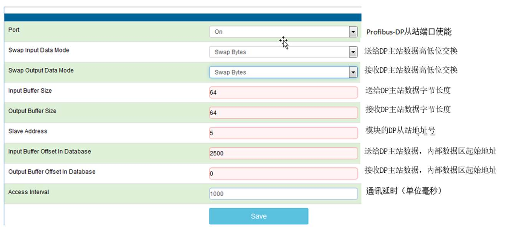

在西门子PLC一侧，添加OB1,OB82,OB83,OB84,OB85,OB86,OB87,OB121,OB122.功能块

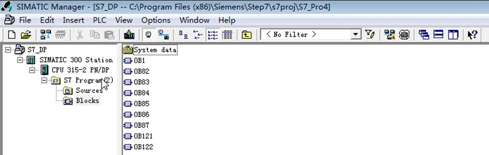

在西门子PLC中安装模块DP从站的GSD文件。

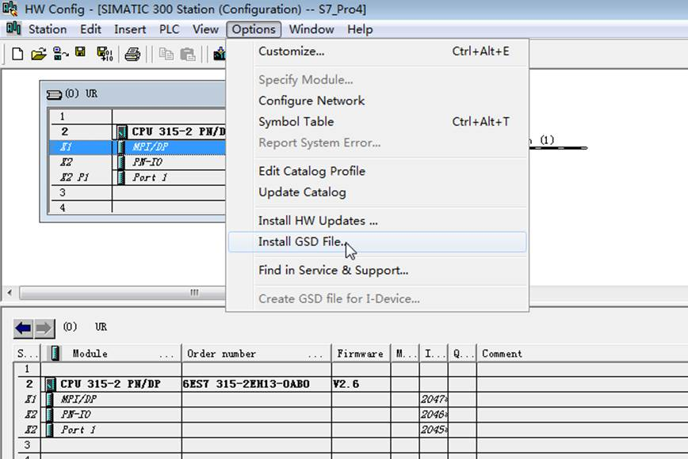

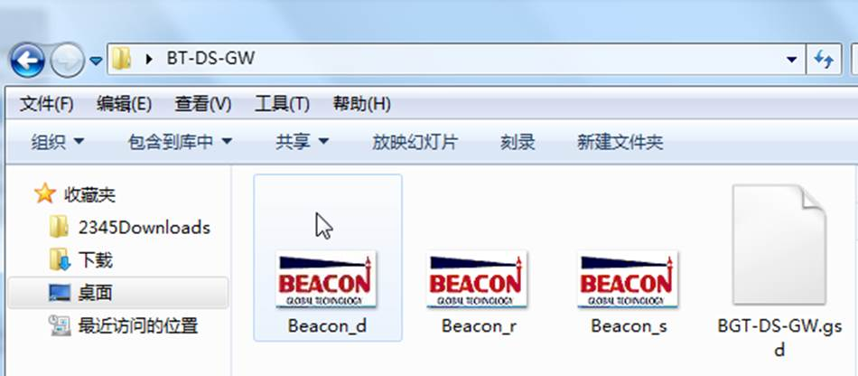

GSD文件可在随机带的U盘里面找到。

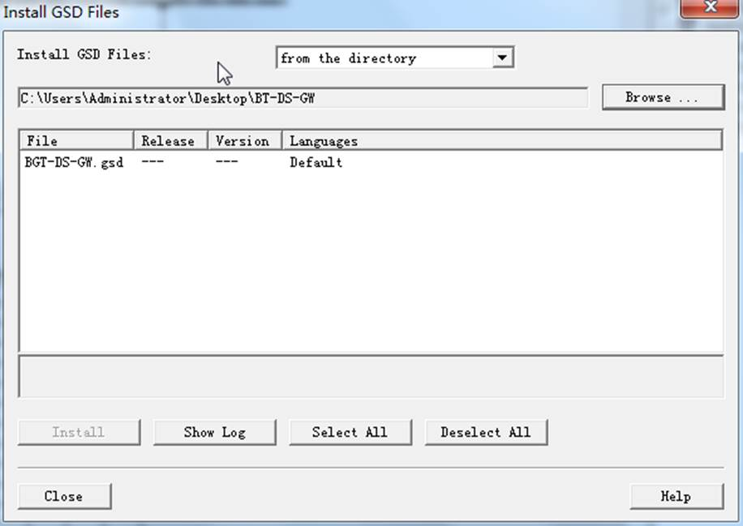

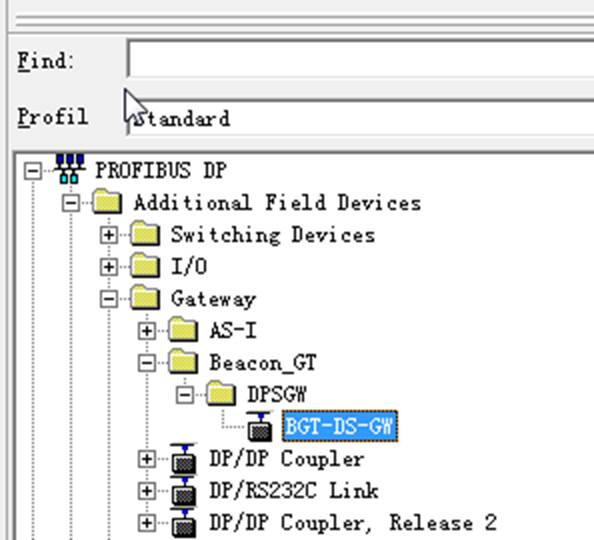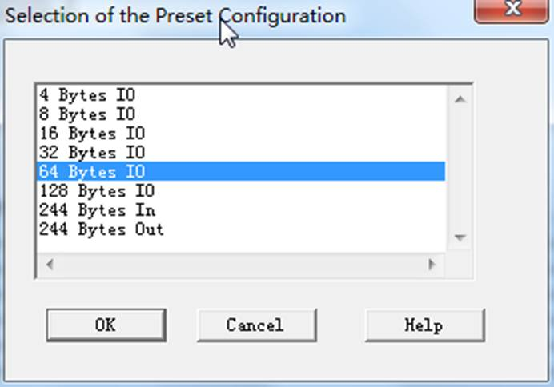

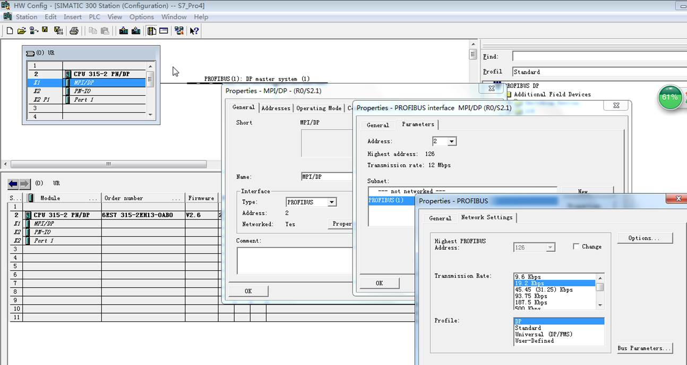

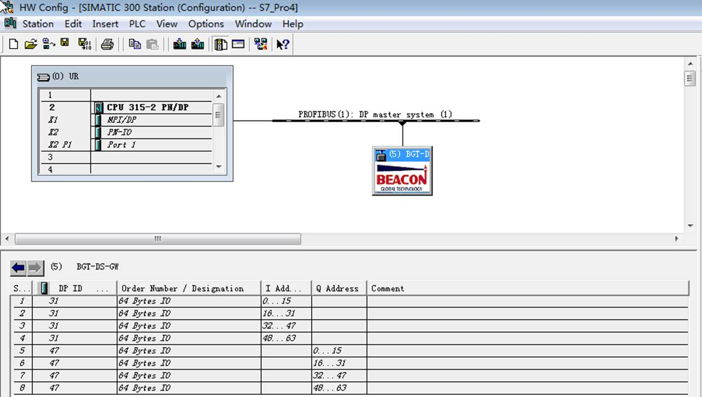

配置完，下载程序到西门子PLC，然后监控标签，新建一个变量表，写一些数据，强制变量。

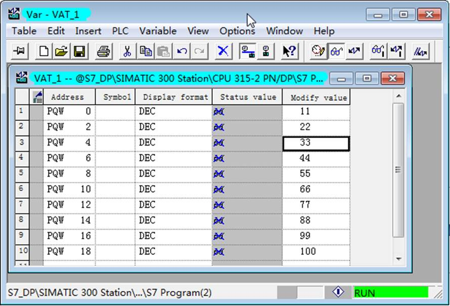

在模块的profibus slave----slave stauts检查DP通讯状态，如下图。

 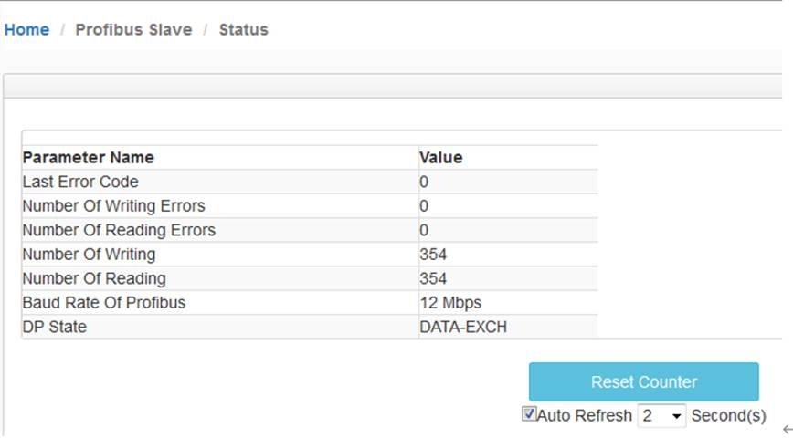

检查模块内部数据区是否有数据。注意，模块接收DP主站数据的内部数据区起始地址为0。

前文中介绍在模块Profibus Slave配置页面中，可以对模块接收、发送DP主站数据的内部数据区起始地址进行设定。如下图：

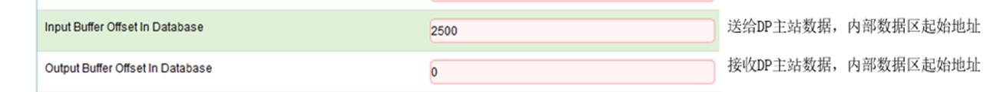

可以看到模块内部数据区，从0-9，接收到了西门子PLC写入的数据。

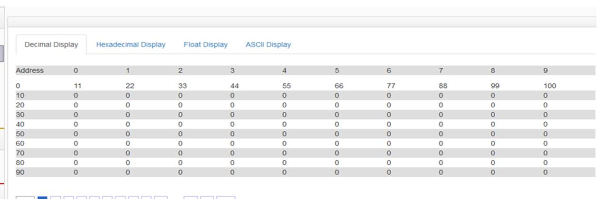

检查西门子输入数据。刚才我们设定了，西门子PLC作为DP主站，采集模块内部数据区的起始地址为2500，如下图。

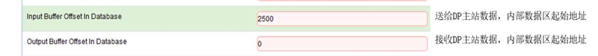

如果我们通过了其他协议在模块内部寄存器 2500-2747 的地址赋值（根据其他不同型号模块，可使用对应的协议驱动对模块赋值）。就可以在西门子 S7-300一侧，采集到写出的数据。

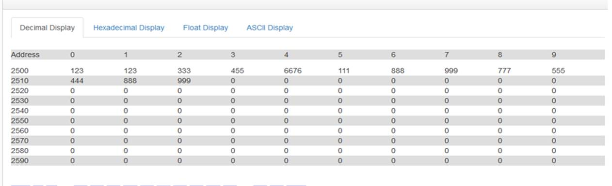

