## **举例1.西门子S7-1200 PLC和罗克韦尔 PLC 之间交换数据**

本案例中模块EtherNet/IP 协议端配置Server使用，Profinet RT协议端同样配置Server使用。

首先打开一个PLC项目，这里我们以PLC 西门子1215C为例。PLC为Profinet IO主站连接从站的模块。

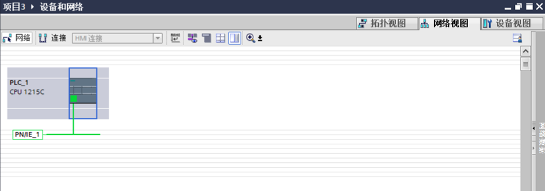

您可通过Beacon Global Technology官网获取到模块的GSD文件并解压缩，下载地址：http://www.beaconglobaltech.com/productdetail.php?id=BT-MT-PNA

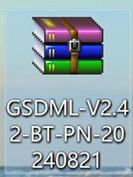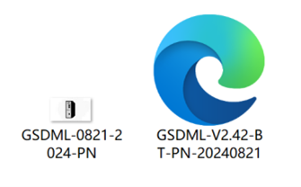

安装BT-XX-PNA的GSD文件。

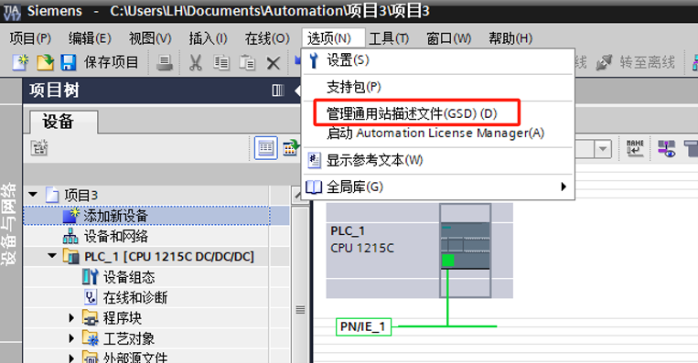

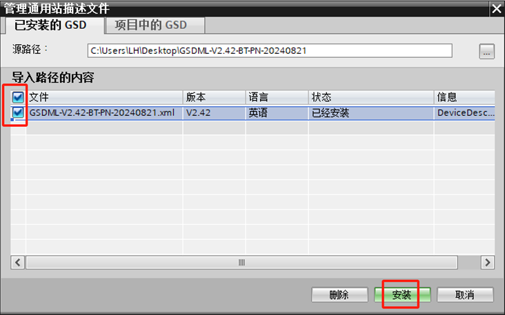

找到解压缩目录，安装好GSD。在目录下的其他现场设备 >>PROFINET IO>> Gateway下找到安装好GSD的设备。

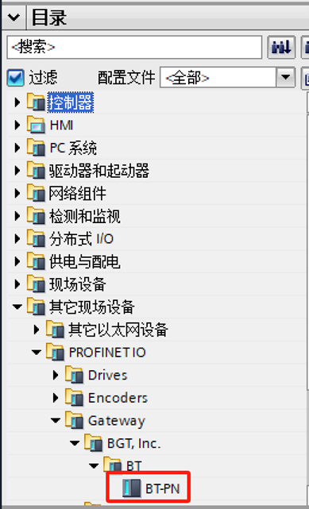

鼠标拖动设备 “BT-PN”放到网络视图中分配Profinet连接。

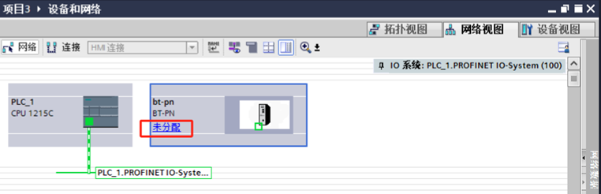

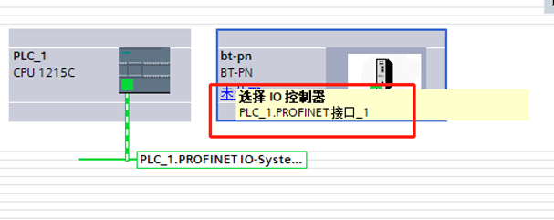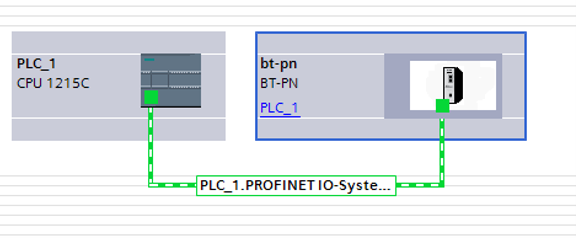

分配好Profinet连接后点击模块BT-PN，在“设备视图”给模块添加输入输出。添加的IO大小从而决定了模块与PLC的数据交换大小。

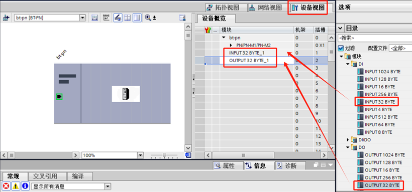

修改模块的IO周期时间，修改到8ms，初始设定的IO周期因太短会通信中断，导致触发看门狗报警。

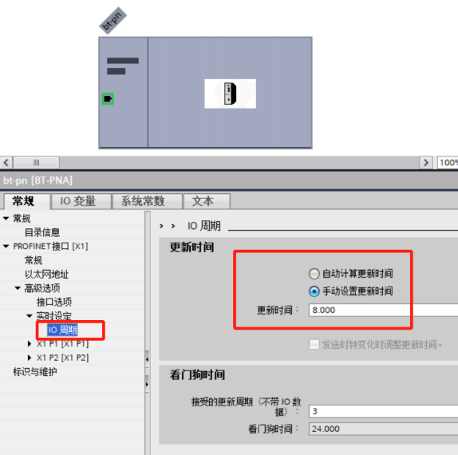

可以选择修改模块的Profinet设备名称和IP地址。**（注：模块的Profinet IP与模块IP相同，在这里修改Profinet IP后再分配设备名称时，模块的IP同样会进行更改）**

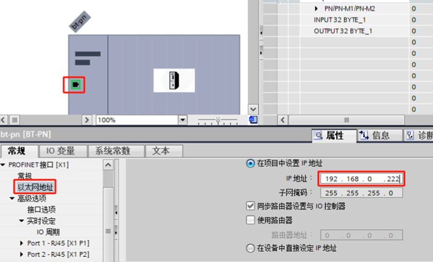

**（点击“bt-pn”处可以修改设备名称，设备名称尽量不要有下划线，会影响模块GSD的自动识别。添加多个模块时，PLC自动分配的初始设备名称会有下划线）**

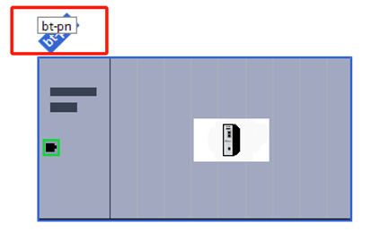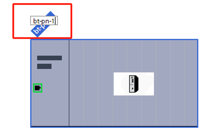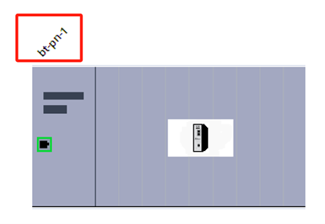

然后右键单击模块分配设备名称，分配成功的同时也会分配模块BT-PN对应的Profinet IP。

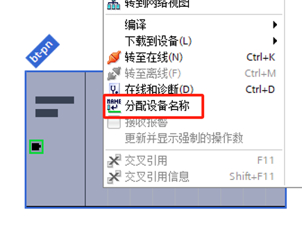

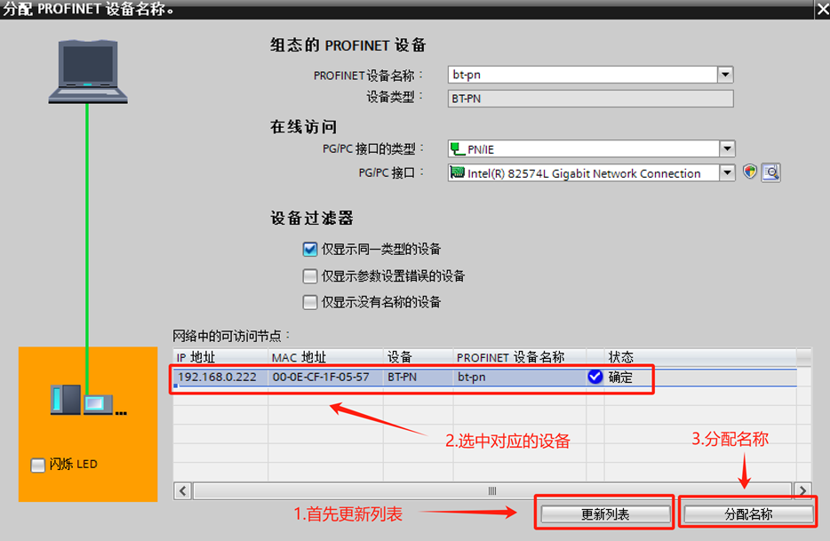

模块初次分配名称时，更新列表扫出来的IP地址都为0.0.0.0或固定出厂IP，所以初次分配多个模块的设备名称时，建议分别单独对模块进行分配。

然后将整个项目下载到PLC里面，然后转至在线后可以看到正常连接。

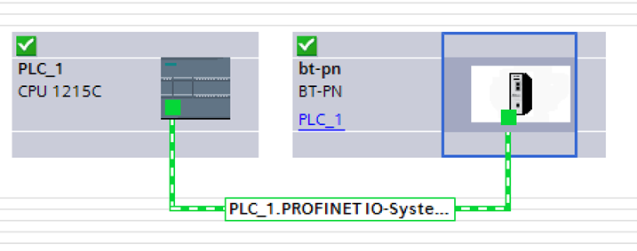

建立监控表，输入几个变量，输出几个变量。地址的起始与我们之前配置的输入输出地址对应。修改对应的QW点数据。

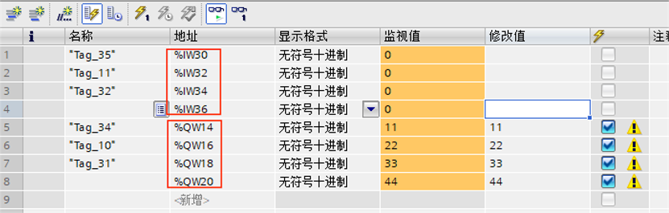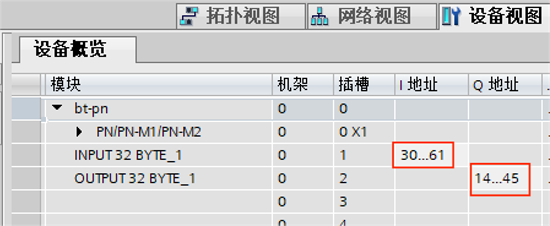

我们可以在模块的内部数据区看到由PLC通过Profinet协议传过来的数据

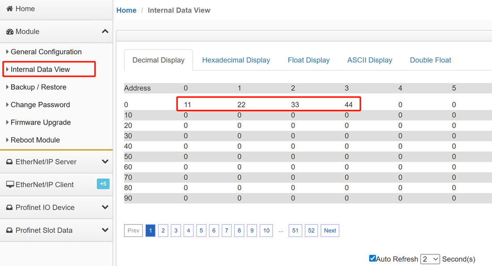

Profinet协议传过来存放的内部数据区起始地址与我们之前配置的一致

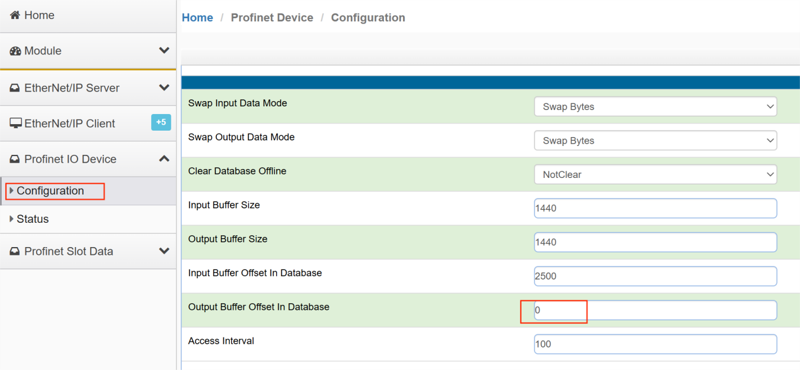

在 RSLogix5000 内建立 CIP 输入输出数组，具体内容请见前文“配置模块做 EtherNet/IP Server”。前文我们介绍过，模块 EtherNet/IP 做 Server 时，CIP 输入标签对应模块内部数据区的关系 

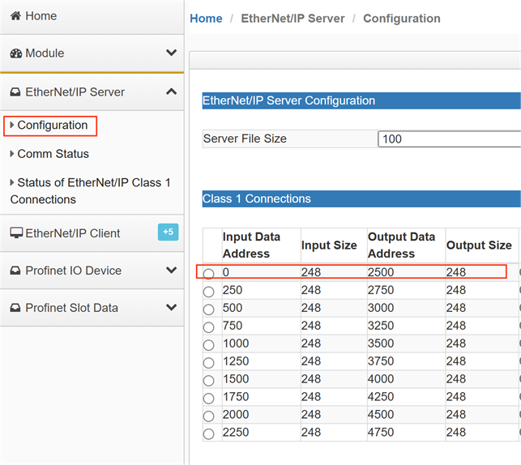

EN:0:I.Data[0]- EN:0:I.Data[247]对应模块内部寄存器 0-247 的地址 ，可以看到 RSLogix5000 中，采集到了西门子 PLC 写出的数据。

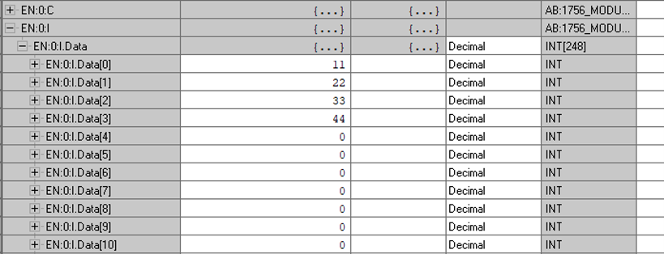

然后，我们在AB PLC 的输出标签组中写一些数据。 

前文我们介绍过，模块 EtherNet/IP 做Server 时，CIP 输出标签对应模块内部数据区的关系 ：EN:0:O.Data[0]- EN:0:O.Data[247]对应模块内部寄存器2500-2747 的地址。

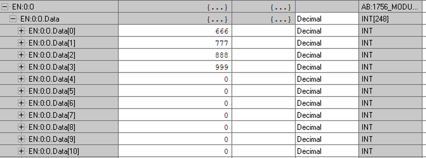

查看模块内部寄存器 2500-2503的地址，接收到了 RSLogix5000 写入的数据。

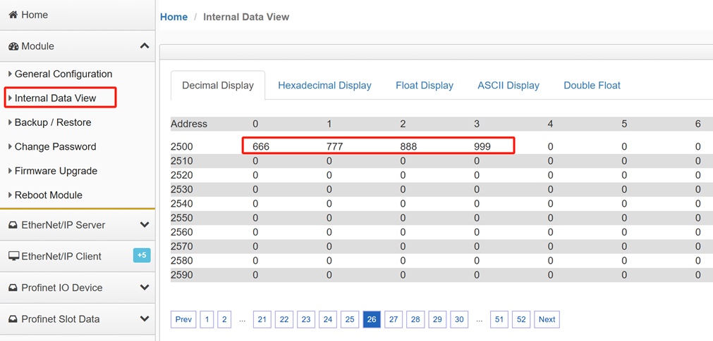

2500的地址对应着如下图，之前配置好的Profinet主站读取模块数据区的起始地址。

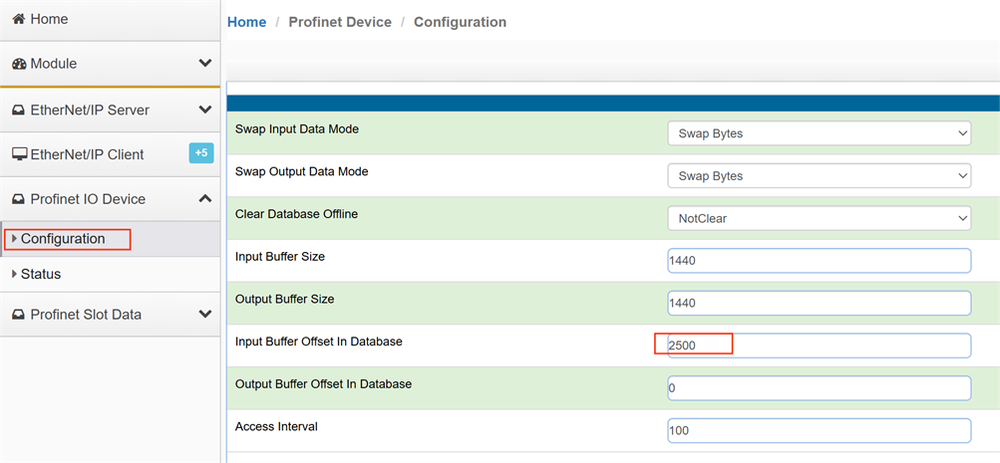

可以在西门子PLC里收到 RSLogix5000写出的数据。

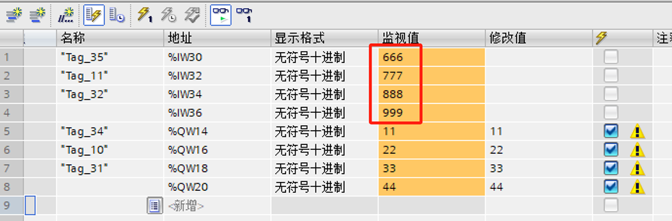

