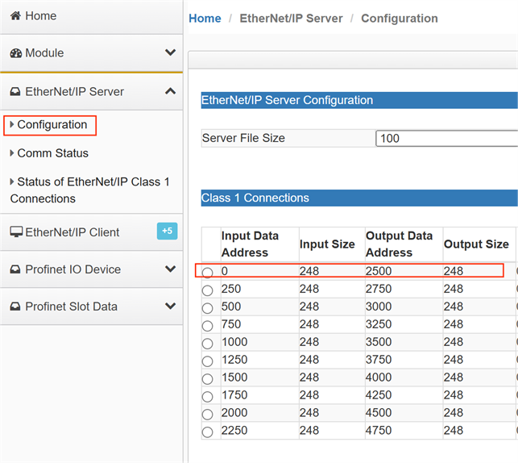

## 举例2.模块Profinet Slot Data功能使用（西门子S7-1200 PLC交换数据）

Slot Data功能是模块作为Profinet Server直接针对西门子PLC中IO设备数据槽的通讯模式，该模式对PLC中IO设备的每个插槽单独进行指令配置，可大大降低通讯延迟。这里我们介绍模块Slot Data的使用方法，PLC端的配置方式与前文举列1中的配置方式一样，这里不再叙述。

在模块主页面中点击 “Profinet Slot Data**”**，在下拉菜单中点击Configuration打开“Slot Data Mode”使能，打开使能后模块不再使用之前的Profinet连接方式和IO配置。

下图为PLC中模块的IO分配

点击Commands

通过添加指令配置模块，使模块与PLC中对应插槽的IO数据进行通信。一条指令对应PLC一个插槽，需要与PLC多少插槽的数据通讯就配置多少条指令。

**Slot:** 对应PLC中的IO插槽号    

**Input Data Swap:** 输入数据是否高低位转换

**Output Data Swap:** 输出数据是否高低位转换

**Clear Database Offine:** 选择当Profinet通讯中断时是否清除最后传过来的数据

**Input Byte Size:** 输入数据大小（最大不超过PLC中对应插槽的数据大小）

**Output Byte Size:** 输出数据大小（最大不超过PLC中对应插槽的数据大小）

**Poll Interval:** 命令轮询时间

**Internal Input Data Address:** 输入数据在模块内部的起始地址

**Internal output Data Address:** 输出数据在模块内部的起始地址

 

配置好通讯指令，点击Save，再点击OK,模块重启后配置生效。

打开PLC测试一下数据通讯，建立监控表，输入几个变量，输出几个变量。地址的起始与我们之前配置的输入输出地址对应。修改对应的QW点数据。

我们可以在模块的内部数据区看到由PLC通过Profinet协议传过来的数据

Profinet协议传过来存放的内部数据区起始地址与我们之前配置的一致

在 RSLogix5000 内建立 CIP 输入输出数组，具体内容请见前文“配置模块做 EtherNet/IP Server”。前文我们介绍过，模块 EtherNet/IP 做 Server 时，CIP 输入标签对应模块内部数据区的关系 

EN:0:I.Data[0]- EN:0:I.Data[247]对应模块内部寄存器 0-247 的地址,可以看到 RSLogix5000 中，采集到了西门子 PLC 写出的数据。

然后，我们在AB PLC 的输出标签组中写一些数据。 

前文我们介绍过，模块 EtherNet/IP 做 Server 时，CIP 输出标签对应模块内部数据区的关系:EN:0:O.Data[0]- EN:0:O.Data[247]对应模块内部寄存器2500-2747 的地址。

查看模块内部寄存器 2500-2503的地址，接收到了 RSLogix5000 写入的数据。

查看模块内部寄存器 2500-2503的地址，接收到了 RSLogix5000 写入的数据。

可以在西门子PLC里收到 RSLogix5000写出的数据。

