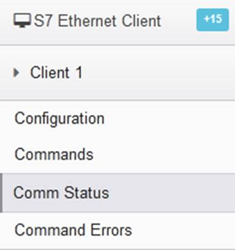
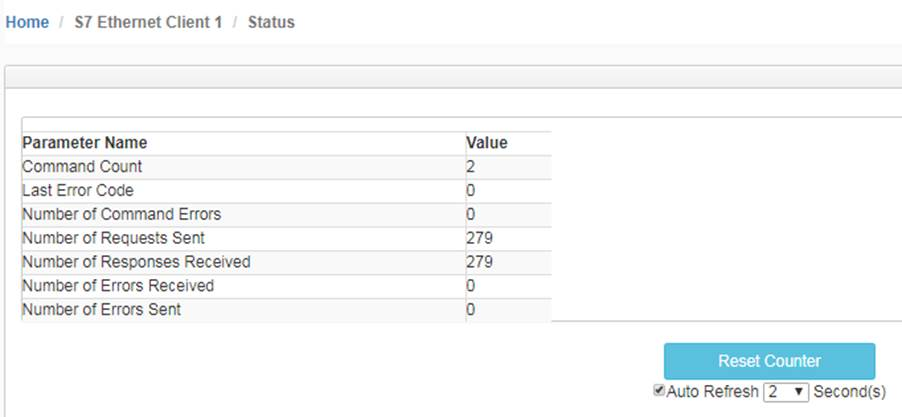
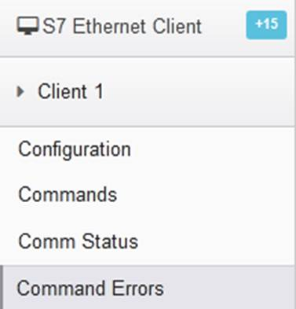
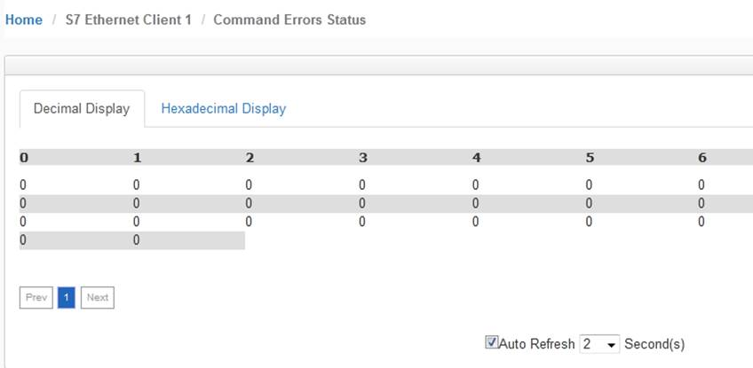

# 西门子S7工业以太网协议错误诊断

在模块西门子S7工业以太网协议端口做Client（主站）时，用户可以在模块页面查看通讯状态以及命令错误代码，从而快速了解问题所在。

点击S7 Ethernet Client ---Client1 ---Comm Status，从这里可以查看整个Clien发送和接受命令的状态，命令是否有错误。

点击S7 Ethernet Client ---Client1 --- Command Errors，从这里可以查看整个Clien所建立的第几个命令有错误。

 相关错误代码明细如下：

| 代码 | 代码（16进制） | 描述         |
| ---- | -------------- | ------------ |
| -2   | 0xFFFE         | 命令超时     |
| -3   | 0xFFFD         | 目标连接失败 |
| -4   | 1xFFFC         | 目标注册超时 |
| -5   | 2xFFFB         | 建立连接超时 |
| -7   | 3xFFF9         | 未知错误     |
| -10  | 0xFFF6         | 缺少配置参数 |
| -11  | 0xFFF5         | 数据类型错误 |
| -12  | 0xFFF4         | 数据地址错误 |
| -13  | 0xFFF3         | 站号错误     |
| -14  | 0xFFF2         | 数量错误     |
| -15  | 0xFFF1         | 功能号错误   |
| -16  | 0xFFF0         | 数据交换错误 |
| -17  | 0xFFEF         | TSAP错误     |

 
