# 配置Client（主站）与西门子1200&1500PLC通讯

1. 设置IP地址，与网关通讯设置成相同的网段。

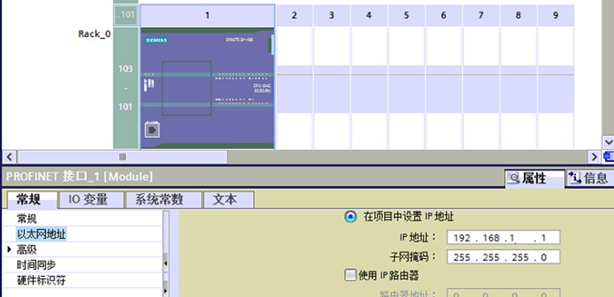

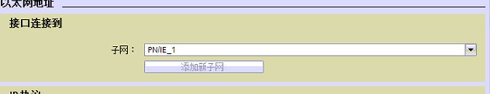

2. 建立与网关通讯的DB块数据。点击添加新快，选择数据块（DB）

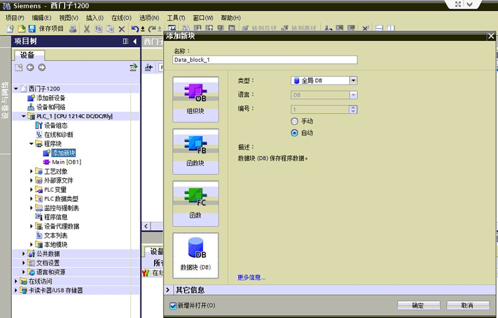

3. 修改所建立的DB块的属性，建立数据之前或之后修改都可以，修改目的是要保证数据块(DB)1是带地址的背景数据块。

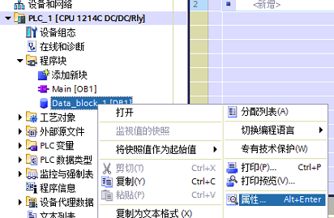

4. 点击属性后，把“优化的块访问”去掉勾选，默认是勾选的。

5. 点击确定，会弹出是否更改，点击确定。

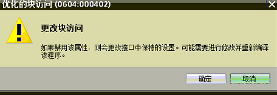

6. 点击确定，去掉勾选项，然后确定数据块(DB)

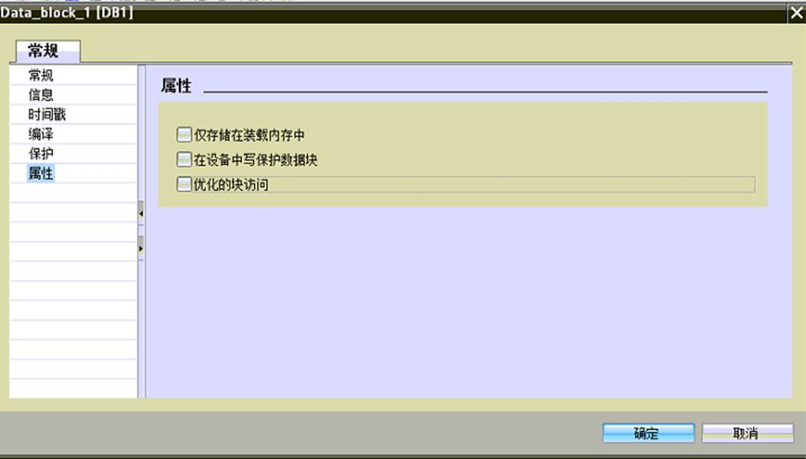

7. 西门子1200系列DB块通讯的数据量显示如下，各种类型可同时传输。可以对不同的DB块进行操作。数组或者是单个的变量都支持，以最终地址为准。

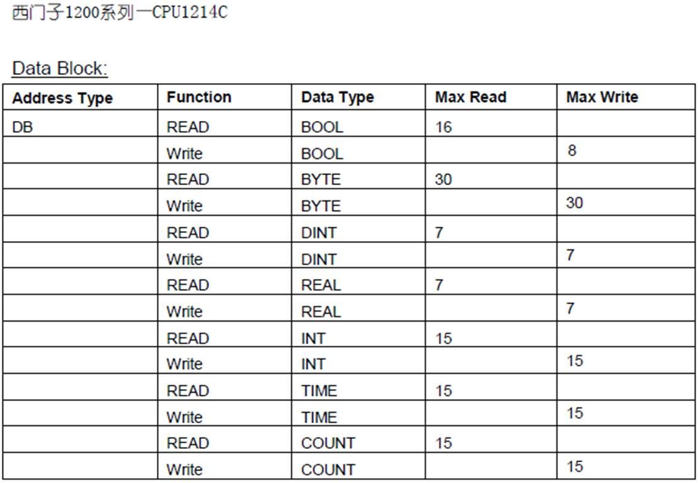

8. 举例：

​     **布尔量**

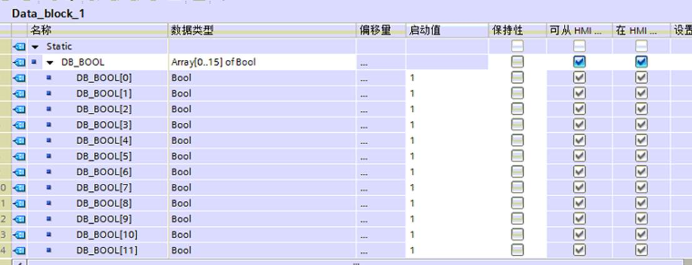

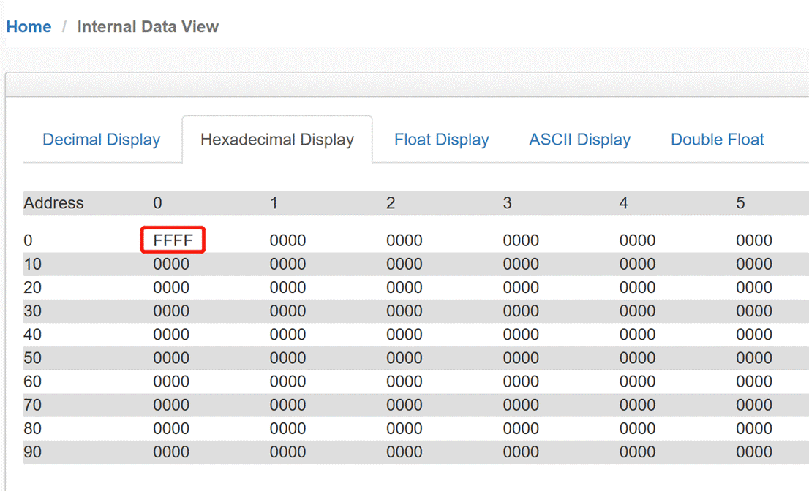

​    **字节**

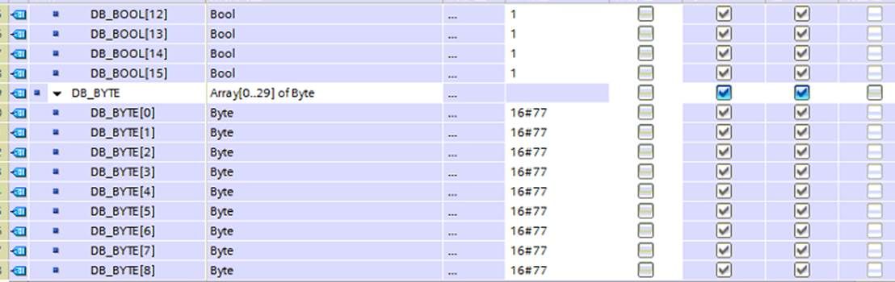

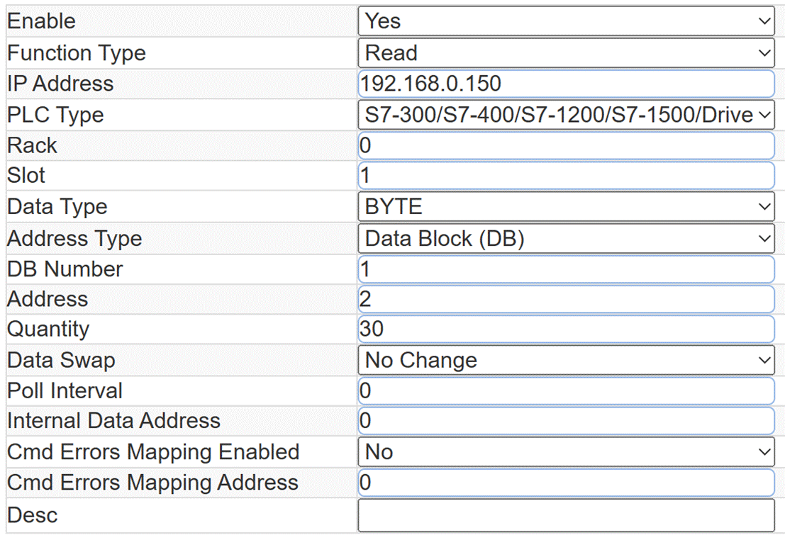

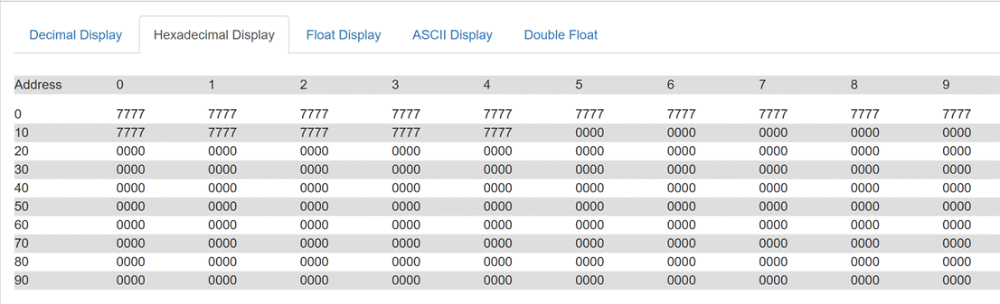

​     **整数**

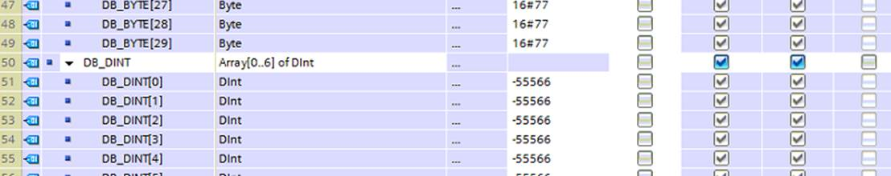

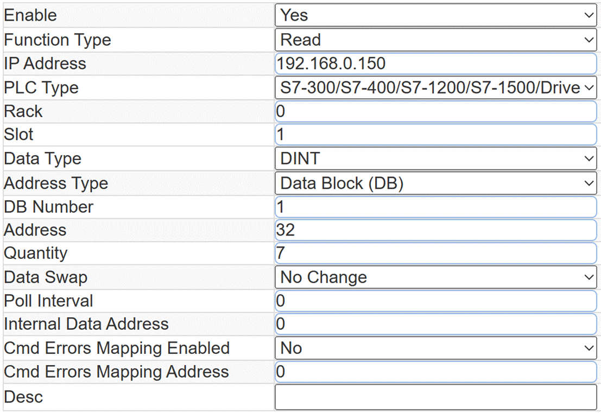

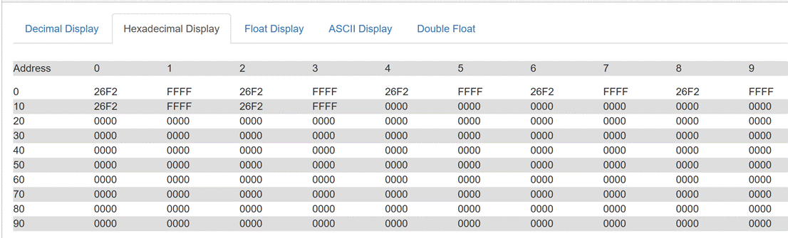

​     **实数**

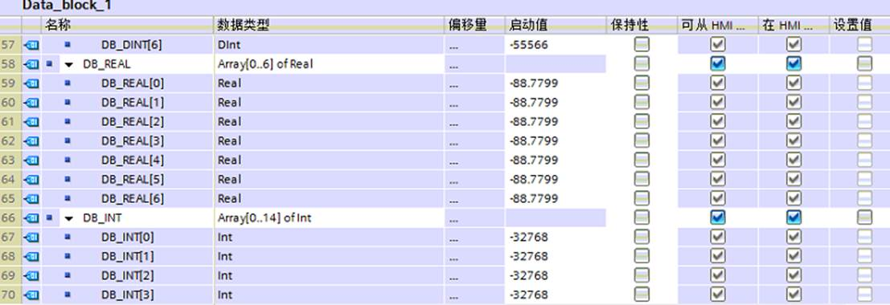

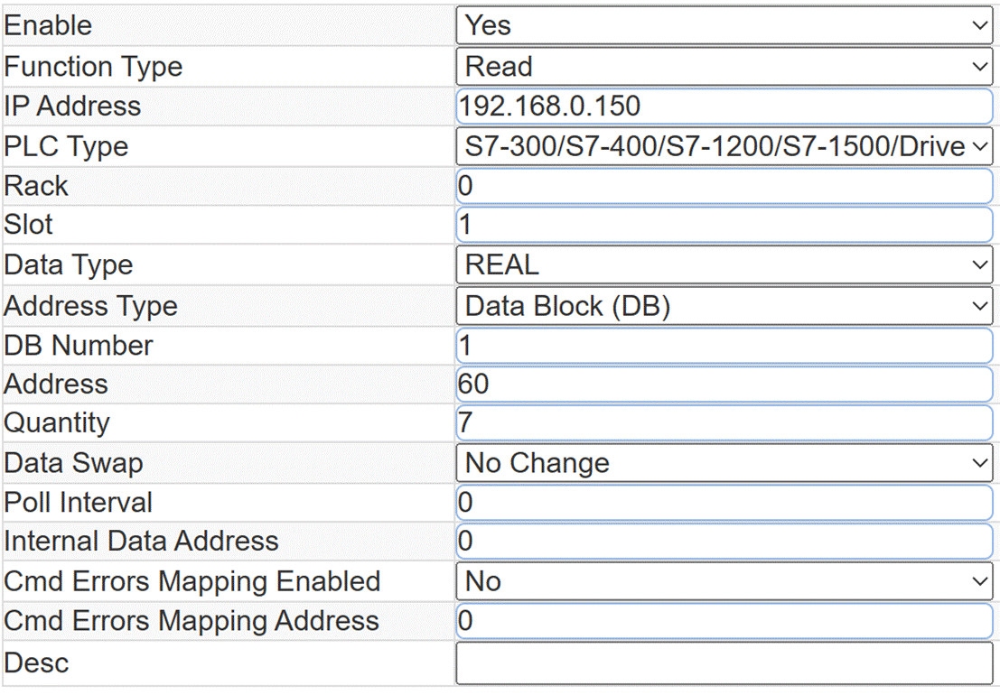

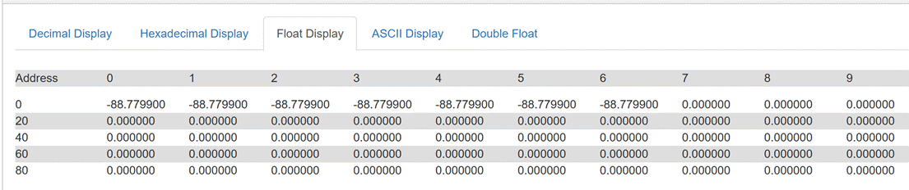

 
