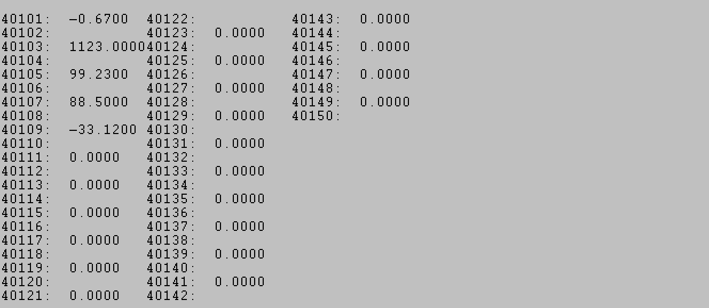

# 配置Client（主站）与西门子S7-200 SMART PLC通讯

网关连接西门子S7-200 SMART PLC通讯，西门子200 SMART不需要配置，网关可以直接读取Q区，I区，V区。

西门子200 SMART 支持西门子S7工业以太网协议，TSAP端口号0200，0201,0300,0301。这四个端口号都可以使用。

#### 读取STEP 7-Micro/WIN SMART Q区输出点

表示读取192.168.0.100 S7-200 SMARTQ区 8个位放到内部寄存器0里面，一个寄存器有16位，8个位放进来会占用内部寄存器0一半的寄存器地址。

####  读取STEP 7-Micro/WIN SMART软件里面V区变量

表示读取192.168.0.100 S7-200 SMART V区 50个字放到内部寄存器20~69里面，总共读取50个数据

在STEP 7-Micro/WIN SMART软件里面强制V区变量点。在状态表2里面写入新值。

查看网关内部寄存器。

#### **写入STEP 7-Micro/WIN SMART软件里面V区变量**

表示把网关内部寄存器输出区域2000-2009的内部寄存器数据写到192.168.0.100 PLC的VW100-VW120里面。

先在符号表里面建立S51~S60与VW100~VW118的对应关系。

 在状态图表建立图表3，输入S51~S60,然后下载到PLC里面。

检查在状态图表建立图表3，点击眼镜图表

#### 读取STEP 7-Micro/WIN SMART软件里面V区浮点数变量

表示读取192.168.0.100 S7-200 SMART V区 从2010开始的浮点数放到内部寄存器100~109里面，总共读取5个浮点数。

检查网关内部寄存器100-109

通过Modbus RTU为查看模块内部寄存器数值**（注意，本例中使用Modbus作为举例，不同型号模块支持的驱动协议不同，具体配置模块时，可根据实际情况使用不同的驱动协议读写模块数据区）**可见ModScan32的40101至40109读取到了相同的数值。

