# 配置西门子S7工业以太网协议 Client（主站）

点击 S7 Ethernet Client,可以看到模块可支持做主站的数量，+15表示可以该模块最多作为15个主站.

点开Configuration.查看默认的配置

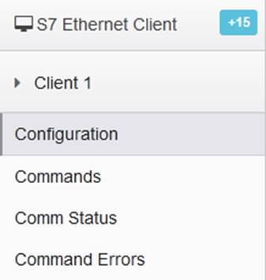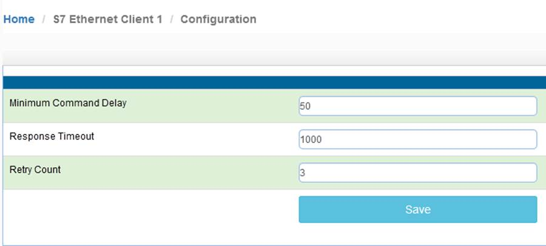

Minimum Command Delay   ：每个Client执行发出Client下面建立的指令的轮询时间 单位ms       0-65535

**（注：该时间越小,****模块发送命令越快，但并非越小越好，需要先查看从站设备的说明书，确定从站响应时间是否能及时接受和反馈，主站发送命令的间隔，建议根据需要修改成500-1000ms****。）**

Response Timeout：所连接设备的响应时间 单位ms              0-65535

Retry Count：重新尝试连接次数

点击S7 Ethernet Client ---Client1 ---Commands，如果没有出现Add等按钮，应该是没有点击右上角登录或者没有使用正确的浏览器导致。

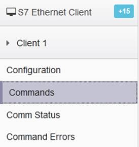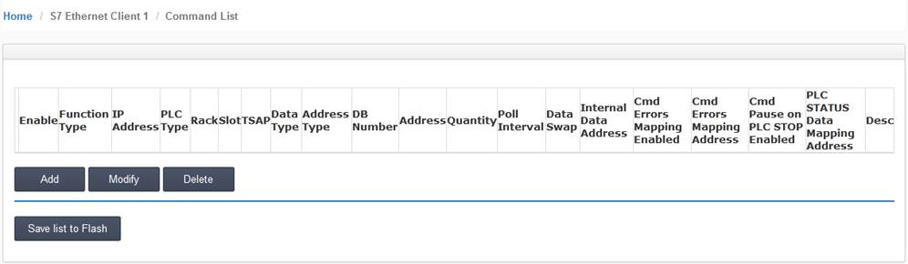

配置命令参数，用来读或写西门子PLC的命令。每个主站最大指令数为32个，如果同时连接5个西门子PLC，建议在Client1-Client5配置每个主站分别对应一个西门子PLC的读写。可以减小命令执行延时，以及设备掉线对其他设备的干扰。

点击Add ,可以增加新的命令，如下为针对不同种类西门子PLC添加指令的配置界面，主要分为两大类 ：

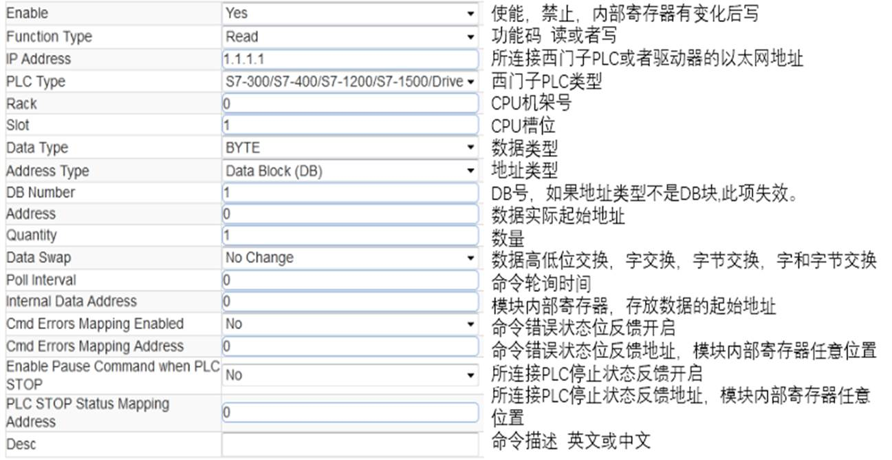

西门子S7-300/S7-400/S7-1200/S7-1500/Drive这几种PLC设备采用上图来进行读或写的操作。

西门子S7-200/S7-200 SMART/LOGO这几种PLC设备采用上图来进行读或写的操作

点击S7 Ethernet Client ---Client1 ---Comm Status，从这里可以查看整个Clien发送和接受命令的状态，命令是否有错误。

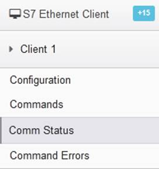 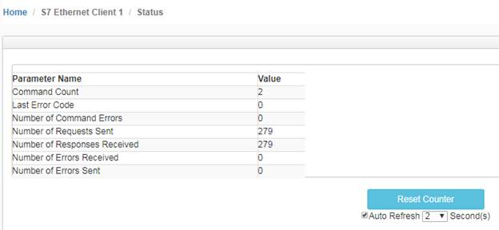

点击S7 Ethernet Client ---Client1 --- Command Errors，从这里可以查看整个Clien所建立的第几个命令有错误。

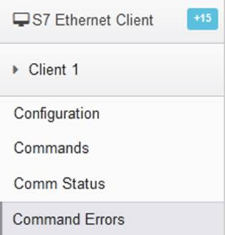 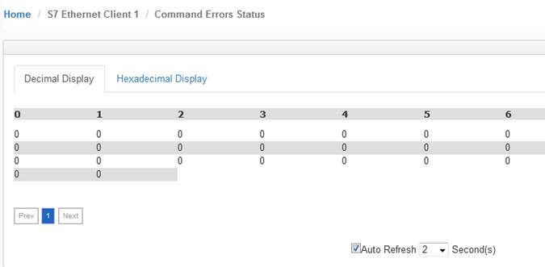

**连接西门子PLC注意事项**

—特别使用冗余PLC系统和模块进行通讯时

**S7-300/400** **注意事项：**西门子CPU硬件配置页面里面有最大通讯连接数，以CPU 315-2 PN/DP举例，该CPU模块具有最大16个连接数，我们可以看到S7通讯连接数已经有一个在使用，模块一个Clinet 连接西门子CPU以太网会占用1个S7的连接数。

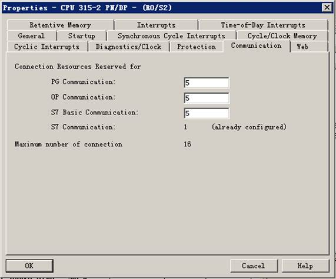 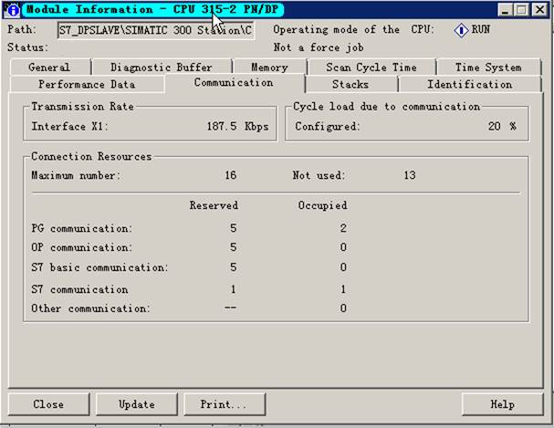

 **S7-1200/1500** **注意事项：**

1.只能访问全局DB。

2.优化的块访问必须关闭。

3.访问级别必须为“完全”，并且“连接机制”必须允许GET / PUT。

在“程序块”下的左窗格中选择DB，然后按Alt-Enter（或在上下文菜单中选择“属性…”）

取消选中“优化阻止访问”，默认情况下已选中

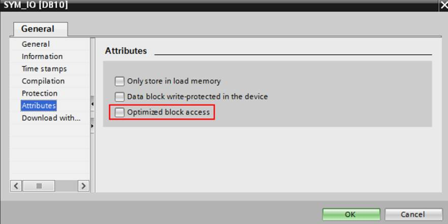

Protection 相关内容：

在左窗格中选择CPU项目，然后按Alt-Enter（或在上下文菜单中选择“属性…”）

在保护项中，选择“完全访问”，然后选中“使用PUT / GET…允许访问”。 如图。

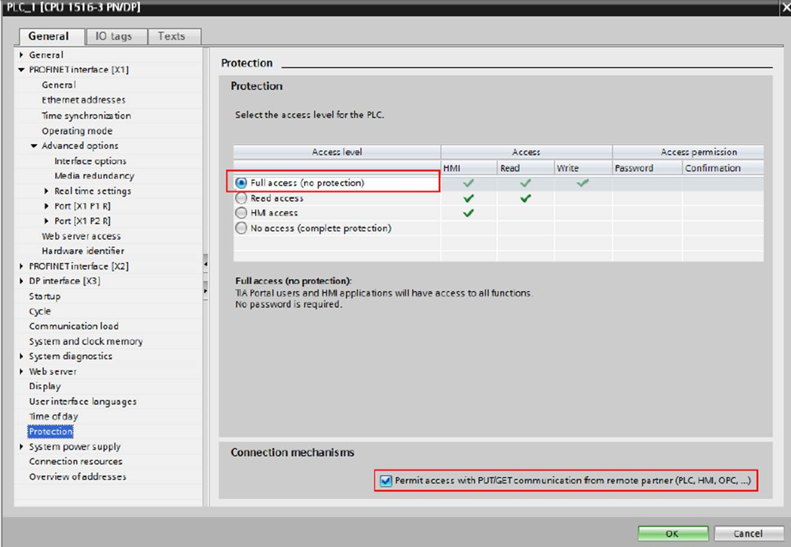

**S7-200/S7-200 SMART/LOGO注意事项：**

模块建立命令要填写TSAP,这个TSAP是指S7-200/S7-200 SMART/LOGO本地的TSAP。

**S7-200** **举例 ，**如果本地TSAP是02.00， 模块建立命令时候TSAP就填写200，如果本地TSAP是10.00 模块建立命令时候TSAP就填写1000。

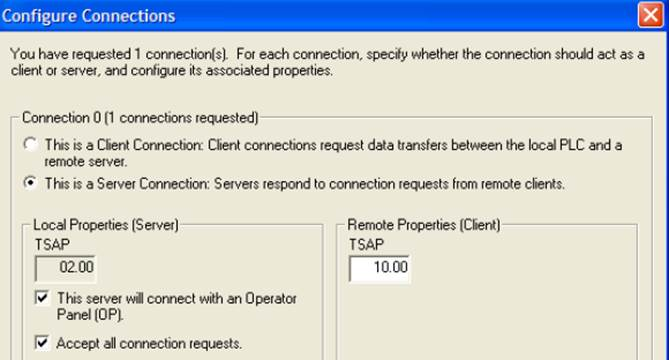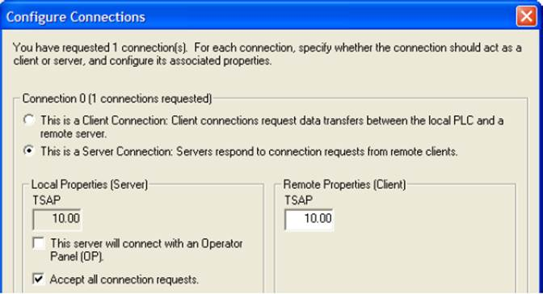

**S7-200 SMART** **举例** ，TSAP 端口号 0200，0201,0300,0301.这四个端口号都可以使用，可以任意选择一个端口号填写。

与S7-200 SMART连接有单独介绍模块各种数据类型相连接的方法。

 

**LOGO****举例**

TSAP 端口号 0200 ，模块建立命令时候TSAP就填写200。

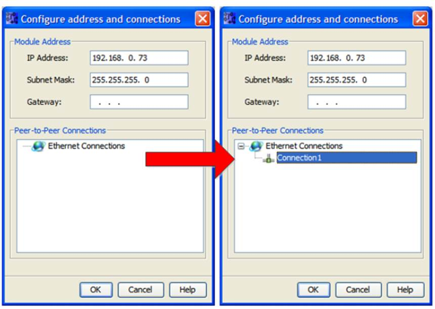

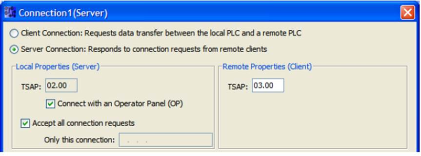

 

**举例1，模块读取西门子PLC整型数据**

配置S7-Eethernet Client主站指令，点击S7-Eethernet Client----Commands建立指令，读或写西门子DB数据块的数据。

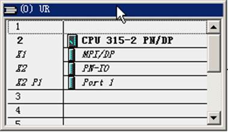

  
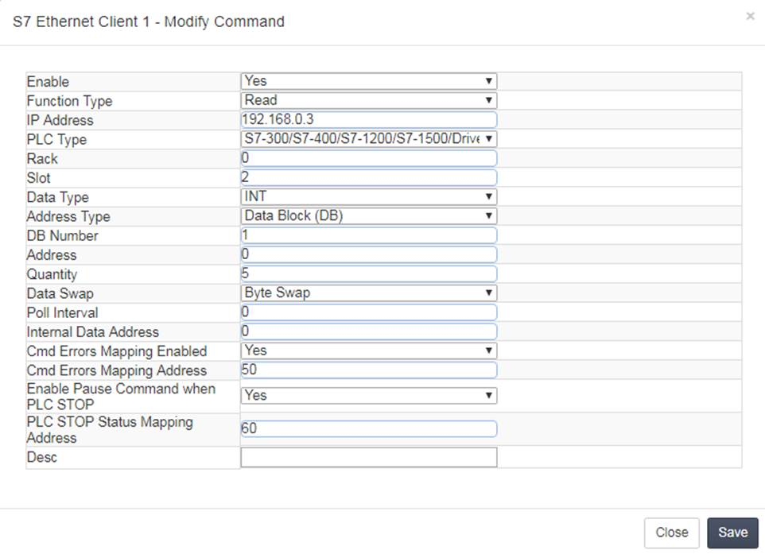

以上读指令解释如下，

读取IP地址为192.168.0.3的西门子S7-300系列的控制器，

把其中的DB1数据块里面的5个INT读到模块内部数据寄存器地址0-4中，数据高字节和低字节交换

如果第一条命令发生错误后，错误状态存放在模块内部数据寄存器地址50中.

如果第一条命令检测到西门子CPU运行或停止，CPU的运行或停止状态存放在模块内部数据寄存器地址60中.

命令的要注意的地方，Slot是指西门子CPU的槽位，Address是指DB数据的起始地址，Quantity是指要传输几个数据，Data Swap是指传输的数据是否进行高低位交换，Internal Data Address是指模块内部寄存器的起始地址。

点击 Save 保存，提示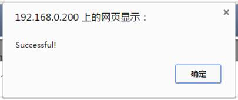，然后点击Close关闭这个命令。接着点击Save list to Flash把这个命令保存到模块里面。

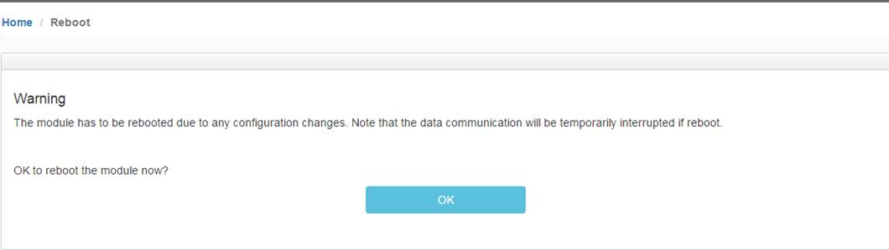

提示重启模块，点击OK 完成重启。

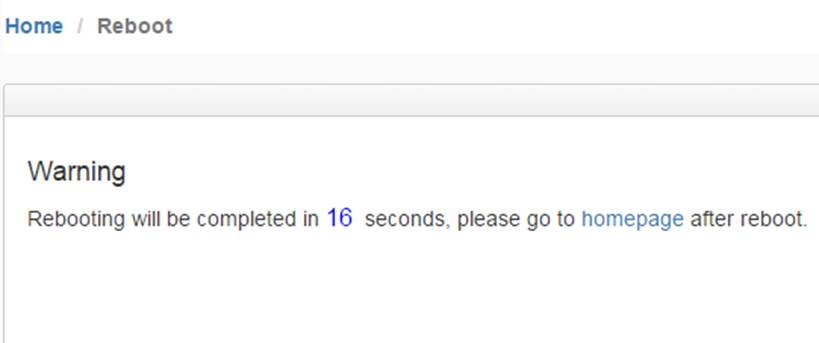

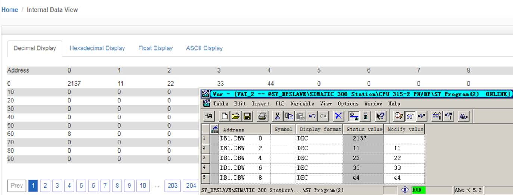

DB1.DBW0是一个加1循环的数值,该数值在一直加1 ，可以看到模块通过上文中的主站命令把西门子DB1里面5个INT格式的数据存放到了模块内部寄存器0-4里面，内部寄存器50是0 表示没有错误，内部寄存器60是8，（表示运行 注：西门子400冗余系统不使用此功能，请使用S7 Ethernet Server，后面章节会有介绍使用方法），表示西门子CPU在运行状态，错误状态和CPU运行状态可以开启或者关闭。用于设计人员取状态点使用。

把CPU从运行状态转换成停止状态，我们可以看一下这两边的数据关系。

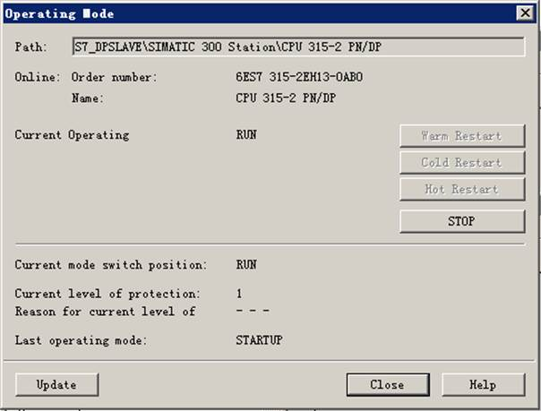 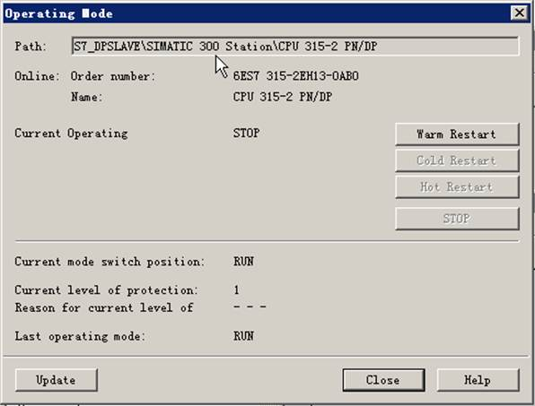

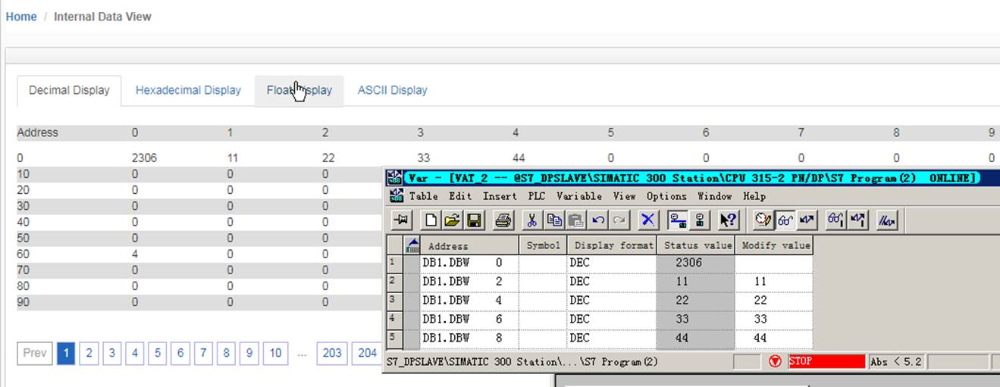

当西门子CPU从运行转换成停止时，内部寄存器60的数值从8变成4，（表示西门子CPU停止状态）

如果内部寄存器50的数值是非零值 表示模块建立的命令没有正确读取到所有的数值，其中可能是IP地址错误，槽位错误，机架号错误，DB块不存在，数据长度没有对应等，这里不再一一讨论，非零值就表示命令错误。

 

**举例2：模块和西门子PLC浮点数的读写**

配置S7-Eethernet Client主站指令，点击S7-Eethernet Client----Commands建立指令，读或写西门子DB数据块的数据。

 

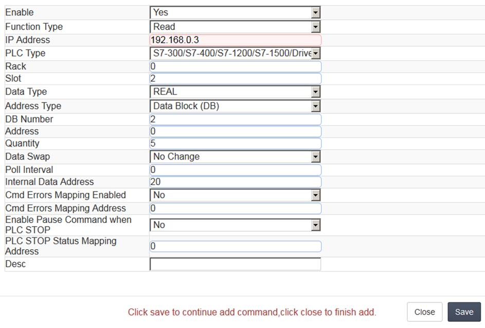

以上指令解释如下，读取IP地址为192.168.0.3的西门子S7-300系列的控制器，把其中的DB2数据块里面，从0地址开始的5个REAL类型数据，读到模块内部数据寄存器起始地址为20的区域中. 因为模内部数据寄存器为16位的字，所以5个浮点数会占用10个寄存器，也就是存放到模块内部地址20-29中

本例中未使用指令执行状态查询和CPU运行状态查询的功能。

如下图，在西门子PLC中DB2.DBD0-16中赋值

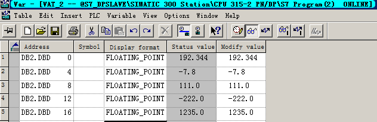

可见模块内部数据区20-29的10个寄存器读取到了相同的数值。

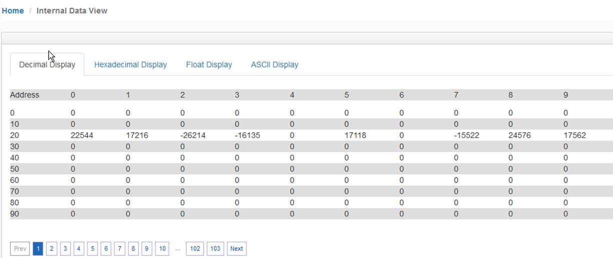

通过Modbus RTU为查看模块内部寄存器数值**（注意，本例中使用Modbus作为举例，不同型号模块支持的驱动协议不同，具体配置模块时，可根据实际情况使用不同的驱动协议读写模块数据区）**可见ModScan32的40021至40029读取到了相同的数值。

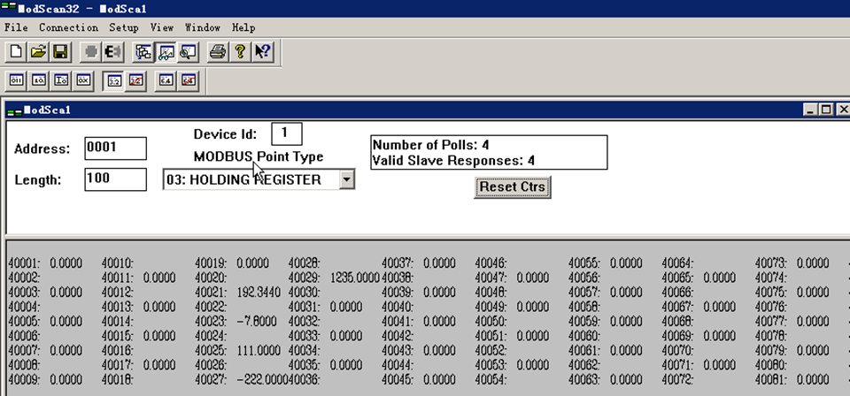

