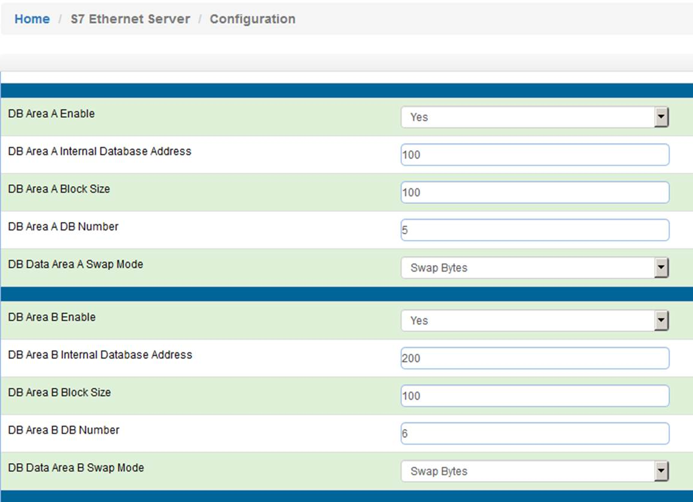
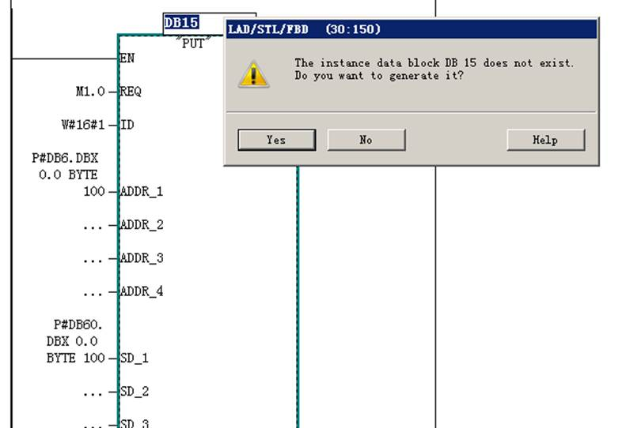
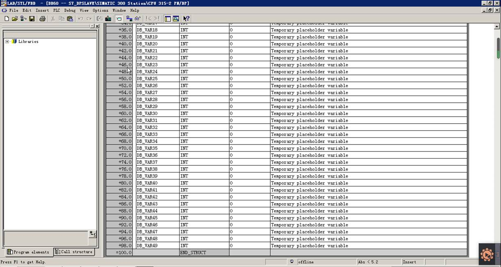
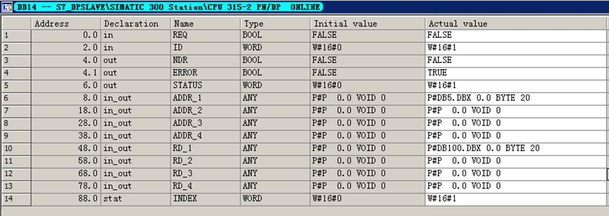
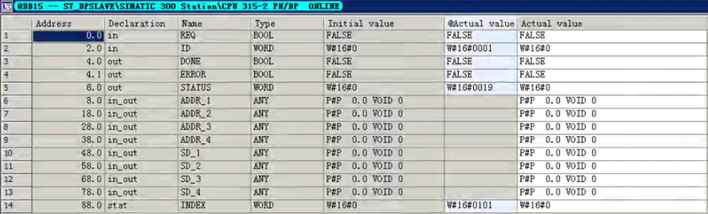
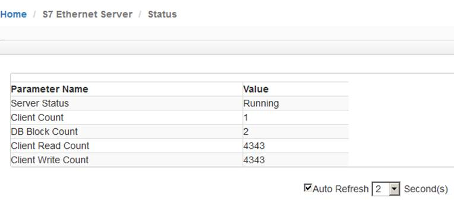
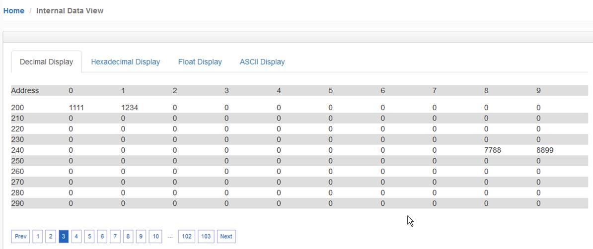
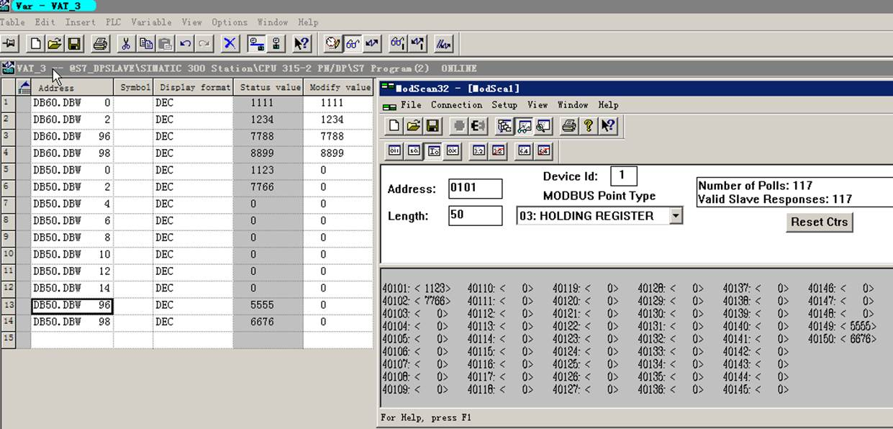
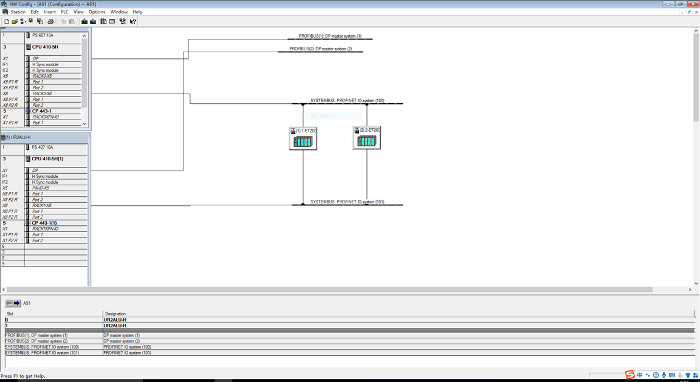
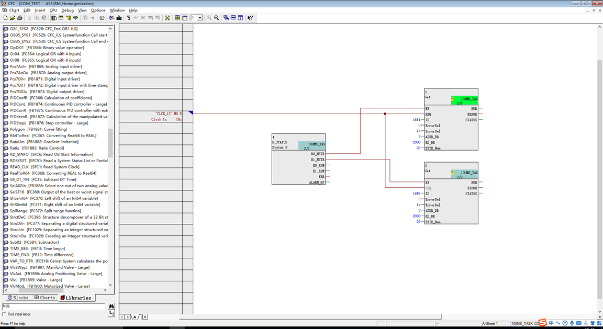

# 配置西门子S7工业以太网协议 Server（从站）

点击 S7 Ethernet Server,可以看到模块可支持做 S7 以太网从站的数量。模块做从站时，可以支持任意 5 个 DB 块的传输，点开 Configuration.查看默认的配置，可以看到出现 5 组 DB 块的序列，这 5 组可以被西门子 PLC 当成一个从站进行访问。西门子 S7-400 冗余系统进行 CPU1 或 CPU2 冗余切换不会影响数据传输中断。 由于西门子 S7-400 冗余系统与罗克韦尔或者施耐德冗余系统不同，西门子 S7-400 冗余系统切换时，两个 IP 地址在冗余切换时不是一个 IP 地址，是两个独立的 IP 地址，所以不建议使用模块作为 S7 Ethernet Client 对西门子 S7-400 冗余进行读或写的操作，模块作为 S7 以太网从站与西门子 S7-400 冗余连接，不论 S7-400 冗 余如何切换，从站都会被主站实时读写。

点击 S7 Ethernet Server 菜单下的 “Configuration” 配置 DB 块

开启两组模块从站 DB，设置起始地址，数据长度等内容。 

第一组从站数据，表示从模块内部寄存器起始地址 100 开始总共 100 个字节，也就是模块内部寄存器 100-149 

这 50 个 INT 的数据配置为 DB5 的数据，并且选择字节交换。 

第二组从站数据,表示从模块内部寄存器起始地址 200 开始总共 100 个字节，也就是模块内部寄存器 200-249 

这 50 个 INT 的数据配置为 DB6 的数据，并且选择字节交换。 

配置完后，点击保存，重启模块。

举例：用西门子S7-300配置举例。找到组态的网络配置，点击CPU，CPU由白变灰，会出现CPU可以插入链接的表格，右键点击表格第一行空白处，增加新的链接，类型选择S7链接，点击OK 。

Local ID 默认1， IP地址填写模块模块的IP地址，例如192.168.0.200，点击确定。

创建完毕后，可以看到表格里面增加了一条新的链接，这条链接用于连接作为S7从站的BEACON 模块。

 主程序OB1增加如下程序，下面的程序是新建的一个1秒脉冲。M1.0表示1秒脉冲一次。 

 SFB14用来读取模块S7协议Server内部增加的DB块，下面这条程序表示PLC每1秒读取一次，ID为1的S7协议链接设备中的DB5数据块中的100个字节的数据，放到西门子DB50的数据块里面，然后为SFB14做一个背景数据块(DB14),直接在SFB14上方输入，然后点击回车确定，会弹出新建这个背景数据块。然后在主程序里面建立DB50数据块。

 

SFB15用来写数据到模块S7协议Server内部增加的DB块，下面这条程序表示每1秒从西门子PLC的DB60的数据块里面写出一次数据， 到ID为1的S7协议链接设备中的DB6数据块的100个字节，然后为SFB15做一个背景数据块(DB15),直接在SFB15上方输入然后键盘确定，会弹出新建这个背景数据块。然后在主程序里面建立DB60数据块。 

做完程序和新建DB数据块后，把这些配置下载到西门子S7-300的CPU里面，或者整个重新下载西门子主程序。

可以在线查看SFB14的背景数据块状态，如果ERROR的Actual value 是TRUE,表示有错误，如果是FALSE表示没有错误。

可以在线查看SFB15的背景数据块状态，如果ERROR的Actual value 是TRUE,表示有错误，如果是FALSE表示没有错误。

 

返回BEACON模块配置页面查看 S7 Ethernet Server –Status,可以看到Server在运行（running），有一个PLC作为主站在和模块连接，有2个DB块在运行，西门子S7-300客户端读取DB块数据的次数，西门子S7-300客户端写入DB块数据的次数.

如果此处西门子PLC作为S7客户端读写的次数值不变动，表示客户端没有运行

如果此处西门子PLC作为S7客户端读写的次数值相差非常大，表示客户端读或写有错误，需要检查配置是否正确。

如果此处西门子PLC作为S7客户端读写的次数值都在变动，且两者一致，表示客户端读写都正常。

 

如果只需要PLC读取模块内部寄存器，只需要西门子PLC作为S7客户端在程序中建立SFB14就可以，无需建立SFB15.例如西门子PLC通过BEACON模块采集MODBUS RTU的数据，这些MODBUS数据都是仪表的数据，无需PLC写入控制数据，建立一组读取连接就可以。

模块的S7 Ethernet Server 和S7 Ethernet Client可以同时运行，只要区分好模块内部寄存器地址就可以。

在DB60里面录入数据，录入地址为0-2和96-98，可以检查100个Byte（50个INT）的数据情况。

查看模块内部寄存器地址，被西门子PLC作为主站写入了相同的数据。

通过Modbus TCP为查看模块内部寄存器数值**（注意，本案例中使用Modbus TCP作为举例，不同型号模块支持的驱动协议不同，具体配置模块时，可根据实际情况使用不同的驱动协议读写模块数据区）**

查看MODBUS TCP连接，使用ModScan32仿真软件可以查看，模块内部寄存器0对应着40001，模块内部寄存器100对应着40101，模块内部寄存器200对应着40201，以此类推。可以查看到Modbus TCP主站采集到了西门子PLC 中DB60写出的数据

同理，在ModScan中40101,40102,40149,40150这4个地址给模块对应的内部寄存器（100,101,148,149）写入数据，返回查看西门子PLC的DB50.DBW0, DB50.DBW2, DB50.DBW96, DB50.DBW98首尾这4个数据的情况。

我们可以看到都是一一对应，说明西门子PLC作为S7主站，通过模块读取到了Modbus TCP录入的数据。 

举例1.西门子400系列 410-5H冗余CPU 硬件组态 

建立网络连接

建立RACK0 CPU 与BEACON模块的S7 connection：Local ID=4

建立RACK1 CPU 与BEACON模块的S7 connection：Local ID=5

自定义FB 1000 

SFB14 GET、SFB15 PUT接收来自BEACON S7网络模块数据或向BEACON S7网络模块发送DB数据。

CFC程序如下

H_STATUS能够判断当前Master CPU 是RACK 0 CPU 还是RACK 1 CPU

 

### 模块支持读写西门子PLC的数据类型

S7-300/S7-400/S7-1200/S7-1500/Drive/支持的数据类型

| **地址类型**            | **功能** | **数据类型** |
| ----------------------- | -------- | ------------ |
| DB/ Flag/ Input/ Output | READ     | BOOL         |
|                         | Write    | BOOL         |
|                         | READ     | BYTE         |
|                         | Write    | BYTE         |
|                         | READ     | DINT         |
|                         | Write    | DINT         |
|                         | READ     | REAL         |
|                         | Write    | REAL         |
|                         | READ     | INT          |
|                         | Write    | INT          |
|                         | READ     | TIME         |
|                         | Write    | TIME         |
|                         | READ     | COUNT        |
|                         | Write    | COUNT        |
| Timer                   | READ     | TIME         |
| Counter                 | READ     | Count        |

 

S7-200/S7-200 SMART/LOGO支持的数据类型

| **地址类型**            | **功能** | **数据类型** |
| ----------------------- | -------- | ------------ |
| DB/ Flag/ Input/ Output | READ     | BOOL         |
|                         | Write    | BOOL         |
|                         | READ     | BYTE         |
|                         | Write    | BYTE         |
|                         | READ     | DINT         |
|                         | Write    | DINT         |
|                         | READ     | REAL         |
|                         | Write    | REAL         |
|                         | READ     | INT          |
|                         | Write    | INT          |

  

### 模块支持读写西门子PLC的数据范围

 每条命令支持最大数据点

| S7-300/S7-400 | 功能  | 数据类型 | 最大数量 | 最大数量 |
| ------------- | ----- | -------- | -------- | -------- |
| DB            | READ  | BOOL     | 1        |          |
|               | Write | BOOL     |          | 1        |
|               | READ  | BYTE     | 164      |          |
|               | Write | BYTE     |          | 164      |
|               | READ  | DINT     | 41       |          |
|               | Write | DINT     |          | 41       |
|               | READ  | REAL     | 41       |          |
|               | Write | REAL     |          | 41       |
|               | READ  | INT      | 82       |          |
|               | Write | INT      |          | 82       |
|               | READ  | TIME     | 82       |          |
|               | Write | TIME     |          | 41       |
|               | READ  | COUNT    | 82       |          |
|               | Write | COUNT    |          | 82       |
| Timer         | READ  | TIME     | 1        |          |
| Counter       | READ  | Count    | 111      |          |
| Flag          | READ  | BOOL     | 1        |          |
|               | Write | BOOL     |          | 1        |
|               | READ  | BYTE     | 222      |          |
|               | Write | BYTE     |          | 212      |
|               | READ  | DINT     | 55       |          |
|               | Write | DINT     |          | 53       |
|               | READ  | REAL     | 55       |          |
|               | Write | REAL     |          | 53       |
|               | READ  | INT      | 111      |          |
|               | Write | INT      |          | 106      |
|               | READ  | TIME     | 111      |          |
|               | Write | TIME     |          | 53       |
|               | READ  | Count    | 111      |          |
|               | Write | Count    |          | 106      |
| Flag          | READ  | BOOL     | 1        |          |
|               | Write | BOOL     |          | 1        |
|               | READ  | BYTE     | 222      |          |
|               | Write | BYTE     |          | 212      |
|               | READ  | DINT     | 55       |          |
|               | Write | DINT     |          | 53       |
|               | READ  | REAL     | 55       |          |
|               | Write | REAL     |          | 53       |
|               | READ  | INT      | 111      |          |
|               | Write | INT      |          | 106      |
|               | READ  | TIME     | 111      |          |
|               | Write | TIME     |          | 53       |
|               | READ  | Count    | 111      |          |
|               | Write | Count    |          | 106      |
| Input         | READ  | BOOL     | 1        |          |
|               | Write | BOOL     |          | 1        |
|               | READ  | BYTE     | 128      |          |
|               | Write | BYTE     |          | 128      |
|               | READ  | DINT     | 32       |          |
|               | Write | DINT     |          | 32       |
|               | READ  | REAL     | 32       |          |
|               | Write | REAL     |          | 32       |
|               | READ  | INT      | 64       |          |
|               | Write | INT      |          | 64       |
|               |       |          |          |          |
|               | READ  | TIME     | 64       |          |
|               | Write | TIME     |          | 32       |
|               | READ  | Count    | 64       |          |
|               | Write | Count    |          | 64       |

 

| S7-1200/S7-1500 | 功能  | 数据类型 | 最大数量 | 最大数量 |
| --------------- | ----- | -------- | -------- | -------- |
| DB              | READ  | BOOL     | 1        |          |
|                 | Write | BOOL     |          | 1        |
|                 | READ  | BYTE     | 30       |          |
|                 | Write | BYTE     |          | 30       |
|                 | READ  | DINT     | 7        |          |
|                 | Write | DINT     |          | 7        |
|                 | READ  | REAL     | 7        |          |
|                 | Write | REAL     |          | 7        |
|                 | READ  | INT      | 15       |          |
|                 | Write | INT      |          | 15       |
|                 | READ  | TIME     | 15       |          |
|                 | Write | TIME     |          | 15       |
|                 | READ  | COUNT    | 15       |          |
|                 | Write | COUNT    |          | 15       |
| Flag            | READ  | BOOL     | 1        |          |
|                 | Write | BOOL     |          | 1        |
|                 | READ  | BYTE     | 212      |          |
|                 | Write | BYTE     |          | 212      |
|                 | READ  | DINT     | 53       |          |
|                 | Write | DINT     |          | 53       |
|                 | READ  | REAL     | 53       |          |
|                 | Write | REAL     |          | 53       |
|                 | READ  | INT      | 106      |          |
|                 | Write | INT      |          | 106      |
|                 | READ  | TIME     | 105      |          |
|                 | Write | TIME     |          | 105      |
|                 | READ  | Count    | 106      |          |
|                 | Write | Count    |          | 106      |
| Output          | READ  | BOOL     | 1        |          |
|                 | Write | BOOL     |          | 1        |
|                 | READ  | BYTE     | 212      |          |
|                 | Write | BYTE     |          | 212      |
|                 | READ  | DINT     | 53       |          |
|                 | Write | DINT     |          | 53       |
|                 | READ  | REAL     | 53       |          |
|                 | Write | REAL     |          | 53       |
|                 | READ  | INT      | 106      |          |
|                 | Write | INT      |          | 106      |
|                 | READ  | TIME     | 105      |          |
|                 | Write | TIME     |          | 105      |
|                 | READ  | Count    | 111      |          |
|                 | Write | Count    |          | 106      |
| Input           | READ  | BOOL     | 1        |          |
|                 | Write | BOOL     |          | 1        |
|                 | READ  | BYTE     | 222      |          |
|                 | Write | BYTE     |          | 212      |
|                 | READ  | DINT     | 55       |          |
|                 | Write | DINT     |          | 53       |
|                 | READ  | REAL     | 55       |          |
|                 | Write | REAL     |          | 53       |
|                 | READ  | INT      | 111      |          |
|                 | Write | INT      |          | 111      |
|                 | READ  | TIME     | 111      |          |
|                 | Write | TIME     |          | 106      |
|                 | READ  | Count    | 111      |          |
|                 | Write | Count    |          | 106      |

 

| S7200/S7-200SMART | 功能  | 数据类型 | 最大数量 | 最大数量 |
| ----------------- | ----- | -------- | -------- | -------- |
| DB                | READ  | BOOL     | 1        |          |
|                   | Write | BOOL     |          | 1        |
|                   | READ  | BYTE     | 222      |          |
|                   | Write | BYTE     |          | 212      |
|                   | READ  | DINT     | 55       |          |
|                   | Write | DINT     |          | 53       |
|                   | READ  | REAL     | 55       |          |
|                   | Write | REAL     |          | 53       |
|                   | READ  | INT      | 111      |          |
|                   | Write | INT      |          | 106      |
| Flag              | READ  | BOOL     | 1        |          |
|                   | Write | BOOL     |          | 1        |
|                   | READ  | BYTE     | 32       |          |
|                   | Write | BYTE     |          | 32       |
|                   | READ  | DINT     | 8        |          |
|                   | Write | DINT     |          | 8        |
|                   | READ  | REAL     | 8        |          |
|                   | Write | REAL     |          | 8        |
|                   | READ  | INT      | 16       |          |
|                   | Write | INT      |          | 16       |
| Output            | READ  | BOOL     | 1        |          |
|                   | Write | BOOL     |          | 1        |
|                   | READ  | BYTE     | 16       |          |
|                   | Write | BYTE     |          | 16       |
|                   | READ  | DINT     | 4        |          |
|                   | Write | DINT     |          | 4        |
|                   | READ  | REAL     | 4        |          |
|                   | Write | REAL     |          | 4        |
|                   | READ  | INT      | 8        |          |
|                   | Write | INT      |          | 8        |
| Input             | READ  | BOOL     | 1        |          |
|                   | Write | BOOL     |          | 1        |
|                   | READ  | BYTE     | 16       |          |
|                   | Write | BYTE     |          | 16       |
|                   | READ  | DINT     | 4        |          |
|                   | Write | DINT     |          | 4        |
|                   | READ  | REAL     | 4        |          |
|                   | Write | REAL     |          | 4        |
|                   | READ  | INT      | 8        |          |
|                   | Write | INT      |          | 8        |

 

 

 
